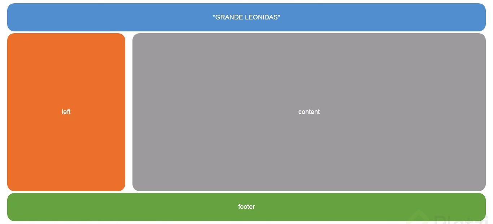
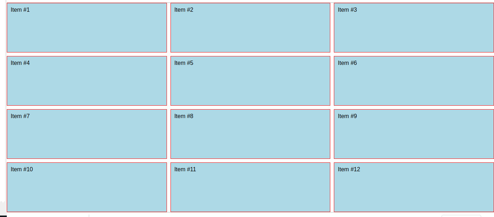
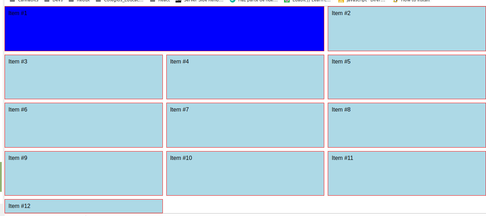
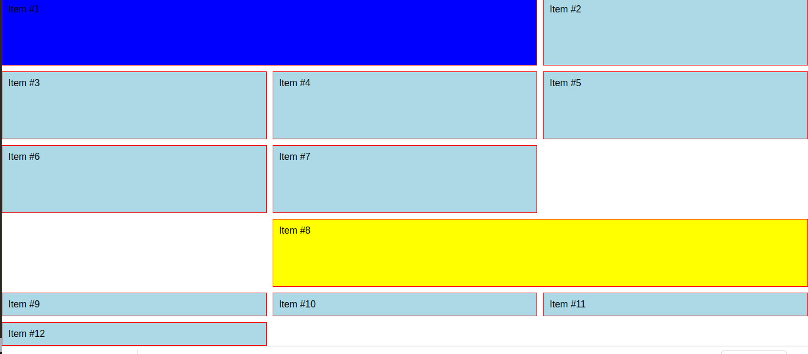
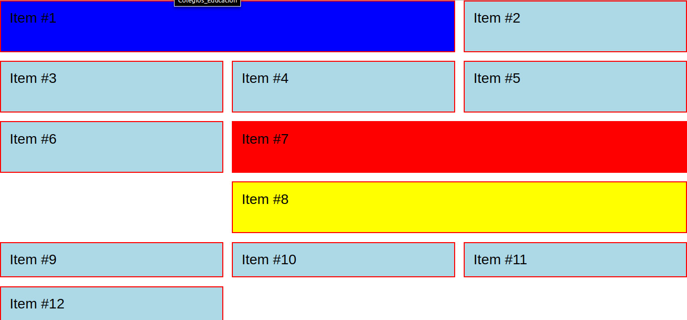
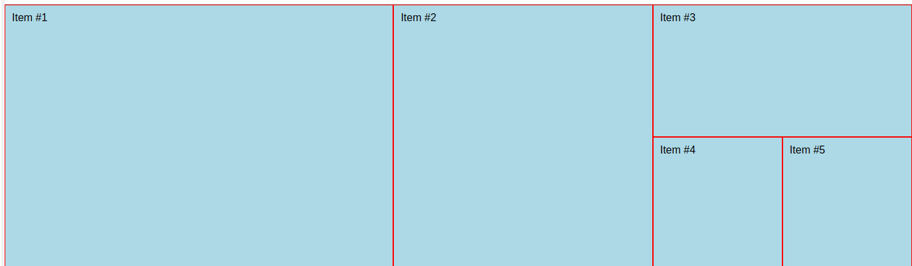
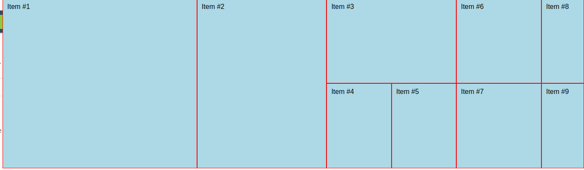
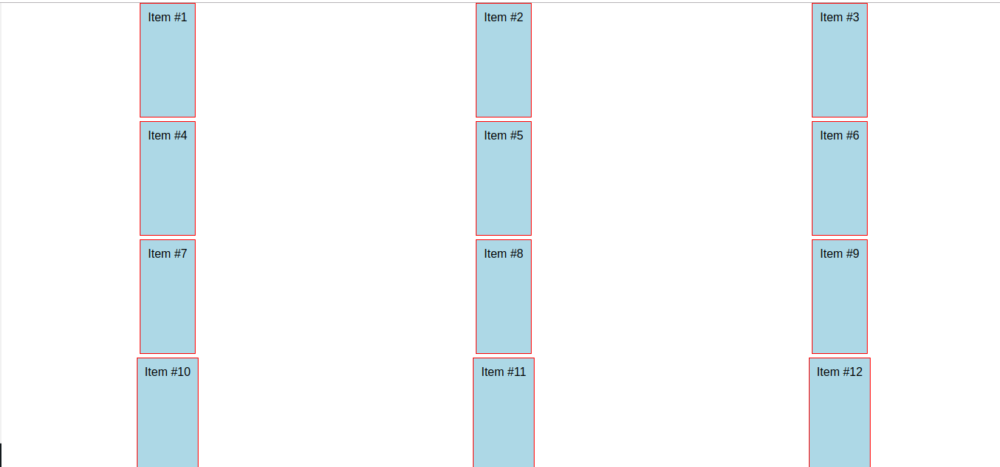
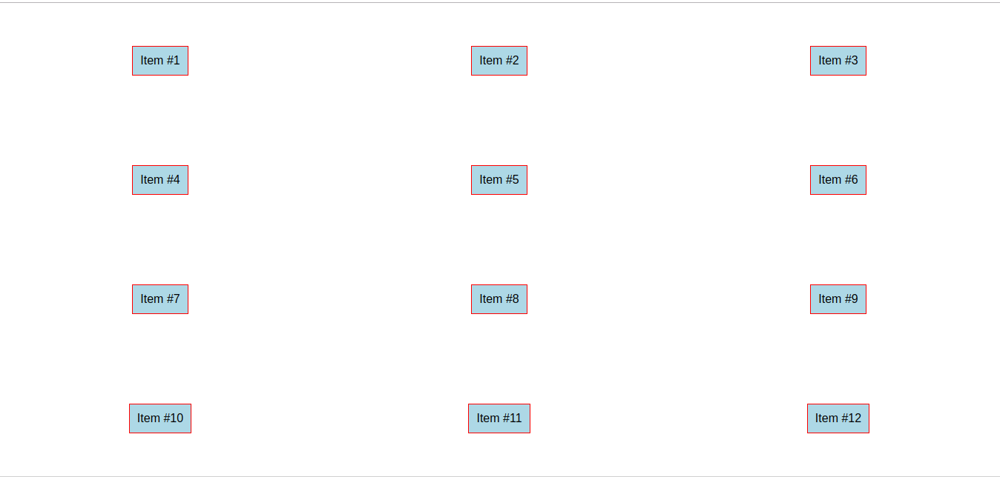
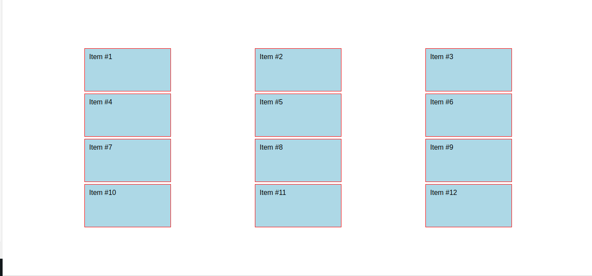

[//]: # @param group $$ Front-end
[//]: # @param title $$ CSS Grid
[//]: # @param author $$ Iván D. Sánchez

# CSS Grid Layout

para CSS todo es una caja
Flexbox estaba pensado para trabajar en linea y/o de manera continua

## Orden Carpetas

[A Complete Guide to Grid](https://css-tricks.com/snippets/css/complete-guide-grid/)

## Conceptos fundamentales

### Grid container

Elemento padre donde se asigna un `{display: grid;}`

### Grid item

- Hijos **directos** de un grid container
- grid items -> componentes dentro del container

### Grid Line

- Lineas divisorias horizontales y verticales
- Un grid es una rejilla
- Divisiones invisibles
- El contorno cuenta también

### Grid track

- Espacio entre dos líneas adyacentes, filas y columnas.

### Grid Cell

- Espacio entre dos filas adyacentes y 2 columnas adyacentes

### Grid area

- Espacio rodeado por 4 grid lines

## grid-template-columns - Definiendo columnas

grid-template-columns debo especificarle el tamaño del numero de columnas que requerimos. Admite valores absolutos o se puede hacer dinamico manejando % con combinado entre absoluto y relativo.

**CSS**

    body{
    	font-family: Arial;
    }
    .container{
    	display: grid;
    	grid-template-columns: 25% 200px 25%;
    }

**HTML**

    <section class="container">
    	<div class="item">Contenido 1</div>
    	<div class="item">Contenido 2</div>
    	<div class="item">Contenido 3</div>
    	<div class="item">Contenido 4</div>
    	<div class="item">Contenido 5</div>
    	<div class="item">Contenido 6</div>
    	<div class="item">Contenido 7</div>
    	<div class="item">Contenido 8</div>
    	<div class="item">Contenido 9</div>
    	<div class="item">Contenido 10</div>
    	<div class="item">Contenido 11</div>
    	<div class="item">Contenido 12</div>
    </section>

## grid-template-rows - Definiendo filas

- en ejemplo anterior tenemos 12 item y definimos 3 columnas por los cuales se generaron automáticamente 4 filas
- podemos tener un grid implicito(Automático) y otro explicito (Definido)

**CSS**

    .container{
    	display: grid;
    	grid-template-columns: 200px 200px 200px;
    	grid-template-rows: 300px 250px;
    }

Definimos el tamaño de la fila 1 y 2(Explicito) y la fila 3 y 4 es automático(implicito)

## grid-template - Definiendo filas y columnas al mismo tiempo

    grid.template: filas / columnas;

    .container{
    	display: grid;
    	/*grid-template-columns: 200px 200px 200px;
    	grid-template-rows: 300px 250px;*/
    	grid-template: 300px 250px / 200px 200px 200px;
    }

## Grids identados y tipos de displays

1. Grid dentro de un grid

- Seleccionar un item para crear internamente el grid
- Utilizando un a pseudo-clase ubicar el item que seleccionamos

```
.item:nth-of-type(4){
	background-color: blue;
}
```

- En el futuro se espera que `display: subgrid` permita heredar del grid padre sus propiedades grid-template.
- También se espera en un futuro que funcione `display: inline-grid`

**CSS**

    .item:nth-of-type(4){
    	background-color: blue;
    	display: grid;
    	grid-template: 50px 50px / 200px 200px 200px;
    }

    .item .item{
    	background-color: yellow;
    }

**HTML**

    <section class="container">
    	<div class="item">Contenido 1</div>
    	<div class="item">Contenido 2</div>
    	<div class="item">Contenido 3</div>
    	<div class="item">
    		<div class="item">subitem 1</div>
    		<div class="item">subitem 2</div>
    		<div class="item">subitem 3</div>
    		<div class="item">subitem 4</div>
    		<div class="item">subitem 5</div>
    	</div>
    	<div class="item">Contenido 5</div>
    	<div class="item">Contenido 6</div>
    	<div class="item">Contenido 7</div>
    	<div class="item">Contenido 8</div>
    	<div class="item">Contenido 9</div>
    	<div class="item">Contenido 10</div>
    	<div class="item">Contenido 11</div>
    	<div class="item">Contenido 12</div>|
    </section>

## Espaciado entre filas y columnas

Aunque se podría utilizar margin para separar los items, podría traer algunos problemas en función de los tamaños definidos para filas y columnas, utilizar grid-gap

### grid-column-gap

Espaciado entre columnas

### grid-row-gap

Espaciado entre filas

```
.container{
	display: grid;
	/*grid-template-columns: 200px 200px 200px;
	grid-template-rows: 300px 250px;*/
	grid-template: 300px 250px / 50% 200px 200px;
	grid-column-gap: 30px;
	grid-row-gap: 30px;
}
```

### grid-gap

**Versión resumida**

- grid-gap: filas columnas -> Espaciado resumido (filas y columnas)

```
.container{
	display: grid;
	/*grid-template-columns: 200px 200px 200px;
	grid-template-rows: 300px 250px;*/
	grid-template: 300px 250px / 50% 200px 200px;
	/*grid-column-gap: 30px;
	grid-row-gap: 50px;*/
	grid-gap: 50px 30px;
}
```

- El container no contiene el espaciado

grid-gap con un solo valor indica que aplica tanto para filas como para columnas

**Confirmar- Deprecated**

- grid-gap -> gap
- grid-column-gap -> column-gap
- grid-row-gap -> row-gap

## Repetidores, unidades de medida y funciones

Nueva unidad de medida - Fracciones (fr)

fr-> dividir el espacio por fracciones (1fr 1fr quivale a 50% 50%)
auto -> Divide el espacido con referencia a su contenido

**fr**

    .container{
    	display: grid;
    	grid-template: 50px 250px / 1fr 1fr 1fr;
    	grid-gap: 50px 30px;
    }

Divide el espacio 33.33% 33.33% 33.33%

**auto**

    .container{
    	display: grid;
    	grid-template: 50px 250px / auto auto auto ;
    	grid-gap: 50px 30px;
    }

### función repeat

Evita repetir la configuración

    .container{
    	display: grid;
    	grid-template: 50px 250px / repeat(4,1fr);
    	grid-gap: 10px 30px;
    }

### minmax()

Fracción de espacio mínimo y de espacio máximo

### auto-fill

Calcula automáticamente el número de columnas que se pueden presenta en funcion del ancho de la pantalla y el ancho de los contenidos

    grid-template-columns: repeat(auto-fill, 250px);

**minmax(valor_minimo, valor_maximo)**

    .container{
    	display: grid;
    	grid-template: 50px 250px / repeat(4,minmax(200px,1fr));
    	grid-gap: 10px;
    }

En el anterior caso el minmax aplica para la cuatro columnas de igual manera.

    .container{
    	display: grid;
    	grid-template: 50px 250px / minmax(200px,1fr) 1fr 1fr 1fr;
    	grid-gap: 10px;
    }

El anterior ejemplo minmax solo esta configurado para la primer columna

## Definiendo áreas de contenido



- Como container no tiene un algo fijo y decimos 1fr, no hay un punto de partida para el calculo asi que van haber areas de silencio. Para ello indicamos que el alto del container es 100vh
- Se debe designar áreas al container
- Para el ejemplo en la definició de áreas se repite header y footer porque ocupan dos columnas
- Indicarle a cada uno de los elemento que área ocupar. Lo indicamos de una manera explicita a través de clases con el nombre de las áreas.
- con la propiedad grid-area que es aplicada a los hijos de grid container se le indica que espacio ocupar a las clases.
- Para lograr los tamaños de columna de la fila 2 modifico grid-template y en la seccion de columnas inserto un valor fijo y un area con valor dinámico.
- Hacer lo mismo con las filas

**CSS**

    body{
    	font-family: Arial;
    	margin:0;
    }
    .container{
    	display: grid;
    	grid-template: 100px 1fr 150px/ 250px 1fr;
    	grid-gap: 10px;
    	height: 100vh;
    	grid-template-areas: "header header"
    						 "left content"
    						 "footer footer";
    }

    .item{
    	border: 1px solid red;
    	padding: 10px;
    	background-color: lightblue;
    }

    .header{
    	grid-area: header;
    }

    .left{
    	grid-area: left;
    }

    .content{
    	grid-area: content;
    }

    .footer{
    	grid-area: footer;
    }

**HTML**

    <section class="container">
    	<div class="item header">Header</div>
    	<div class="item left">Left</div>
    	<div class="item content">Content</div>
    	<div class="item footer">Footer</div>
    </section>

**Nota:** En grin-template-areas podemos indicar con un . cuando una área este vacio o no ocupada.

    .hero-container {
    	display: grid;
    	grid-template-columns: 70px 1fr 320px;
    	grid-template-areas: "badge title form"
    						 ". description form"
    						 ". countdown form";
    	grid-gap: 10px;
    }

## Definiendo el tamaño de las columnas dentro de un grid

### grid-column-start

Sirve para indicarle a un item en que grid line comienza

### grid-column-end

Sirve para indicarle a un item en que grid line termina

### Ejemplo



**CSS**

    .container{
    		display: grid;
    		grid-template-columns: repeat(3,1fr);
    		grid-template-rows: repeat(4,1fr);
    		grid-gap: 10px;
    		height: 100vh;
    }

Indicandole al item 1 que empiece en el grid line 1 y termine en el 3

    .item:nth-of-type(1){
        background-color: blue;
        grid-column-start: 1;
        grid-column-end: 3;
    }



### grid-column

Forma resumida para indicar grid line de inicio y final

Indicandole al item 8 que inicie en el grid line 2 y termine en el 4

    .item:nth-of-type(8){
    	background-color: yellow;
    	grid-column: 2 / 4;
    }



### span

Otra forma de escribir el tamaño de la columna es indicandole donde inicia pero sin decirle donde termina se le indica cuanto espacio va a ocupar

con **span** le indico la cantidad de espacios a ocupar

Indicandole al item 7 que inicie en el grid line 2 y ocupe dos espacios

    .item:nth-of-type(7){
    	background-color: red;
    	grid-column: 2 / span 2;
    }



Indicandole al item 9 que ocupe todas las columnas. En este caso se le indica span 3 porque el maximo de columnas es 3

    .item:nth-of-type(9){
    	background-color: green;
    	grid-column: 1 / span 3;
    }

En el caso que se agregaran mas columnas y quisieramos que ocupara siempre todas las columnas indicamos -1 en la ubicación de valor final. Item 10

.item:nth-of-type(10){
background-color: gray;
grid-column: 1 / -1;
}

Tambien es posible que omitamos donde inicia un elemento y solo indiquemos que espacio ocuopa

    .level-1 {
    	grid-row-end: span 3;
    }

    .level-2 {
    	grid-row-end: span 2;
    }
    .level-3 {
    	grid-row-end: span 1;
    }

## Definiendo el tamaño de filas dentro de un grid

Tal como funciona grid-column para el manejo de filas utilizamos grid-row

### grid-row


_Layout de referencia_

Vamos a replicar la maquetación de la parte inferior.

**CSS**

    body{
    	font-family: Arial;
    	margin:0;
    }
    .container{
    	display: grid;
    	grid-template-columns: repeat(7,1fr);
    	grid-template-rows: repeat(2,200px);
    	height: 100vh;
    }

    .item{
    	border: 1px solid red;
    	padding: 10px;
    	background-color: lightblue;
    }

    .item:nth-of-type(1){
       grid-column: 1 / span 3;
       grid-row: 1/ span 2;
    }

    .item:nth-of-type(2){
        grid-column: 4 / span 2;
        grid-row: 1/ span 2;
    }
    .item:nth-of-type(3){
        grid-column: 6 / span 2;
    }

**HTML**

    <section class="container">
    	<div class="item">Item #1</div>
    	<div class="item">Item #2</div>
    	<div class="item">Item #3</div>
    	<div class="item">Item #4</div>
    	<div class="item">Item #5</div>
    </section>

**Resultado**



## Definiendo el nombre de lineas

Se puede definir el nombre de los grid lines con el fin de no ubicarlas por su número de posición sino por su nombre.

Se le debe dar un nombre a cada linea tanto horizontales como verticales

**CSS**

    .container{
    	display: grid;
    	grid-template-columns: [inicio] 1fr [linea2] 1fr [linea3] 1fr [linea4] 1fr [linea5] 1fr [linea6] 1fr [linea7] 1fr [final];
    	grid-template-rows: [inicio] 200px [linea2] 200px [final];
    	height: 100vh;
    }

Renombrando algunas lineas para optimizar su ubicación en el espacio

    .container{
    	display: grid;
    	grid-template-columns: [inicio] 1fr [linea2] 1fr [linea3] 1fr [destacado1-end] 1fr [linea5] 1fr [destacado2-end] 1fr [linea7] 1fr [final];
    	grid-template-rows: [inicio] 200px [linea2] 200px [final];
    	height: 100vh;
    }

    .item{
    	border: 1px solid red;
    	padding: 10px;
    	background-color: lightblue;
    }

    .item:nth-of-type(1){
       grid-column: inicio / destacado1-end;
       grid-row: inicio/ final;
    }

    .item:nth-of-type(2){
        grid-column: destacado1-end / destacado2-end;
        grid-row: inicio/ final;
    }
    .item:nth-of-type(3){
        grid-column: destacado2-end / final;
    }

## Manejando el grid implícito

### grid-auto-flow

El grid implicito corresponde a los HTML que no estan contemplados dentro del CSS.

por default css-grid esta configurado para que el flujo automático del grid sea con filas, osea que los elementos implicitos se reordenan en filas

    grid-auto-flow: row;

por defecto el grid-auto-flow esta configurado como row, pero se podría cambiar a column, esto haría que los elementos implicitos sean desplazados a manera de columnas

    grid-auto-flow: column;

**CSS**

    .container{
    	display: grid;
    	grid-template-columns: [inicio] 1fr [linea2] 1fr [linea3] 1fr [destacado1-end] 1fr [linea5] 1fr [destacado2-end] 1fr [linea7] 1fr [final];
    	grid-template-rows: [inicio] 200px [linea2] 200px [final];
    	height: 100vh;
    	/*grid-auto-flow: row;*/
    	grid-auto-flow: column;
    }

### grid-auto-columns

También es posible asignar un tamaño de columna para el grid implicito

    .container{
    		display: grid;
    		grid-template-columns: [inicio] 1fr [linea2] 1fr [linea3] 1fr [destacado1-end] 1fr [linea5] 1fr [destacado2-end] 1fr [linea7] 1fr [final];
    		grid-template-rows: [inicio] 200px [linea2] 200px [final];
    		height: 100vh;
    		/*grid-auto-flow: row;*/
    		grid-auto-flow: column;
    		grid-auto-columns: 200px 100px;
    	}



### grid-auto-rows

También es posible asignar un tamaño de fila para el grid implicito

    .container{
    	display: grid;
    	grid-template-columns: [inicio] 1fr [linea2] 1fr [linea3] 1fr [destacado1-end] 1fr [linea5] 1fr [destacado2-end] 1fr [linea7] 1fr [final];
    	grid-template-rows: [inicio] 200px [linea2] 200px [final];
    	height: 100vh;
    	grid-auto-flow: row;
    	grid-auto-rows: 50px;
    	/*grid-auto-flow: column;
    	grid-auto-columns: 200px 100px;*/

    }

## Alineación de contenido

Del lado del container hay 2 propiedades para alinear:
**justify-items** -> alineado de manera horizontal -> recibe valores de -> start end center stretch;
**align-items** -> alineado de manera vertical -> recibe valores de -> start end center stretch;

**CSS - justify-items**

    .container{
    	display: grid;
    	grid-template-columns: repeat(3, 1fr);
    	grid-template-rows: repeat(4,1fr);
    	height: 100vh;
    	grid-gap: 5px;
    	justify-items: end;
    }

### justify-items: stretch

stretch es el valor por defecto que tienen las dos propiedades, permite estirar el contenido al espacio que dé el grid

### justify-items: start;

Poner el contenido hacia la izquierda, el inicio. Los elementos ocupan según el ancho del contenido

justify-items: start;

### justify-items: end;

Poner el contenido hacia la derecha, el inicio. Los elementos ocupan según el ancho del contenido

justify-items: end;

### justify-items: center;

El contenido se ajusta en la mitad. Los elementos ocupan según el ancho del contenido

    justify-items: center;

**Resultado**


### align-items: center;

Alinea vertical los elementos al centro. Los elementos ocupan según el ancho del contenido

**Resultado justify-items: center align-items: center**


### align-self & justify-self

También podemos hacer que un solo elemento tenga una alineación diferente:

    .item:nth-of-type(5){
    	align-self: start;
    	justify-self: end;
    }

## Alineación de filas y columnas

### justify-content: start, end, center, strech, space-around, space-between, space-evenly

center: alinea el contenido en el centro de manera horizontal
space-around: le da espacio al rededor de cada columna
space-between: le da espacio entre columnas
space-around:le da espacio al rededor de cada columna, de manera mas homogenea que space-around

### align-content: start, end, center, strech, space-around, space-between, space-evenly

center: alinea el contenido en el centro de manera vertical

**_Ejemplo justify-content: space-evenly; align-content: center;_**

    .container{
    	display: grid;
    	grid-template-columns: repeat(3, 200px);
    	grid-template-rows: repeat(4,100px);
    	height: 100vh;
    	grid-gap: 5px;
    	justify-content: space-evenly;
    	align-content: center;
    }



## Proyectos CSS

### Layout de Instagram
