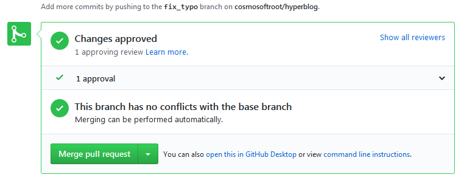

[//]: # @param group $$ Desarrollo de software
[//]: # @param title $$ Control de versiones - GitHub
[//]: # @param author $$ Iván D. Sánchez

# Github

## Introducción

- Es una plataforma que permite trabajar con repositorios remotos de Git
- Es posible realizar acciones mediante una interfaz gráfica

## Opciones de trabajo con repositorios

- **New repository:** Crear un nuevo repositorio remoto
- **Import repository:** Solo funciona si el repositorio a importar está online
- **New gist:** Son fragmentos de código para compartir
- **New organization:** Trabajar para múltiples empresas
- **New Project:** Grupo de repositorios dentro de una organizacion

## Opciones del repositorio

- **Raw:** Muestra el código en texto plano
- **Blame:** Se pueden ver las transacciones sobre un archivo
- **History:** Similar a git log

## De Master a Main

A raiz del movimiento #BlackLivesMatter se esta empezando a desvincular del argot técnico, terminos peyorativos utilizados en la industria, por tal motivo github abandona la rama `master` como rama principal e implementa `main`

Para implementar la rama `main` se requiere mover todo el historial a dicha rama

    git branch -M main

## Clonar repositorio

Ubicarse en la carpeta de destino del repositorio

    git clone url_remoto_https_o_ssh

## Conectar repositorio local con repositorio de GitHub

Configurar repositorio remoto por https o ssh

    git remote add origin URL_HTTPS_SSH

Verificar la configuración del repositorio remoto (-v verbose, verbal)

    git remote
    git remote -v

El repositorio remoto ahora es el master

Enviar al repositorio remoto la rama master

    git push origin master

**Nota:** En SO Windows se abre una ventana de autenticación en GitHub al ejecutar el comando push

- Al intentar realizar push por primera vez desde el repositorio local, el repositorio remoto identifica que hay archivos que no son comunes entre los repositorios.

- Se requiere descargar al repositorio local los archivos del repositorio remoto

  git pull origin master

**Nota** Al conectar por primera vez los repositorios arroja un warning por que hay commits que no son comunes

Al final se obtiene un error fatal porque git se reusa a unir historias no relacionadas, para forzar esta acción agregar la siguiente bandera al git pull

    git pull origin master --allow-unrelated-histories

**Nota:** En caso que se abra Vim, para salir se hace con `esc + shift + zz`

Empujar los archivos del repositorio local al remoto

    git push origin master

## Modificar archivos en el repositorio remoto

Seleccionar el archivo a modificar y eligir la opción editar


Editar el archivo y diligenciar en la parte inferior la información del commit para salvar los cambios.


Para actualizar los archivos del repositorio local realizar un `git pull`

    git pull origin master

Equivale a hacer `git fetch` y `git merge`

## Llaves públicas y privadas

- Cifrado simétrico de un solo camino
- El emisor genera una llave pública y una llave privada
- El emisor envia la llave pública al receptor
- El receptor encripta el mensaje con la llave publica del emisor
- El emisor desencripta el mensaje con su llave privada

## Configuración llaves SSH en GitHub

**Nota:** Las llaves SSH no se configuran por repositorio sino por persona o equipo de desarrollo

Verificar que la configuración de git tiene instanciado el parámetro email.

Para verificar configuracion del git

    git config -l

En caso que no este instanciado el parámetro

    git config --global user.email "name@mail.com"

### Crear las llaves publica y privada SSH

1.  Ubicado en el home ~ (no en el repositorio)

        # keygen:  key generator
        # -t : Especificar el algoritmo
        # -b : Que tan compleja sera la llave
        # -C : Comment: Comentario o en github correo al que va a estar asociada la llave
        # Se recomienda proteger la llave privada con contraseña (passphrase)
        ssh-keygen -t rsa -b 4096 -C "name@mail.com"

2.  Activar el servidor ssh

        eval $(ssh-agent -s)

3.  Ruta de la llave ssh

        cd ~/.ssh/

4.  Agregar la llave privada al servidor

        ssh-add ~/.ssh/id_rsa

#### Windows y Linux

Iniciar servidor de llaves SSH

    eval $(ssh-agent -s)

Añadir la llave primaria al servidor SSH

    ssh-add ruta_llave_privada

#### Mac

Encender el "servidor" de llaves SSH de tu computadora:

    eval "$(ssh-agent -s)"

Si usas una versión de OSX superior a Mac Sierra (v10.12) debes crear o modificar un archivo "config" en la carpeta de tu usuario con el siguiente contenido (ten cuidado con las mayúsculas):

    Host \*
    AddKeysToAgent yes
    UseKeychain yes
    IdentityFile ruta-donde-guardaste-tu-llave-privada

Añadir tu llave SSH al "servidor" de llaves SSH de tu computadora (en caso de error puedes ejecutar este mismo comando pero sin el argumento -K):

    ssh-add -K ruta-donde-guardaste-tu-llave-privada

_Recuperado del curso de GitHub de Platzi_

## Conexión a GitHub con SSH

1.  Copiar toda la llave publica e ir a Github

        cat id_rsa.pub

2.  Ir al perfil -> Settings -> SSH and GPG keys
3.  Título de la llave (algo que oriente a que está conectada esa llave)
4.  Pegar la llave pública en el formulario

    

5.  Ir al repositorio en GitHub y seleccionar -> Clone or download
6.  Usar SSH y copiar la direccion URL
7.  Ubicarse en el repositorio local y setear la conexión al repositorio remoto de HTTPS a SSH

        git remote set-url origin URL_SSH

8.  Ver la configuración de la conexión con el repositorio remoto

        git remote -v

## Tags y versiones en Git y GitHub

Los tags o etiquetas tienen como función poder identificar los commits con cambios mas significactivos y marcarlos como versiones del proyecto para su agil localización

### Crear un tag

    # Sintaxis
    git tag -a nombre_tag id_commit -m "Mensaje"

    # Ejemplo
    git tag -a v0.1 e31f6b53a9d0e9301909f921e51534a612f1d396 -m "Version 0.1"

### Eliminar un tag del repositorio local

    git tag -d nombre_tag

### Listar los tags

    git tag

    # también

    git show-ref --tags

### Publicar los tags en el repositorio remoto

    git push origin --tags

### Eliminar tag del repositorio remoto

    # Eliminar primero el tag del repositorio local
    git tag -d nombre_tag

    # luego del repositorio remoto
    git push origin :refs/tags/nombre_tag

## Trabajo Colaborativo

### Preparando el repositorio local del colaborador

    # Antes de comenzar el nuevo colaborador debe tener configurado las variables globales de git
    git config -l

    git config --global user.name "Nataly Fonseca"
    git config --global user.email "correo_nataly@gmail.com"

    # clonar el repositorio remoto
    git clone https://github.com/cosmosoftroot/hyperblog.git

    # Al continuar con el flujo de trabajo en el repositorio local
    # y hacer push del proyecto va a arrojar un error
    # ya que el usuario no pertenece al grupo de colaboradores del proyecto

    Nataly@DESKTOP-QMI60V2 MINGW64 ~/cursogit/hyperblog (master)
    $ git push origin master
    remote: Permission to cosmosoftroot/hyperblog.git denied to natalyfonseca.
    fatal: unable to access 'https://github.com/cosmosoftroot/hyperblog.git/': The requested URL returned error: 403

### Habilitar colaborador en el repositorio remoto

1. Ir a los settings del repositorio

 2. Ingresar en Collaborators 3. Ingresar el correo electrónico o username del colaborador

    **Nota:** Cada colaborador habilita en su perfil si desea su configurar un correo público para ser agregado como colaborador o por el nombre de usuario.

4. Al habilitar un colaborador se envía automáticamente una invitación con las indicaciones del repositorio


5. El colaborador al aceptar la invitación ya puede realizar aportes al proyecto

### Recomendaciones trabajo colaborativo

- Se recomienda que cada colaborador trabaje sobre la rama de su competencia
- Debe existir un lider de proyecto que se encarge de hacer los merge de las diferentes ramas
- Para los archivos binarios (imágenes, pdf), una buena práctica es tenerlos aparte y no ser alojados en el repositorio remoto.

  **Nota:** Al hacer un git pull a una rama especifica, se debe estar ubicado en ella en caso contrario se hará merge con la rama donde se este ubicado

- En un entorno profesional se bloquea la rama master para que ningún colaborador pueda hacer merge directamente
- Un proceso antes del merge debe haber un code review
- La rama master es la que deber ser subida al servidor de producción
- El ambiente de desarrollo y pruebas deber ser tan similar como pueda al entorno de producción
- Se recomienda el uso de subdominios para ejecutar pruebas
- El desarrollo se realiza en servidores de desarrollo o de staging
- El staging es una rama antes de master
  Los features de la rama master, se realiza en ramas a parte que se fusionan (merge) con la rama de staging que va al servidor de pruebas
- Son los DevOps los encargados de administrar el entorno de desarrollo

### pull request

- Pull request es una característica de gitHub.
- En gitlab se llama merge request
- Estado intermedio antes de hacer el merge, los cambios requieren de aprobación
- Un pull request tiene como función hacer merge desde github luego de revisión y aprobación de cambios

#### Ejemplo

**Situación:** se creó una rama para realizar correcciones en el contenido llamada fix_typo y se envian al repositorio remoto las correcciones.

Podemos hacer un pull request de dos forma:

**Opción 1**

1. Nuevo pull request

   

2. Seleccionar las ramas a comparar

   

**Opción 2**

1. Aceptar la sugerencia de GitHub de comparar y hacer pull request cuando detecta cambios en una rama

   

#### Agregando colaboradores para el code review


**Vista del reviewer**

Novedad de pull request del lado del reviewer


Seleccionar el pull request


Revisar los archivos modificados


Dar respuesta sobre la revisión. Es posible realizar un comentario, aprobar los cambios o solicitar cambios para ser aprobado


Solicitando cambios para aprobación


**Vista colaborador**

Luego de realizar los cambios notificar a través de conversacion al reviewer


....


**Vista del reviewer**

Aprobar los cambios


**Vista del propietario o DevOp**

Terminar el merge pull request



_Es posible eliminar el branch luego de aprobar, queda a discreción del equipo de desarrollo_

### fork

- Cuando un usuario no es colaborador de un proyecto de github, puede estar pendiente de los cambios que se realicen en este mediante la opción Watching y Star.
- Se puede clonar un proyecto desde github mediante la opción fork, el cual replica el proyecto del repositorio original a nuestro repositorio.
- Cuando se hace fork se obtiene una copia del estado actual del proyecto en el repositorio de github
- Fork es una característica única de github
- Seleccionar el proyecto público y hacer click en Fork, esto generará la copia automáticamente en nuestro repositorio de github

**Contribuyendo a un repositorio**

1. Hacer un fork del repo
2. Clonar a nuestro repositorio local
3. Realizar cambios, commit y push al repositorio remoto forked
4. Crear un nuevo pull request desde el repositorio forked
5. El propietario del repositorio toma decisiones sobre el pull request

#### Update forked repository

El propietario del repositorio hace cambios y las personas externas que aportan al proyecto quedan con una versión forked desactualizada en comparación al master del repositorio original.

**Actualizar desde repositorio local**

    # upstream es un nombre opcional
    git remote add upstream https://github.com/cosmosoftroot/hyperblog.git

    # verificar
    git remote -v

    # traer los archivos
    git pull upstream master

    # Crear un commit
    git commit -am "Upgrade from original repository"

    # enviar los cambios a nuestro repositorio remoto
    git push origin master

    # Si hay cambios en nuestro repositorio remoto hacer pull antes de push

### deployment a un servidor

- Es recomendado agregar tags cuando se envia una versión a producción
- Situado en la carpeta del hosting git clone URL_HTTPS
- git pull para actualizar
- Nota: no enviar la base de datos de git (.git) apache y nginx tiene formas de como ocultarlo
- Es posible usar software de terceros para hacer el deploy como travis CI (pago) o Jenkins
- Integración continua o desarrollo continuo en DevOps

## Ignorar archivos en el respositorio con .gitignore

- No todos los archivos tienen que ir al repositorio por ejemplo variables de entorno (.env), dependencias de desarrollo (node_modules), llaves de APIs, conexiones a bases de datos.
- Los archivos binarios por lo general no se envian al repositorio sino a un CDN.
- Con .gitignore configuramos la lista de archivo que vamos a ignorar.
- El archivo .gitignore se debe crear en la raíz del proyecto.
- El archivo .gitignore se debe enviar al repositorio
- Apoyarnos en proyectos opensource como referencia es una buena práctica

## Cómo funciona

Ignorar todos los archivos .jpg

    *.jpg

Excepciones `!/README.md`

## README.md

- Funciona con markdown para darle formato al texto
- Se ubica en la raíz del proyecto
- También se puede agregar HTML
- Apoyarnos en proyectos opensource como referencia es una buena práctica

## GitHub Pages

- Es un servicio de hosting gratis
- [GitHub Pages](https://pages.github.com/)
- Ir a GitHub y crear un repositorio con el mismo nombre de usuario u organización.
- Si los nombres no coinciden GitHub Pages no funcionará
- Clonar el repositorio en el equipo local
- Crear el archivo index.html y hacer push del archivo al repositorio
- Configurar en GitHub el nombre del repositorio que va cargar GitHub Pages
- Ir al repositorio -> settings -> GitHub Pages -> source -> Master branch (O la rama para hacer deploy del repositorio)
- Optional se puede tener un dominio personalizado.
- Se puede acceder al repositorio desde la URL -> https://username.github.io/username/
- [Ejemplo: Cosmosoftroot](https://cosmosoftroot.github.io/cosmosoftroot/)
- Cambiar el nombre de repositorio en GitHub para que se cargue en la raiz de la URL https://username.github.io/
- Settings-> Repository name >username.github.io
- [Ejemplo: Cosmosftroot](https://cosmosoftroot.github.io/)

### Agregar otros repositorios a la GitHub pages

- settings -> GitHub Pages -> source -> Master branch (O la rama para hacer deploy del repositorio)
- si el repositorio no tiene en la raiz no tiene un index.html no se cargara automáticamente el sitio pero se puede agregar la ruta en la url

## Git Rebase: Reorganizando el trabajo realizado

- Es una mala práctica, nunca se debe usar
- Con rebase puedes recoger todos los cambios confirmados en una rama y ponerlos sobre otra
- La historia en los repositorios remotos deberían mantenerse intacta
- Si se requiere usar rebase se recomienda solo para repositorios locales ya que este reescribe toda la historia del repositorio.

- rebase sirve para hacer cambios silenciosos en una rama sin dejar la historia de la rama.

- Si a la final se requier el rebase se debe hacer primero desde la rama que queremos modificar y luego hacemos rebase a la rama final

### Ejemplo rebase

Ubicados en la rama experimento

    git rebase master

Luego ir a la rama final (Master)

    git rebase experimento

## git stash

- Se usa cuando se requiere ir a una rama y hay cambios en los archivos actuales pero no estan listos para ser agregados a rama o no merecen un rebase.
- git stach cuarda los cambios en un lugar temporal
- Permite volver rapidamente a la versión anterior

Volviendo al estado anterior pero guardando las modificaciones actuales

    git stash

El lugar temporal se puede consultar con:

    git stash list

Volver a los cambios que estan stash

    git stash pop

Borrando un stash

    git stash drop

Pasar el stash a una rama (Ejemplo desde master). Primer hacer stach y luego ejecutar stash con branck

    git stash

    git stash branch new_branch

## git clean

- limpiar el proyecto de archivos que no forman parte del proyecto: copias, backups
- los archivos que son ignorados (.gitignore) no son limpiados, tampoco las carpetas
- Remove untracked files from the working tree

Simular lo que va a borrar (ejecución en seco)

    git clean --dry-run

Limpiar el proyecto de los archivos en cuestión

    git clean -f

## Git cherry-pick

En caso de estar trabajando una rama alterna de la cual la rama master requier un avance (commit) entonces podemos usar el comando git cherry-pick hash_object y ensamblamos las modificaciones de ese commit.

**ejemplo:**

    git checkout master

    git cherry-pick 8e42f77

En caso de requerir fusionar la ultima version de la rama con master podemos hacer un merge(desde master) pero se pueden tener conflictos que se debe solucionar manualmente (unmerge)

## Reconstruír commits en Git con amend

- En ocasiones se puede hacer un commit el cual puede ir incompleto ya que hay archivos que no se alcanzaron a actualizar. Luego de realizar los cambios:

1. Añadir el archivo modificado

```
git add filename
```

2. Remendar: Los cambios nuevo los vamos a pegar al commit anterior. Se puede modificar el mensaje del commit anterior.

```
git commit -ammend
```

## Git Reset y Reflog

Usar en caso de emergencia cuando nuestra aplicación se rompa y queramos volver a un estado en el que funcionaba

### git reset

Volver a un estado

    git reset hash_object

Volver a un estado manteniendo lo que esté en stagin area

    git reset --SOFT hash_object

Vovler a un estado reseteando todo incluido el stagin area

    git reset --HARD hash_object

Por lo general se usa **HARD**

    git reset --hard e5c8015

### git reflog

Consultar todo el historial del proyecto. Cada log esta referenciado con un hash object que podemos usar en el reset para volver a un estado anterior

    git reflog

## Buscar en archivos y commits de Git con Grep y log

### git grep

**Buscar en el código del proyecto**

Para buscar utilizamos el comando git grep keyword (Buscará en todos los archivos la keyword)

    git grep color

Conocer en que línea usé una palabra

    git grep -n color

Contar las veces que usé una palabra

    git grep -c color

Cuantas veces usamos una etiqueta. Usar comillas para evitar un error de sintaxis

    git grep -c "<p>"

**Buscar en el cuerpo de los mensajes (commits)**

    git log -S footer

> grep para los archivos, log para los commits

## Comandos y recursos colaborativos en Git y Github

Los commits que ha hecho cada miembro del equipo

    git shortlog

Mostrar la cantidad de commits por miembro del equipo

    git shortlog -sn

Mostrar la cantidad de commits por miembro del equipo incluidos los borrados

    git shortlog -sn --all

Sin contar los merge

    git shortlog -sn --all --no-merges

###Crear un alias dentro de git

Crear el comando git stats para la configuración global de la máquina
git config --global alias.stats "shortlog -sn --all --no-merges"
git stats

### git blame

Revisar quien ha hecho cada linea de codigo de un archivo

    git blame name_file

identando la salida

    git blame -c ./9.source_code/app/src/containers/Home.jsx

identificando quien realizo cada linea de codigo dentro de un rango de lineas

    git blame -c ./9.source_code/app/src/containers/Home.jsx -L35,50

Con identación
git blame -c ./9.source_code/app/src/containers/Home.jsx -L35,50 -c

## --help

Como funciona un comando

    como funciona commit

### ver las ramas del remoto

    git branch -r

### Ver las ramas del remoto y local

    git branch -a

### Github -> repositorio -> insights -> pulse

Muestra un panel que contiene # pull request , # merge, contribuidores del repositorio, issues resueltos

### Github -> repositorio -> insights -> Contributors

Muestra los stats del contribuidores al proyecto

### Github -> repositorio -> insights -> Dependency graphs

Muestra las dependencia isntaladas en el proyecto

## Tu futuro con Git y Github


## Examen

1. Git funciona para muchos tipos de archivo, ¿Qué tal funciona Git con archivos binarios?

   R. Los puedo agregar y versionar pero es mejor usar Git con texto plano

2. En un commit, los mensajes del commit son...

   PROBAR. no decir opcional

3. Los cambios a un archivo que están en "staging" están en...

   R.

4. ¿Qué es un branch o una rama en Git?

   R. Un repositorio aparte del master donde puedes trabajar en paralelo

5. Con checkout puedo...

   R. Ver todos los archivos de mi proyecto como los dejé en otras ramas

6. Un repositorio remoto y un repositorio personal…

   R.

7. Cuando hay un conflicto entre archivos lo mejor es...

   R. Analizar los conflictos tal como los reporto Git y elegir los cambios finales, luego commit

8. Github es...

   R. Un sistema online de manejo de repositorios de Git

9. Las llaves públicas son..

   PROBAR. Facile de compartir y sus mensajes imposibles de descifrar

10. Para transmitir cambios seguros entre tu repositorio local y Github se recomienda...

    R. Usar una llave SSH

11. Se crean dos archivos cuando creas una llave pública y privada para SSH. La extensión de la llave privada es...

    R. Ninguna extensión

12. Los tags en Git crean...

    R. Versiones descargables y puntos únicos de una rama en un repositorio

13. ¿Puedo crear ramas en Github que no tenga en mi repositorio local

    PROBAR. Si, tú decides si traer esas ramas a tu repositorio local

14. En un repositorio público en Github, los colaboradores pueden...

    PROBAR. Ver el código y clonarlo, pero no editarlo.

15. Un pull request es

    PROBAR.

16. El dueño de un repositorio al ver un pull request puede

    PROBAR. Editarlo, aceptarlo, darle merge, comentarlo para pedir cambios.

17. Si ya hiciste el desafío de “Hazme un pull request,” ¿Dentro de cuál etiqueta tenías que agregar el cambio?

    R. `<div id="post">`

18. Cuando usas git stash, los cambios que "guardas" temporalmente se guardan en...

    R. Memoria temporal, volviendo al estado del último commit

19. Deberías usar cherry-pick cuando...

    R. Quiero los cambios de un commit pasado, sin dañar la historia de la rama.

20. Con amend puedo...

    R. Corregir los mensajes de un commit que hice mal sin que quede en la historia del repo

21. Con gitk puedes…

    R. Ver en una interfaz visual las ramas y el log de tu repositorio

22. ¿Cómo instalas Gitk?

    PROBAR. Se instala automáticamente cuando instalamos Git

23. ¿Cómo llaman GitHub y GitLab a los "merges" (propuestas de cambios desde otra rama o repositorio)?

    R. GitHub lo llama Pull Request y GitLab Merge Request

24. ¿Puedes conectar tu repositorio local con más de un repositorio remoto?

    R. Verdadero

25. Estás en la rama master y quieres mandar los últimos cambios que guardaste con git stash a la rama retomando-los-cambios (la rama no ha sido creada aún). ¿Cuál de las siguientes soluciones es incorrecta?

    PROBAR. git stash apply

26. ¿Cuál es la diferencia entre git rm y git reset HEAD?

    R. git rm saca los archivos del repositorio y (opcionalmente) del disco duro. git reset saca los archivos del staging pero no del disco duro.

27. ¿Para qué sirve git grep?

    R. Para encontrar las veces que hemos usado una palabra en los archivos del repositorio

28. Por defecto, GitHub usa la rama master como la rama principal. ¿Podemos cambiar la rama principal?

    R. Verdadero

29. ¿Para qué sirve GitHub Pages?

    R. Es un servicio de GitHub que nos permite publicas nuestros repositorios en internet (por ejemplo, nombre.github.io o nombre.github.io/proyecto)

30. El Jefe Freddy despidió a Anita y no piensa volver a contratarla. ¿Qué debe hacer Anita para seguir haciendo contribuciones a los proyectos públicos de Platzi

    R. Crear un fork del proyecto y enviar pull request al proyecto original
