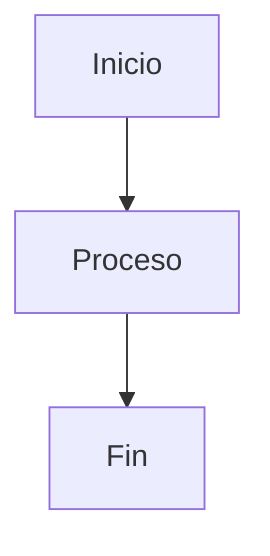

[//]: # @param group $$ Inteligencia Artificial para la Productividad
[//]: # @param title $$ 01-Introducción a la Inteligencia Artificial
[//]: # @param author $$ Iván D. Sánchez

# Introducción a la Inteligencia Artificial

## ¿Es seguro compartir datos personales con la inteligencia artificial?

Es natural sentirse inquieto sobre la seguridad de los datos personales al utilizarlos en plataformas de inteligencia artificial. Sin embargo, ChatGPT y otras plataformas de AI han implementado configuraciones de privacidad útiles. Estas permiten a los usuarios desactivar la opción de usar sus datos para entrenar nuevos modelos, garantizando así la seguridad tanto de sus datos personales como la información empresarial sensible.

**¿Qué consideraciones de privacidad y verificación debes tener?**

Mientras utilizas ChatGPT, es crucial proteger la confidencialidad de tu información. Siempre verifica la precisión de los datos proporcionados. Aquí algunos consejos:

- No compartas datos sensibles o confidenciales.
- Activa los filtros de privacidad de la plataforma.
- Revisa y ajusta las respuestas de la IA según tus necesidades específicas.

**Cómo funciona**

LLM Large Language Model

- Es un reconocedor de patrones. Relaciones entre palabras. Infiere
-

## Checklist

- Configurar las opciones de privacidad
