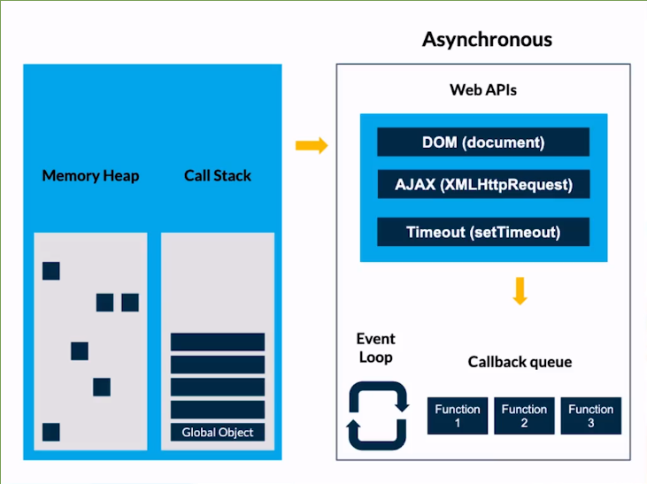
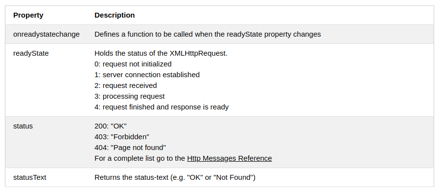

[//]: # @param group $$ JavaScript
[//]: # @param title $$ 2- Asincronismo
[//]: # @param author $$ Iván D. Sánchez

# Asincronismo JS

Javascript es: asíncrono y no bloqueante, con un bucle de eventos implementando con un único hilo para sus interfaces de i/O

## Introducción al asincronismo



## Callbacks

un callback es una función que al crearla le pasamos como parámetro una segunda función y de esta forma al momento de hacer una petición esta se ejecuta después de este llamado.

	function sum(num1, num2) {
	  return num1 + num2;
	}


	function calc(num1, num2, callback){
	    return callback(num1, num2);
	}

	console.log(calc(2,2,sum));


	function date(callback){
	  console.log(new Date)
	  setTimeout(function (){
	    let date = new Date;
	    callback(date)
	  },3000)
	}

	function printDate(dateNow){
	  console.log(dateNow)
	}

	date(printDate);
	
## Peticiones a APIs usando Callbacks

Para hacer peticiones hacia algún servicio en la nube, url, api, ftp, archio  desde node es necesario instalar

	npm install xmlhttprequest --save-dev
	
Para instanciar la dependencia

	let xmlhttprequest = require('xmlhttprequest').XMLHttpRequest;
	
- fetch está en ECMASCRIPT 6 pero funciona con promesas, vamos a usar callback para comprender la evolución de este tipo de peticiones.
- XMLHTTPRequest fué  creado por Microsoft.
- Los parámetros que recibe `xhttp.open` 
	- El método (GET, POST, ...) -> se pasa en string
	- URL
	- Asincronismo (true, false) por defecto está en true
- Ahora vamos a estar escuchando por esta conexión con xhttp.onreadystatechange 

 

- Cuando tenemos un readyState de 4 y un status 200 ya podemos pasarle el callback
- Este callback maneja la estructura error first así que el primer valor que recibe es el error, y el segundo es el resultado
- El resultado es una respuesta en testo que debemos parsear a JSON


**script**

	let xmlhttprequest = require('xmlhttprequest').XMLHttpRequest;

	function fetchData(url_api, callback) {
	  const xhttp = new XMLHttpRequest();
	  xhttp.open('GET', url_api, true);
	  xhttp.onreadystatechange() = function(event) {
	    if (xhttp.readyState === 4) {
	      if (xhttp.status === 200) {
		callback(null, JSON.parse(xhttp.responseText));
	      } else {
		const error = new Error('Error: ' + url_api);
		return callback(error, null);
	      }
	    }
	  };
	  xhttp.send();
	}

## Múltiples Peticiones a un API con Callbacks

	let XMLHttpRequest = require('xmlhttprequest').XMLHttpRequest;
	const API = 'https://rickandmortyapi.com/api/character/';

	function fetchData(url_api, callback) {
	  let xhttp = new XMLHttpRequest();
	  xhttp.open('GET', url_api, true);
	  xhttp.onreadystatechange = function(event) {
	    if (xhttp.readyState === 4) {
	      if (xhttp.status === 200) {
		callback(null, JSON.parse(xhttp.responseText));
	      } else {
		const error = new Error('Error: ' + url_api);
		return callback(error, null);
	      }
	    }
	  };
	  xhttp.send();
	}

	fetchData(API, function(error1, data1) {
	  if (error1) return console.error(error1);
	  fetchData(API + data1.results[0].id, function(error2, data2) {
	    if (error2) return console.error(error2);
	    fetchData(data2.origin.url, function(error3, data3) {
	      if (error3) return console.error(error3);
	      console.log(data1.info.count);
	      console.log(data2.name);
	      console.log(data3.dimension);
	    });
	  });
	});

## Implementando Promesas

- Algo va a suceder ahora, en el futuro o nunca.
- Los dos argumentos de una promesa son resolve y rejejct. 
- resolve en caso que la promesa se resuelva
- reject en caso que la promesa sea rechazada.


Las promesas tiene tres estados

pending (pendiente): estado inicial, ni cumplido ni rechazado.
fulfilled (cumplida): lo que significa que la operación se completó con éxito.
rejected (rechazada): lo que significa que la operación falló.

```
// Example 1

export function delay(time, message) {
  const promise = new Promise((resolve, rejected) => {
    if (time > 0) {
      window.setTimeout(() => {
        resolve(message);
      }, time);
    } else {
      rejected("Debe ingresar un tiempo");
    }
  });

  return promise;
}
delay(2000, "Hello after 2s").then((message) => console.log(message));


// Example 2

const requestStatus = false;

const promise = new Promise((resolve, rejected) => {
  if (requestStatus) {
    resolve(200);
  } else {
    rejected(500);
  }
});

promise
  .then((response) => console.log("request status: " + response))
  .catch((error) => console.error("Error status: " + error))
  .finally(()=>{
    console.log('Finally')
  })


```


**Estructura básica de una promise**

	const somethingWillHappen = () => {
	  return new Promise((resolve, reject) => {
	    if (false) {
	      resolve('Success!!!');
	    } else {
	      reject('Fatal, it does not work');
	    }
	  });
	};

	somethingWillHappen()
	  .then((response) => console.log(response))
	  .catch((err) => console.error(err));

	const somethingWillHappen2 = () => {
	  return new Promise((resolve, reject) => {
	    if (false) {
	      setTimeout(() => {
		resolve('Success, with time out!!!');
	      }, 2000);
	    } else {
	      const error = new Error('This is an error using new Error()');
	      reject(error);
	    }
	  });
	};

	somethingWillHappen2()
	  .then((response) => console.log(response))
	  .catch((err) => console.error(err));


Run multiple promises at once. Using Promise.all receives an array with promises and return in the resolve an array of responses, but in case of error return a single error because when one happens this break the execution

	Promise.all([somethingWillHappen(), somethingWillHappen2()])
	  .then((response) => console.log('Array of results', response))
	  .catch((error) => console.error(error));

## fetch

Para el uso de fetch en NodeJs es necesari instalar

	npm i node-fetch


```
import fetch from "node-fetch";
const API = "https://api.escuelajs.co/api/v1";

function fetchData(url) {
  return fetch(API + url);
}

fetchData("/products")
  .then((response) => response.json())
  .then((products) => {
    console.log(products[0]);
    return fetchData(`/products/${products[0].id}`);
  })
  .then((response) => response.json())
  .then((product) => { 
    console.log(product);
    return fetchData(`/categories/${product.category.id}`);
  })
  .then((response) => response.json())
  .then((category) => console.log(category))
  .catch((error) => console.error(error));

```

**POST**

```
import fetch from "node-fetch";

const API = "https://api.escuelajs.co/api/v1";

function postData(url, data) {
  const response = fetch(API + url, {
    method: "POST",
    mode: "cors",
    credentials: "same-origin",
    headers: {
      "Content-Type": "application/json",
    },
    body: JSON.stringify(data),
  });
  return response;
}

const data = {
  title: "New Product Ivan Dario",
  price: 10,
  description: "A description",
  categoryId: 1,
  images: ["https://placeimg.com/640/480/any"],
};

postData("/products", data)
  .then((response) => response.json())
  .then((data) => console.log(data))
  .catch((error) => console.log(error));
```

## async/await

- Nace en ecmascript 7
- El código se comporta como 
- El uso async/await no bloquea el flujo de la aplicación

	const doSomethingAsync = () => {
	  return new Promise((resolve, reject) => {
	    true
	      ? setTimeout(() => resolve('Do something async'), 3000)
	      : reject(new Error('Test Error'));
	  });
	};

	const doSomething = async () => {
	  const something = await doSomethingAsync();
	  console.log(something);
	};

	console.log('Before');
	doSomething();
	console.log('After');

**Manejo de errores con async/await**

	const anotherFunction = async () => {
	  try {
	    const something = await doSomethingAsync();
	    console.log(something);
	  } catch (err) {
	    console.log(err);
	  }
	};

	console.log('Before 1');
	anotherFunction();
	console.log('After 1');


```
import fetch from 'node-fetch'
const API = 'https://api.escuelajs.co/api/v1'

const fetchData = async function(url){
    const response = await fetch(API + url)
    const data = await response.json()
    return data
}

const foo = async () => {
    try{
        const products =  await fetchData('/products')
        const product = await fetchData('/products/' + products[0].id)
        const category = await fetchData('/categories/' + product.category.id)
        console.log(products[0])
        console.log(product)
        console.log(category)
    }
    catch(error){
        throw new Error(error)
    }
}

foo()
```
	
##	 Callbacks Vs Promesas Vs Async/Await

### callbaks
**pros**

- Son interpretados por cualquier navegador

**contras**
- callback hell

### promises
**pros**
- Mejor sintaxis
- Mas facil de enlazar
- una mayor capacidad de trabajar con asincronismo

**contras**
- requiere un polyfill para traspilar el código .
- No maneja excepciones maneja el error al final


### async/await

**pros**

- Mas faciles de leer
- Espera que algo suceda

**contras**
- Requiere un polyfill

## Examen

- ¿Las promesas resuelven un principal problema de las callbacks?


	Callback hell

- ¿Para qué nos sirve el método XMLHttpRequest?

	
	Nos permite realizar solicitudes HTTP de una forma muy fácil

- ¿El estado 4 de xhttp.readyState hace referencia?


	COMPLETED, la operación esta terminada

- ¿Para qué utilizamos `JSON.parse(xhttp.responseText)`?

	
	Convertir una respuesta de texto en un objeto iterable

- ¿La recomendación de la comunidad para anidar callbacks es?


	Un máximo de 3 callbacks

- ¿Cuáles son los argumentos que recibe una promesa?


	resolve, reject

- ¿Cuál es la forma correcta de retornar un Error en reject?


	reject(new Error('Error))

- ¿Para qué nos sirve xhttp.status === 200?


	Verificamos que el estatus de la petición HTTP resuelva el estado 200

- ¿Para qué nos sirve el método "catch()"?


	Registrar la razón del rechazo

- ¿El método then() retorna?

	
	Promesa

- ¿Nos permite ejecutar una serie de promesas secuencialmente?


	Promise.all()

- ¿Nos permite definir una función así­ncrona?


	async

- ¿Expresión la cual pausa la ejecución de la función así­ncrona y espera la resolución de la Promise?


	await

- ¿Cual es el método recomendando por la comunidad para manejar asincronismo en JavaScript?


	async/await

- ¿Cómo aseguramos manejar los errores asincrónicos correctamente?

	
	try{...código}catch(error){...código}


## Generators

Un generador en JavaScript consta de una función generadora que muestra un objeto iterable Generator. La palabra reservada yield se usa para pausar y reanudar una función generadora.

La estructura del Generador constad de la palabra function seguido de un asterísco * : function* ésta es una función generadora heredada.

El resultado que se quiere obtener se coloca al lado derecho de yield, puede ser de cualquier tipo (string, numérico, objetos, etc) y se puede tener tantos yield que se desee.


```
//Declaración de la función del Generador
function* gen(){
	yield 1;
	yield 2;
	yield 3;
}
```


Para poder iterar con el generador, se puede inicializar un valor con la función generadora:

```
//Expresión de la función Generadora
const g = gen();
```

Entre las propiedades del iterador está next():

```
//Llamada del método next en el objeto del Generador
console.log(g.next()); //Imprime el primer yield: {value: 1, done: false} 
```


next() permite acceder a la función del generador y obtener con yield dos valores: value y el estado de done, es decir si tenemos yield 1; y mandamos a imprimir el resultado con next() obtenemos `{value: 1, done: false}’:

El 1 por el valor al lado derecho del primer yield.
Y done es false porque mientras haya otro yield por operar será falso.
Será true cuando se ejecute cuatro veces next() y la salida mostrará {value: undefined, done: true}. Ésto se debe a que ya no hay mas nada que mostrar, porque se mandó a imprimir un cuarto elemento y el generador solo tiene 3 yield.
	
------------------------------
Nuevas Notas

## Callbacks

### XMLHTTPRequest

Es un objeto de JavaScript utilizado para solicitar información a una Url y obtenerla sin necesidad de recargar la página

- Esta disponible en el navegador, para usarla desde NodeJS es necesario instalar una dependencia

	npm install xmlhttprequest


📲 XMLHttpRequest es un objeto de JS que permite hacer peticiones hacia servicios en la nube(URLs o APIs).

.
📪 Existen 5 estados en un llamado XMLHttpRequest:
.

0 → Se ha inicializado.
1 → Loading (cargando).
2 → Se ha cargado.
3 → Procesamiento si existe alguna descarga.
4 → Completado.
.
📫 Métodos y propiedades:
.
xmlhttp.open() → Prepara la petición para ser enviada tomando tres parámetros: prótocolo, url, asíncrono (true).
xmlhttp.readyState → Retorna el estado de la petición.
xmlhttp.onreadystatechange → Un eventHandler que es llamado cuando la propiedad readyState cambia.
xmlhttp.status → Retorna el estado de la respuesta de la petición. (200,400,500)
xmlhttp.send() → Envía la petición.
.
📬 Características del protocolo http:
.
Verbos: Los verbos indican acciones que están asociadas a peticiones y recursos, es decir, sirven para la manipulación de recursos cliente/servidor. Los Verbos http son:

GET → Solicita un recurso.
HEAD → Solicita un recurso pero sin retornar información, la estructura de esta petición es igual que get tanto en su headers como estatus. Es útil cuando vamos a utilizar API, para comprobar si lo que vamos a enviar esta correcto y puede ser procesado.
POST → Sirve para la creación de recursos en el servidor.
PUT → Actualiza por completo un recurso, reemplaza todas las representaciones actuales del recurso de destino con la carga útil de la petición.
PATCH → Actualiza parcialmente un recurso.
DELETE → Elimina un recurso.
.
📭 Los códigos de estados del servidor:
.
El código de estado (status codes) sirve para describir el estado de la petición hecha al servidor.

1xx → Indican que la petición fue recibida por el servidor, pero está siendo procesada por el servidor.
2xx → Indican que la petición fue recibida, aceptada y procesada correctamente.
3xx → Indican que hay que tomar acciones adicionales para completar la solicitud.
4xx → Indican errores del lado del cliente que hizo mal una solicitud.
5xx → Indican errores del servidor. Suelen aparecer cuando existe un fallo en la ejecución en el servidor.
.
📧 Los códigos más comunes a la hora de interactuar con una API son:
.

200 → OK → Indica que todo está correcto.
201 → Created → Todo está correcto cuando se hizo una solicitud POST, el recurso se creó y se guardó correctamente.
204 → No Content → Indica que la solicitud se completó correctamente pero no devolvió información. Este es común cuando se hacen peticiones con el verbo DELETE.
400 → Bad Request → Indica que algo está mal en la petición (no encontró algo).
401 → Unauthorized → Significa que antes de hacer una solicitud al servidor nos debemos autenticar.
403 → Forbidden → Indica que no tenemos acceso a ese recurso aunque se esté autenticado.
404 → Not Found → Indica que no existe el recurso que se está intentando acceder.
500 → Internal Server Error → Indica que algo falló, es un error que retorna el servidor cuando la solicitud no pudo ser procesada.

fakeapi.platzi.com

***"una ventaja de usan XMLHTTPRequest es que podemos tener control de todo el flujo de la llamada"***


## project

rapidadpi.com

youtube v3 (api oficialU2)

script defer


repo - settings - pages
npmm i -D gh-pages


"scripts": {
	"deploy": "gh-pages -d src"
}
