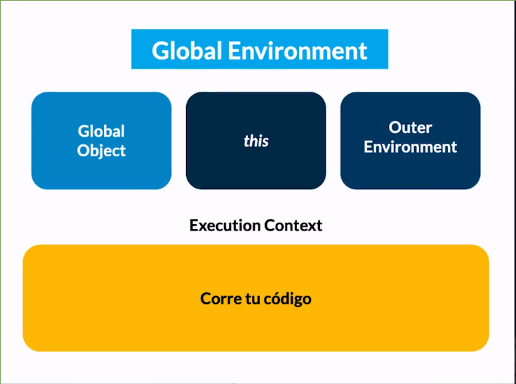
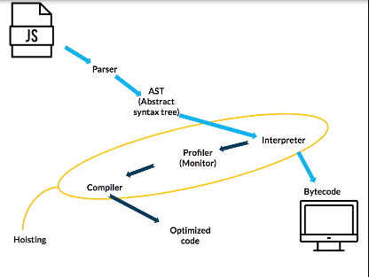
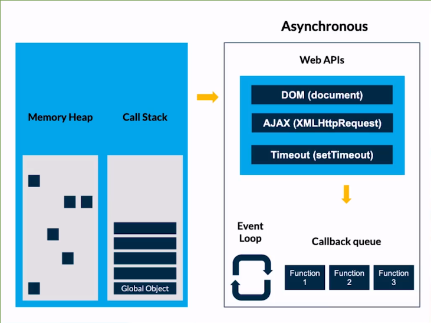

[//]: # @param group $$ JavaScript
[//]: # @param title $$ Curso de JavaScript Engine (V8) y el Navegador
[//]: # @param author $$ Iván D. Sánchez

<title>JavaScript Engine (V8)</title>

# Curso de JavaScript Engine (V8) y el Navegador

## Historia de JavaScript

- HTTP (1991)
- HTML1 (1992)
- MOSAIC (1992- 1993)
- NETSCAPE (1994)
- JS 1995 -1996
- Inicialmente solo se podia consumir informacion
- Brendan Eich 1995 -> creador js -> antes mocha (netscape 1995, se hizo en 2 semana) -> luego en livescript 1995 -> JS 
- Internet explorer 1995 hace ingenieria inversa y crea JScript 
- 1997 ECMA llega a estandarizar JS
- v8 2008 -> Motor de JS que corre en el navegador
- 2009 -> nodeJS Js de lado del backend bajo V8
- frameworks 2010
- ES6 = 2015 

## ECMAScript
- Especificacion estandarizada por ECMA international
- Creada para estandarizar JS
- Año 2020 ES9

## ¿Cómo funciona el JavaScript Engine?

JavaScript Engine: Es el motor de JS, siempre corre en el navegador.
Su función es interpretar el código JavaScript y convertirlo a Machine Code para que la máquina pueda entenderlo.

Just in time compiler: Es la compilación en tiempo real que sucede en el proceso del Engine.

## V8, el JavaScript Engine de Chrome

Cada navegador tiene un motor diferente, pero como V8 es open source otros navegadores están migrando a él.

V8 ayuda a que JS corra de manera más rápida, con esto podemos crear aplicaciones más robustas y rápidas.
-V8 nació para que Google Maps funcione de manera óptima.

La razón del nombre “motor V8” y el logo se debe a la identificación con los motores V8 de los automóviles.
.
Un motor V8 en el automovilismo es un motor montado en el cárter con dos bancos de cuatro cilindros, que comparten cigüeñal, formando una “V”.

## Profundizando en el Engine

- Una vez el motor recibe un archivo JS  genera un Global enviroment
- En el Global enviroment se genera un Global object que es igual a window
- También se genera una variable this
-  this depende del contexto, en el entorno global this es igual al objeto global
- Ya despues de generado el entorno global, comienza  a correr nuestro código en el contexto de ejecucion, a través de un stack de tareas apiladas

 

- Una vez que el motor comienza a interactuar con el navegador, genera  un parseo del documento completo, para encontrar las keywords y las pasa al AST (abstract syntax tree)

[AST Explorer](https://astexplorer.net/) 

- Una vez se tiene el AST, el motor lo pasa al interpreter para retornar  bytecode puede ser entendido por  la máquina
- Si en la interpretación del AST ve mucho código que se repite y que se puede optimizar entra el profiler o monitor, y optimiza el codigo y lo regresa compilado como bytecode para que la máquina lo pueda comprender. Es justo en este paso donde aparece el hoisting, donde el motor en su función de optimizacion reinterpreta el código de una mejor forma y se pueden presentar errores de programacón.
- El hoisting solo sucede con variables y funciones que se mandan a llamar.

 
 

## Ejemplo de Objeto global y hoisting

- this es una variable que hace referencia a window

	windows == this  / / true

**Hoisting**
- Si  llamamos una variable antes de ser declarada, el compiler crea la variable en la memory heap y la inicializa como undefined
- En el caso de las funciones es distinto,  primero mandamos a llamar a las funciones antes de ejecutarlas.
- El hoisting a veces funciona pero no tenemos control de las variables que se van a cambiar
- Si llamamos a una constante (const) antes de inicializar retorna un error de tipo: Uncaught ReferenceError, que corresponde a variables que son referenciadas pero no pudieron ser capturadas

## Código de ejecución

- Corresponde al comportamiento de JS
- Single threads -> solo una tarea a la vez

###  Memory Heap

- Donde se almacena los valores de las variables y las funciones
- Se destina un espacio en memoria para las variables.
- La información en el memory heap, No se guarda de manera lineal 

Los objetos en JS (objetos, arrays, funciones y básicamente todo lo que no sea un valor primitivo) se almacenan en la parte de memoria que de llama Memory Heap. Los valores primitivos son almacenados en el Call Stack, dentro del Scope (Contexto de Ejecución de la función que tenga acceso a esa variable). Acceder al Call Stack es mucho más rápido que al Heap. Además, en el Call Stack también se guardan las referencias, “como si fueran valores primitivos”. Cuando se asigna una variable a otra y esta apunta a un objeto, se copia la referencia, como si fuera un valor primitivo. Si el objeto tiene atributos como un número por ejemplo, este se guarda en la posición de memoria reservada para ese objeto. Los objetos también pueden tener más objetos dentro. En ese caso, dentro de la posición de memoria de ese objeto se va a guardar una referencia a otra posición de memoria

### Callstack

- Como se mandan a llamar las variables y las funciones
- Las tareas en el callstack se apilan de abajo hacia arriba.
- Se llaman de la última que mandamos a llamar hacia abajo
- En la base de la pila reposa el Global Object
- Si una función llama a otra, la pone encima de la pila.
- Se ejecuta una tarea a la vez (sincronía)
- Una vez que se van ejecutando las tareas se van retirando de la pila
- Al ejecutar todas las tareas se retira el Global object.

**Ejercicio**
Inspector -> sources -> snippets -> new

	function restarDos(num){
	    return num-2;
	}
	function calcular(){
	    const sumartotal = 4+5;
	    return restarDos(sumartotal);
	}

	debugger;

	calcular();

ctrl + enter

Si vemos en call stack tenemos (anonymous) que corresponde al objeto global.

## Garbage Collection

- Hay lenguajes de programación donde el manejo de la memoria es responsabilidad del desarrollador quien decide cuando dejar de ocupar variables y funciones que no se están utilizando.
- Mark and sweep -> una vez hay variables o funciones que estan en el root set que no se estan utilizando se hace un mark y luego un sweep de las cosas que ya no se están ocupando
- Cuando re-inicializamos una variabe, el garbage collector se encargar de limpiar el espacio en memoria donde se guardaban los valores que antes tenía la variable.
- Hay momentos en el que podemos llevar nuestro memory heap a un overstack que haria crashear la página, por ejemplo un loop infinito.

## Stack overflow

- Es cuando se desborda de tareas el call stack
- Chrome restringió el limite de operaciones antes de ocupar toda la memoria para dejar de ejecutar el código
- Puede suceder con loops infinitos o funciones recursivas.

## JavaScript Runtime

Javascript es sincrono y hace una sola cosa a la vez, si hay una rutina que demore demás la podemos enviar para que se ejecute de forma asincrona.

## Asincronía

## Recapitulación
- Que es JS engine
- Que es y cómo funciona V8
- Qué es el entorno y objeto global
- Hoisting y como evitarlo
- Como funciona el JIT compiler (Just in time)
- sincronia y asincronia de Javascript
 - Memory heap y callstack
 - Que es stack overflow
 - como funciona JS runtime
 
##  Examen

- ¿En qué año nace JavaScript?

	1995	
		
- ¿Cuál es el navegador que creó JavaScript?

	Netscape

- ¿Cuál fue el nombre de la 1er versión de JavaScript?

	Mocha

- ¿Con qué propósito se crea JavaScript?

	Para poder crear páginas más dinámicas

- ¿Cuál es el nombre del creador de JavaScript?

	Brendan Eich

- El motor de JavaScript V8 es lanzado en el 2008.

	Verdadero

- ¿Qué es y qué hace un motor de JavaScript?

	Es un intérprete, que compila código JavaScript a Bitecode

- ¿Qué es hoisting?

	Es el proceso que realiza el motor de JavaScript de colocar las declaraciones de variables y funciones hasta arriba de nuestro código, almacenándolas así previamente en memoria dentro de un contexto de ejecución.

- El proceso de hoisting solo sucede con dos palabras reservadas de JavaScript, ¿cuáles son?

	var y function

- ¿Qué navegador inventó V8 Engine?

	Chrome

- ¿Cuál fue la aplicación web que tuvo mayor provecho de V8 como motor de JavaScript?

	Google maps

- Cuando hablamos de window, ¿a qué nos referimos?

	Al objeto global

- ¿Qué significa AST?

	Abstract syntax tree

- Al igual que window como objeto global, ¿qué otro elemento se crea como referencia a este mismo objeto en el contexto global?

	Se crea la variable this, que hace referencia al objeto global window

- ¿Qué es un stack overflow?

	Es cuando tenemos más de las tareas de las que podemos procesar en el call stack

¿A qué nos referimos cuando decimos que JavaScript es "Synchronous"?

	Nos referimos a que JavaScript solo puede procesar una tarea a la vez.

¿A qué nos referimos cuando decimos que JavaScript se comporta como "Asynchronous"?

	A que hay ciertas funciones que nos ayudan a que JavaScript puede trabajar tareas de forma simultánea.

- ¿Qué es el Memory Heap?

	Es el lugar donde se guardan objetos y funciones en bloques de memoria de forma arbitraria y sin un orden, los cuales pueden ser usados múltiples veces a través de una referencia única.

- ¿Cómo se llama el algoritmo que nos ayuda a limpiar nuestra memoria, cuando tenemos valores de variables que ya no estamos utilizando?

	Garbage collector

- ¿Qué función realiza el EventLoop?

	Es una especie de "watcher"  u observador que mueve las tareas del callback queue hacía el call stack  una vez que está vacio para que sean ejecutadas.
