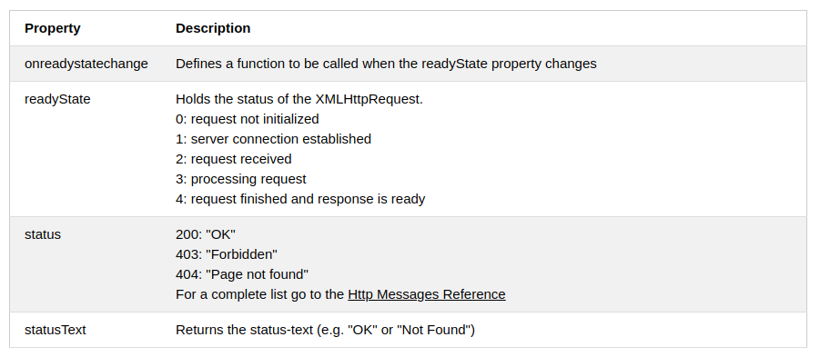

[//]: # @param group $$ JavaScript
[//]: # @param title $$ 2- Asincronismo
[//]: # @param author $$ Iván D. Sánchez

# Asincronismo JS

## Introducción al asincronismo

## Callbacks

un callback es una función que al crearla le pasamos como parámetro una segunda función y de esta forma al momento de hacer una petición esta se ejecuta después de este llamado.

	function sum(num1, num2) {
	  return num1 + num2;
	}

	function calc(num1, num2, callback){
	    return callback(num1, num2);
	}

	console.log(calc(2,2,sum));

	function date(callback){
	  console.log(new Date)
	  setTimeout(function (){
	    let date = new Date;
	    callback(date)
	  },3000)
	}

	function printDate(dateNow){
	  console.log(dateNow)
	}

	date(printDate);
	
## Peticiones a APIs usando Callbacks

Para hacer peticiones hacia algún servicio en la nube, url, api, ftp, archio  desde node es necesario instalar

	npm install xmlhttprequest --save-dev
	
Para instanciar la dependencia

	let xmlhttprequest = require('xmlhttprequest').XMLHttpRequest;
	
- fetch está en ECMASCRIPT 6 pero funciona con promesas, vamos a usar callback para comprender la evolución de este tipo de peticiones.
- XMLHTTPRequest fué  creado por Microsoft.
- Los parámetros que recibe `xhttp.open` 
	- El método (GET, POST, ...) -> se pasa en string
	- URL
	- Asincronismo (true, false) por defecto está en true
- Ahora vamos a estar escuchando por esta conexión con xhttp.onreadystatechange 

 

- Cuando tenemos un readyState de 4 y un status 200 ya podemos pasarle el callback
- Este callback maneja la estructura error first así que el primer valor que recibe es el error, y el segundo es el resultado
- El resultado es una respuesta en testo que debemos parsear a JSON

**script**

	let xmlhttprequest = require('xmlhttprequest').XMLHttpRequest;

	function fetchData(url_api, callback) {
	  const xhttp = new XMLHttpRequest();
	  xhttp.open('GET', url_api, true);
	  xhttp.onreadystatechange() = function(event) {
	    if (xhttp.readyState === 4) {
	      if (xhttp.status === 200) {
		callback(null, JSON.parse(xhttp.responseText));
	      } else {
		const error = new Error('Error: ' + url_api);
		return callback(error, null);
	      }
	    }
	  };
	  xhttp.send();
	}

## Múltiples Peticiones a un API con Callbacks

	let XMLHttpRequest = require('xmlhttprequest').XMLHttpRequest;
	const API = 'https://rickandmortyapi.com/api/character/';

	function fetchData(url_api, callback) {
	  let xhttp = new XMLHttpRequest();
	  xhttp.open('GET', url_api, true);
	  xhttp.onreadystatechange = function(event) {
	    if (xhttp.readyState === 4) {
	      if (xhttp.status === 200) {
		callback(null, JSON.parse(xhttp.responseText));
	      } else {
		const error = new Error('Error: ' + url_api);
		return callback(error, null);
	      }
	    }
	  };
	  xhttp.send();
	}

	fetchData(API, function(error1, data1) {
	  if (error1) return console.error(error1);
	  fetchData(API + data1.results[0].id, function(error2, data2) {
	    if (error2) return console.error(error2);
	    fetchData(data2.origin.url, function(error3, data3) {
	      if (error3) return console.error(error3);
	      console.log(data1.info.count);
	      console.log(data2.name);
	      console.log(data3.dimension);
	    });
	  });
	});

## Implementando Promesas

- Algo va a suceder ahora, en el futuro o nunca.
- Los dos argumentos de una promesa son resolve y rejejct. 
- resolve en caso que la promesa se resuelva
- reject en caso que la promesa sea rechazada.

**Estructura básica de una promise**

	const somethingWillHappen = () => {
	  return new Promise((resolve, reject) => {
	    if (false) {
	      resolve('Success!!!');
	    } else {
	      reject('Fatal, it does not work');
	    }
	  });
	};

	somethingWillHappen()
	  .then((response) => console.log(response))
	  .catch((err) => console.error(err));

	const somethingWillHappen2 = () => {
	  return new Promise((resolve, reject) => {
	    if (false) {
	      setTimeout(() => {
		resolve('Success, with time out!!!');
	      }, 2000);
	    } else {
	      const error = new Error('This is an error using new Error()');
	      reject(error);
	    }
	  });
	};

	somethingWillHappen2()
	  .then((response) => console.log(response))
	  .catch((err) => console.error(err));

Run multiple promises at once. Using Promise.all receives an array with promises and return in the resolve an array of responses, but in case of error return a single error because when one happens this break the execution

	Promise.all([somethingWillHappen(), somethingWillHappen2()])
	  .then((response) => console.log('Array of results', response))
	  .catch((error) => console.error(error));

## async/await

- Nace en ecmascript 7
- El código se comporta como sincrono

	const doSomethingAsync = () => {
	  return new Promise((resolve, reject) => {
	    true
	      ? setTimeout(() => resolve('Do something async'), 3000)
	      : reject(new Error('Test Error'));
	  });
	};

	const doSomething = async () => {
	  const something = await doSomethingAsync();
	  console.log(something);
	};

	console.log('Before');
	doSomething();
	console.log('After');

**Manejo de errores con async/await**

	const anotherFunction = async () => {
	  try {
	    const something = await doSomethingAsync();
	    console.log(something);
	  } catch (err) {
	    console.log(err);
	  }
	};

	console.log('Before 1');
	anotherFunction();
	console.log('After 1');
	
##	 Callbacks Vs Promesas Vs Async/Await

### callbaks
**pros**

- Son interpretados por cualquier navegador

**contras**
- callback hell

### promises
**pros**
- Mejor sintaxis
- Mas facil de enlazar
- una mayor capacidad de trabajar con asincronismo

**contras**
- requiere un polyfill para traspilar el código .
- No maneja excepciones maneja el error al final

### async/await

**pros**

- Mas faciles de leer
- Espera que algo suceda

**contras**
- Requiere un polyfill

## Examen

- ¿Las promesas resuelven un principal problema de las callbacks?

	Callback hell

- ¿Para qué nos sirve el método XMLHttpRequest?

	
	Nos permite realizar solicitudes HTTP de una forma muy fácil

- ¿El estado 4 de xhttp.readyState hace referencia?

	COMPLETED, la operación esta terminada

- ¿Para qué utilizamos `JSON.parse(xhttp.responseText)`?

	
	Convertir una respuesta de texto en un objeto iterable

- ¿La recomendación de la comunidad para anidar callbacks es?

	Un máximo de 3 callbacks

- ¿Cuáles son los argumentos que recibe una promesa?

	resolve, reject

- ¿Cuál es la forma correcta de retornar un Error en reject?

	reject(new Error('Error))

- ¿Para qué nos sirve xhttp.status === 200?

	Verificamos que el estatus de la petición HTTP resuelva el estado 200

- ¿Para qué nos sirve el método "catch()"?

	Registrar la razón del rechazo

- ¿El método then() retorna?

	
	Promesa

- ¿Nos permite ejecutar una serie de promesas secuencialmente?

	Promise.all()

- ¿Nos permite definir una función así­ncrona?

	async

- ¿Expresión la cual pausa la ejecución de la función así­ncrona y espera la resolución de la Promise?

	await

- ¿Cual es el método recomendando por la comunidad para manejar asincronismo en JavaScript?

	async/await

- ¿Cómo aseguramos manejar los errores asincrónicos correctamente?

	
	try{...código}catch(error){...código}

	
	