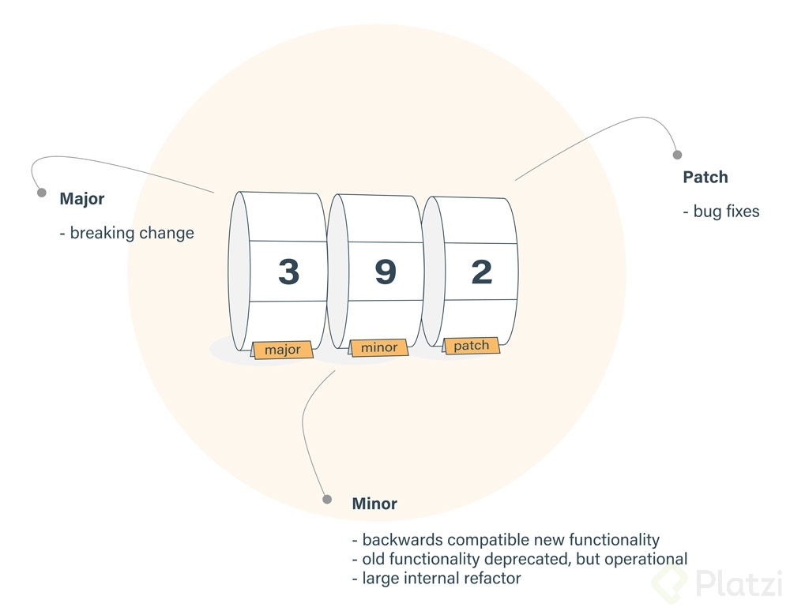

[//]: # @param group $$ JavaScript
[//]: # @param title $$ NPM
[//]: # @param author $$ Iván D. Sánchez

# Curso de Gestión de Dependencias y Paquetes con NPM

- NPM -> Es el gestor de paquetes mas popular que tiene JS, recursos para desarrolladores
- Node Package Manager
- También podemos crear paquetes para compartirlos con la comunidad
- [NPM](https://www.npmjs.com/)
- En la página se puede consultar el estado de la dependencia, su ultima versión, forma de instalación y uso.

## windows

Se debe instalar NODE desde la página nodejs.org

## update NPM

    npm install -g npm@latest
    sudo npm install -g npm

## Iniciar un proyecto

- inicializar git `git init`

- Inicializar proyecto `npm init` -> se crea el archivo package.json

[Tipos de licencias](https://universoabierto.org/2015/12/20/introduccion-a-los-diferentes-tipos-de-licencias-de-codigo-abierto-y-software-libre/)

En autor se puede indicar tambien el correo del autor para efectos de contacto.

inicialización rápida

    npm init -y

Configuración de variables por defecto para archivo de inicialización

    npm set init.author.email "cosmosoft.soluciones@gmail.com"
    npm set init.author.name "@cosmosoftroot"
    npm set init.license "MIT"

    npm init -y

## Instalación de dependencias

Antes de instalar asegurarse con pwd que estamos parados en la carpeta raiz del proyecto.

Por defecto, si no incluimos flags en la instalación, se salva como dependencia core del proyecto (production)

    npm install moment

Equivale a

    npm install moment --save
    npm install moment -S

Para instalar como dependencia de desarrollo (development)

    npm install moment --save-dev

Al instalar la primer dependencia se crea la carpeta node_modules, que es donde se almacenan los módulos que vamos instalando. No va a producción, ni al repositorio. Se debe siempre ignorar (.gitignore)

Ahora vamos a instalar date-fns como dependencia de desarrollo

    npm install date-fns --save-dev

Instalación de nodemon como dependencia global

    npm install nodemon -g

Consultar todas las dependencias globales instaladas

    npm list -g --depth 0

Instalacion de forma opcional un paquete

    npm install eslint -O

este ultimo nos puede retornar `npm fund` para solicitar financiamiento

NPM decidió agregar un nuevo comando: npm fund que brindará más visibilidad a los usuarios de npm sobre qué dependencias buscan activamente formas de financiar su trabajo .
.
Este comando recupera información sobre cómo financiar las dependencias de un proyecto determinado.
.
Si no se proporciona el nombre del paquete, enumerará todas las dependencias que buscan financiación en una estructura de árbol en la que se enumeran el tipo de financiación y la URL a visitar.
.
Si se proporciona un nombre de paquete, entonces intenta abrir su url de financiación utilizando el --browser parámetro de configuración.

## Instalación de dependencias con force

Una forma de simular una instalación para conocer el número de paquetes y el output de la instalación es utilizando --dry-run

    npm install react --dry-run

Muchos de los paquetes que encuentras en NPM están ligados a otros paquetes y existe por lo tanto una “relación de dependencia” por así decirlo, que pudiera generar conflictos. Entonces, tú al usar npm install-force le estas diciendo a NPM que no importa cual sea la situación con estos paquetes quieres que aún así los instale.

    npm install webpack -f -D
    npm install webpack --force --save-dev

si por algun motivo olvidamos enviar una dependencia a desarrollo y lo arreglamos desde el package.json entonces debemos correr `npm install`

Si queremos instalar una version en especial

    npm install json-server@0.15.0

## Actualizar y eliminar paquetes

Listar los paquetes de un proyecto

    npm list

Ver paquetes que estan desactualizados

    npm outdate

Ver el log del proceso que se corre al buscar paquetes desactualizados.

    npm outdate --dd

Actualizar los paquetes desactualizados

    npm update

Update de un paquete en particular

    npm install json-server@latest

Eliminar un paquete. Se elimina tambien del package.json
npm uninstall json-server
Eliminar un paquete sin retirarlo del package.json

    npm uninstall webpack --no-save

node npm es una extensión para vscode que permite analizar el archivo de package.json y lo confronta contra node-modules para saber si hay errores de instalación o pendientes de instalación

## Package lock y el uso los símbolos ^ y ~

Fork - Archivo de react-base de @gndx

git@github.com:cosmosoftroot/react-base.git

**Clonar e ingresar a la carpeta**

    git clone git@github.com:cosmosoftroot/react-base.git && cd react-base && code .

^ = Si mantenemos el caret dentro de la configuración de nuestro package estamos garantizando que cuando realicemos una actualización o tengamos un cambio que podamos realizar, vamos a hacer actualización de los cambios menores y de los parches o bug fixes.
Para quedarnos en una sola versión eliminamos el caret.

~ = Establece que vamos a recibir actualizaciones o cambios solamente de los cambios que son parches o bug fixes.se

## Ejecutar tareas

Los scripts NPM: Son comandos que podemos establecer para poder ejecutar desde la consola. Estos nos van a dar una serie de salidas según sea el caso.

Podemos crear la cantidad de scripts que necesitemos. Estos scripts van a poder correr de forma nativa dentro de nuestra terminal.

**Concatenar 2 comandos**

    "deploy": "npm run format && npm run build"

## Solución de problemas

Cuando estés trabajando con proyectos que están usando NPM te vas a topar con una gran cantidad de posibles errores que vas a tener. Estos errores pueden ser desde la configuración, pueden ser desde el sistema operativo, espacios, no haber configurado correctamente tu GitHub, no haber establecido bien los datos del package, haber dejado un typo u algún elemento extraño dentro de esta configuración así como una serie de errores que pueden generarse, que no están ligados directamente a NPM.

Para detectar errores podemos habilitar el **modo verbose** para ver lo que sucede paso a paso `--dd`

**ejemplo**
npm run build --dd

Para limpiar el cache de la carpeta node_modules

    npm cache clean --force

y para verficar el cache

    npm cache verify

Si hay algun archivo corrupto o mal instalado lo mejor es eliminar node_modules

    rm -rf node_modules

y volver a correr `npm install`

Otra forma de eliminar la carpeta es instalando de manera global rimraf

    sudo npm install -g rimraf

y luego para borrar

    rimraf node_modules

## Seguridad

Podemos revisar las vulnerabilidades de nuestro proyecto con:

    npm audit

    npm audit --json

En caso de tener vulverabilidades, se recomienda usar el comando:

    npm audit fix

ejemplo de actualización de una dependencia a profundidad 2

    npm update eslint-utils --depth 2

Una herramienta para garantiza la seguridad

[snyk](https://snyk.io/)

## Publicar un paquete

### Crear un paquete para NPM

**package.json**

    {
      "name": "cosmos-messages",
      "version": "1.0.0",
      "description": "Random messages",
      "main": "src/index.js",
      "scripts": {
        "test": "echo \"Error: no test specified\" && exit 1"
      },
      "author": "@cosmosoftroot <cosmosoft.soluciones@gmail.com>",
      "license": "MIT",
      "keywords": [
        "JavaScript",
        "NPM",
        "nodeJS"
      ],
      "bin": {
        "cosmos-msg": "./bin/global.js"
      },
      "preferGlobal": true
    }

**./src/index.js**

    const messages = [
      'Hello world',
      'I don\'t have Coronavirus',
      'Zombie apocalypse',
      'I am JavaScript Developer',
      'Send nudes please'
    ];

    const randomMsg = () => {
      const message = messages[Math.floor(Math.random() * messages.length)];
      console.log(message);
    };

    module.exports = { randomMsg };

**./bin/global.js**

    #!/usr/bin/env node

    let random = require('../src/index.js');

    random.randomMsg();

### Publicar un paquete en NPM

- Ubicarnos en la raiz del proyecto para probar de forma local el paquete que vamos a publicar

  sudo npm link

- Con `link` hacemos una referencia en este paquete hacia lo que lo pueda instalarlo de forma global.

- Hay otra forma de instalarlo `sudo npm install -g`+ ubicación de la carpeta raíz del proyecto

  sudo npm install -g /home/cosmosoftroot/devs/cannabits/npm/cosmos-msg

Cuando el paquete ya este listo, debemos tener una cuenta en https://www.npmjs.com/ antes de subirlo

[Packages and modules | npm Documentation](https://docs.npmjs.com/packages-and-modules/)

- Ahora vamos a loguearnos desde la terminal con el comando `npm adduser`
- Al insertar el usuario y password nos pide el email público que registramos en npm
- Ahora públicamos el paquete en nuestro repositorio con el comando `npm publish`
- Verificar el nombre del paquete antes de publicar, no debe coincidir con uno que ya exista
- Si se acabó de crear la cuenta es importa contestar el correo de verificación del correo antes de publicar.

### Paquetes privados

- Ahora el paquete ya está en NPM
- Debemos cumplir con un mínimo de standart para que el paquete esté publicado.
- El paquete debe tener un buen README.md
- También es necesario tenerlo conectado a un repositorio
- Crear el repositorio en GitHub, hacer push y luego en el package `npm init`para actualizar el package.json.
- Antes de volver a publicarlo vamos a ejecutar un nuevo comando, para modificar la versión, en este caso fué un parche

  npm version patch
  npm version minor
  npm version major

- Esto automáticamente hace un cambio en el package.json

- y ahora si `npm  publish`

- Podemos usar npm enterprise para tener proyecto y repositorios privados para compartir con nuestro equipo de desarrolladores.

## Examen

- ¿Cuál es el comando que nos permite inicializar nuestros proyectos en git?

  git init

- ¿Cuál es el comando que nos permite inicializar nuestros proyectos con npm?

  npm init

- ¿Qué funcionalidad tiene el archivo 'package.json'?

  Contiene la información general del proyecto: scripts, dependencias y configuraciones de un proyecto.

- ¿Cuál es el comando para agregar el nombre del autor a la configuración por defecto de NPM?

  npm set init.author.name "example_user"

- ¿Para qué se usa el comando 'npm init -y'?

  Establece la configuración por defecto para el archivo package.json

- ¿Para quá nos sirve el flag '--save'?

  Instala y agrega la entrada a las dependencias del archivo package.json

- ¿Para qué nos sirve el flag '--save-optional o -O'?

  El paquete aparecerá en "optionalDependencies"

- Identifica cuál es una instalación de una dependencia global

  npm install -g nodemon

- ¿Cuál es comando que nos permite identificar las dependencias globales instaladas en nuestro sistema?

  npm list -g --depth 0

- ¿Cuál es el ejemplo correcto para instalar la versión más reciente de un paquete?

  npm install json-server@latest

- ¿Cuál es el comando para listar los paquetes y módulos instalados?

  npm list

- ¿Cuál es el alias de 'npm run start'?

  npm start

- ¿Cuál es el comando que nos permite ver todo el output en la terminal/consola?

  npm run build --dd

- ¿Cuál es el comando que nos permite ver una auditoría en formato json?

  npm audit --json

- ¿Cuál es el comando que nos permite publicar un paquete en npmjs.com?

  npm publish
