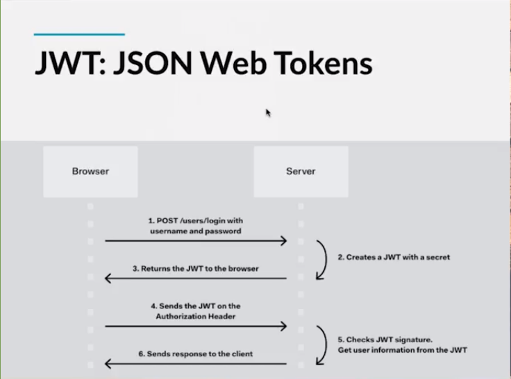
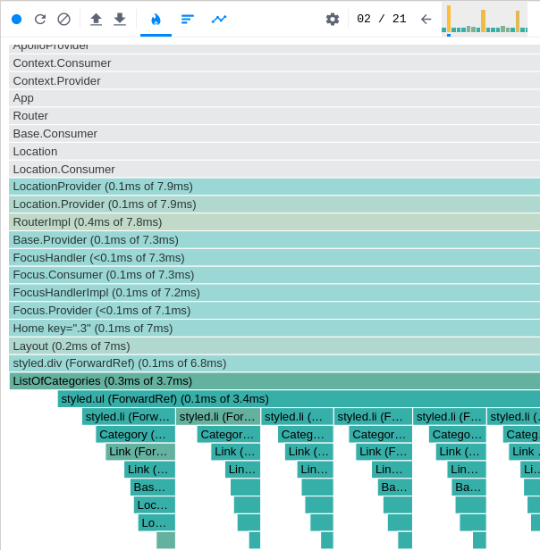
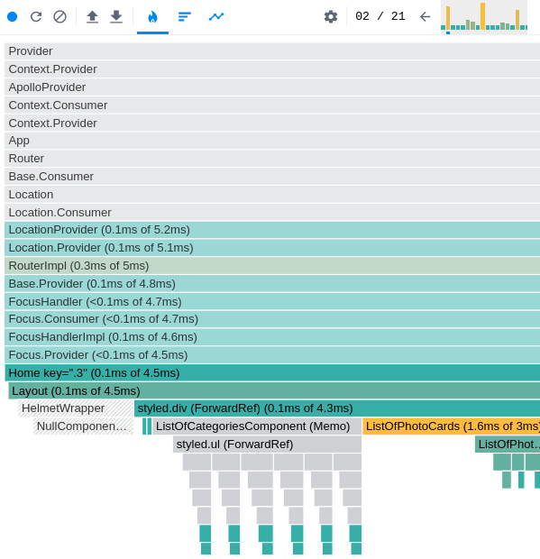
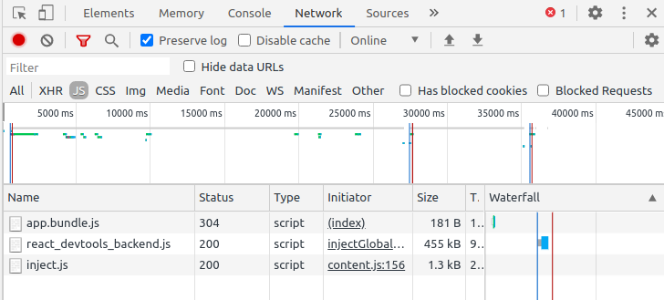
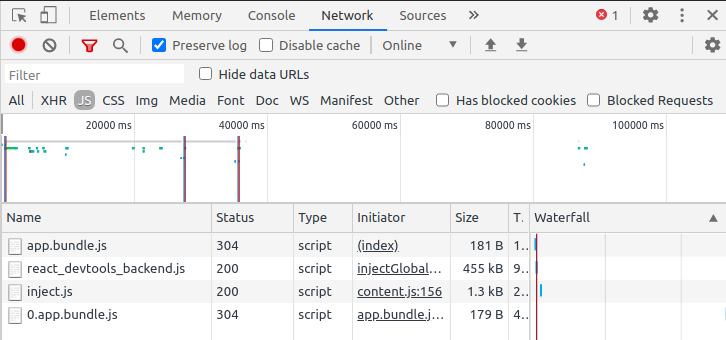
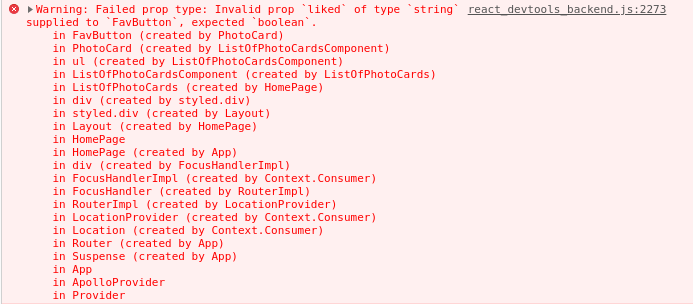
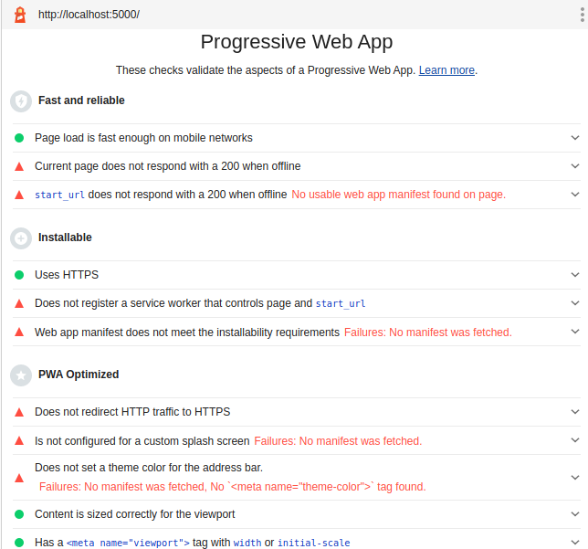
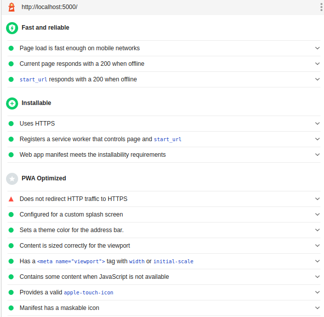
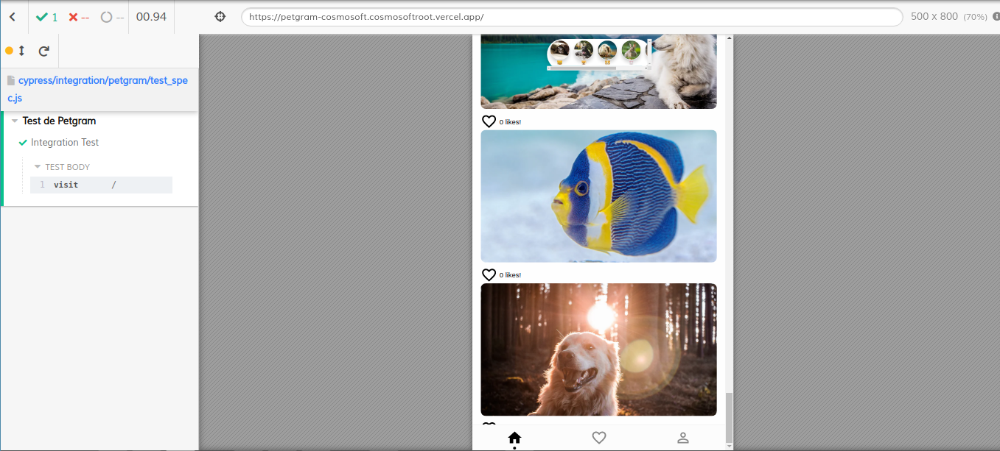

[//]: # @param group $$ React
[//]: # @param title $$ React Avanzado
[//]: # @param author $$ Iván D. Sánchez

# React Avanzado
React es una biblioteca de vistas creada por Facebook no solo para la web, también podemos hacer vistas nativas para el móvil, aplicaciones de terminal e incluso realidad virtual. React esta basado en componentes y programación declarativa.

**Basada en componentes**

- La UI atomizada en trozos mas pequeños. 
- Todo es un componente. 
- Reutilizable y predecible

**Declarativo** 

- No es imperativo.

**¿Por qué debes seguir profundizando en tus conocimientos de React?**

- Actualmente es la tecnología más demandada del mercado.
- Divide el código utilizando React.lazy.
- Render props.
- Hooks personalizados.
- Comparte la lógica con componentes de orden superior.


## Proyecto y tecnologías que usaremos

En este curso realizaremos una aplicación muy parecida a Instagram, llamada petgram. Tendremos nuestras rutas, gestión de usuarios y likes.

**Stack del proyecto**

Utilizaremos como empaquetador y transpilador:

- Webpack
- Babel

Estilado con CSS en JS con:

- styled-components

Como linter utilizaremos:

- Standard JS

Para fetching (obtención) de datos:

- GraphQL
- React Apollo

Para el enrutado de la SPA utilizaremos:

- Reach Router

Para las buenas prácticas utilizaremos:

- Lighthouse
- Cypress

Por último haremos SEO, PWA y Deploy con:

- React Helmet
- Workbox
- Progressive Web App
- Deploy con Now

### Clonando el repositorio e instalando Webpack

Pasos para iniciar nuestro proyecto:

- **Paso 1:** Vamos a clonar el repositorio desde 


	git clone git@github.com:midudev/curso-platzi-react-avanzado.git 
	
	npm init -y
	
	
- **Paso 2:** Vamos a instalar webpack y webpack-cli como dependencias de desarrollo con: 


	npm i webpack webpack-cli --save-dev 
	
	


- **Paso 3:** Crearemos una carpeta llama src y dentro de ella un archivo index.js en el cual colocaremos solo un 


	console.log('Empezamos el curso!').


Confirmar el funcionamiento de webpack

	
	./node_modules/.bin/webpack src/index.js


Ejecutar el bundle

	node dist/main.js 
	

- **Paso 4:** Crearemos en el root de nuestro proyecto un archivo `webpack.config.js` el cual tendrá toda la configuración de webpack

- **Paso 5:** Instalaremos html-webpack-plugin con: 


	npm i html-webpack-plugin --save-dev
	
- The `HtmlWebpackPlugin`  simplifies creation of HTML files to serve your webpack bundles. This is especially useful for webpack bundles that include a hash in the filename which changes every compilation. You can either let the plugin generate an HTML file for you, supply your own template using lodash templates, or use your own loader.

Lo importamos en `/webpack.config.js`


	const HtmlWebpackPlugin = require("html-webpack-plugin");
	module.exports = {
	  output: {
	    filename: "app.bundle.js",
	  },
	  plugins: [
	      new HtmlWebpackPlugin()
	    ],
	};


- Con esto ya obtenemos un index.html que importa app.bundle.js automáticamente
- `HtmlWebpackPlugin` recibe por parámetro un objeto que nos permite parametrizar la plantilla `.html` tal como el título, el favicon entre otros

- Configuramos el script de build en package.json para probar la ejecución de webpack


	//package.json

	"scripts": {
	    "build": "webpack"
	  }

Si observamos despues de la ejecución nos creo dos archivos en la carpeta de production `dist` el archivo `app.bundle.js` e `index.html`


- **Paso 6:** Instalaremos webpack-dev-server con: 


	npm i webpack-dev-server --save-dev

Con webpack-dev-server tenemos un servidor en ambiente de desarrollo para servir nuestra aplicación. Este servidor cuenta con live-reloading


- **Paso 7:** Añadiremos un nuevo script al package.json  `"dev": "webpack-dev-server"`.


	//package.json
	
	"scripts": {
	    "test": "echo \"Error: no test specified\" && exit 1",
	    "build": "webpack",
	    "dev": "webpack-dev-server"
	  },


### Instalación de React y Babel

En esta clase vamos a configurar React instalando las dependencias 


#### react y react-dom

**react** -> nos permite implementar React
**react-dom** -> nos permite renderizar nuestros componentes de React en el DOM

	
	npm i react react-dom
	
**Nota:** Siempre que necesitemos JSX debe estar instalado React

En src/ creamos un custom index.html, antes nos lo había creado automáticamente `HtmlWebpackPlugin`, ahora este archivos lo podemos utilizar como template para nuestro entrypoint.

Debemos configurar este archivo index.html como template en el plugin `HtmlWebpackPlugin` del archivo webpack.config.js

**webpack.config.js**
	
	const HtmlWebpackPlugin = require("html-webpack-plugin");
	module.exports = {
	  output: {
	    filename: "app.bundle.js",
	  },
	  plugins: [
	      new HtmlWebpackPlugin({
		  template: 'src/index.html'
	      })
	    ],
	};
		 
**index.js**
	
	import React from 'react'
	import ReactDOM from 'react-dom'

	ReactDOM.render('Hello World', document.getElementById('app'))

**index.html**

	..
	
	<div id="app"></div>
	..

	
#### Babel

Si le pasamos a ReactDOM un jsx nos va a retornar error al compilar la aplicación

	import React from 'react'
	import ReactDOM from 'react-dom'


	ReactDOM.render(<h1>Hello World</h1>, document.getElementById('app'))


 Instalamos Babel para poder transpilar código jsx a JavaScript Vanilla con: 
 
 	npm i @babel/core @babel/preset-env babel-loader @babel/preset-react --save-dev
 	
**@babel/core** -> El encargado de transpilar el código

**@babel/babel-loader** -> Corresponde al loader que utilizará wepback para poder usar babel  

**@babel/preset-env** -> Permite transpilar basadas en la utltima version de ECMAScript. Podríamos configurar que navegadores vamos a soportar. 

**@babel/preset-React** ->  Permite transpilar React a Javascript
 
 
Ahora añadiremos en nuestro webpack.config.js lo siguiente:

	const HtmlWebpackPlugin = require("html-webpack-plugin");
	module.exports = {
	  output: {
	    filename: "app.bundle.js",
	  },
	  plugins: [
	    new HtmlWebpackPlugin({
	      template: "src/index.html",
	    }),
	  ],
	  module: {
	    rules: [
	      {
		test: /\.js$/,
		exclude: /node_modules/,
		use: {
		  loader: "babel-loader",
		  options: {
		    presets: ["@babel/preset-env", "@babel/preset-react"],
		  },
		},
	      },
	    ],
	  },
	};

Hasta este punto ya podemos utilizar Babel y React


### Linter, extensiones y deploy con Now

En esta clase haremos que el desarrollo sea más ágil y correcto siguiendo los siguientes pasos:

Vamos a instalar StandardJS como dependencia de desarrollo con: 

	npm i standard --save-dev 
	
StandardJS nos va a servir de Linter para una mejor escritura, tiene reglas específicas tanto para JS como para React

Agregaremos un nuevo script en nuestro `package.json` 

	"lint": "standard"

Vamos a configurar una propiedad en `package.json` para excluir del linter algunos archivos

	"standard": {
	    "ignore": [
	      "/api/**"
	    ]
	  }

Ahora vamos integrar el editor con el linter para cargar las reglas para "eslintar", con esto le indicamos al lint de donde obtener el archivo de configuración

	//package.json
	
	"eslintConfig": {
	    "extends": ["./node_modules/standard/eslintrc.json"]
	  }
	  	  
Lo que hicimos en package.json equivale a usar `.eslintrc`

Con esta configuración el Linter va a detectar los errores a la medida que escribimos código	

Ahora debemos tener lo siguiente en nuestro editor de código para que funcione todo al pie de la letra:

	- Tener instalada la extensión ESLint
	- Si quieres que al guardar los cambios se formatee tu código deberás tener instalada la extensión Prettier
	- Tener las siguientes configuraciones en VSCode (settings, ctrl+,):
		- Format On Save: false -> porque puede generar conflicto entre el formateo del editor y el linter
		- Prettier: Eslint Integration: true
		- Eslint: Auto Fix On Save: true


Si hubo inconvenientes en VSCode con la siguiente validación

- Format On Save: false
- Prettier: Eslint Integration: true
- Eslint: Auto Fix On Save: true

Instalé las dependencias de desarrollo

	npm i prettier eslint-config-prettier eslint-plugin-prettier -D

Y configure manualmente en Open Settings (settings.json) ubicado en la parte superior derecha del editor (Tiene forma de {} o como un archivo" y revisan si su archivo de configuración tiene las siguiente lineas y sino las insertan

	"editor.codeActionsOnSave": {
		"source.fixAll.eslint": true
	      },
	"eslint.format.enable": true,
	"prettier.eslintIntegration": true,

`eslint.autofixonsave: true` esta obsoleto por eso debe reemplazarse con `editor.codeActionsOnSave`

**Now**

Vamos a hacer deploy en `now` tanto del servidor como del frontend


**deploy server**

Ingresamos a /api que es nuestro backend

	cd api

Loguearnos en now	

Instalar now de manera global 

	sudo npm i -g now
	
Configurar el archivo de `now.json` y cambiar el nombre y alias de la API que debe ser único

**api/now.json**

	{
	  "version": 2,
	  "name": "petgram-server-cosmosoft",
	  "alias": ["petgram-api"],
	  "builds": [{ "src": "index.js", "use": "@now/node" }],
	  "routes": [{
	    "headers": {
		"Access-Control-Allow-Origin": "*",
		"Access-Control-Allow-Methods": "GET, POST, PUT, DELETE, OPTIONS",
		"Access-Control-Allow-Headers": "X-Requested-With, Content-Type, Accept"
	    },
	    "src": "/.*", "dest": "index.js" }
	  ]
	}
	
Y ejecutamos `now` en la consola

	now
	
Nos devuelve un link de nuestra api en production.

**deploy frontend**

volvemos a la raiz y creamos un archivo now.json
	

**src/now.json**

	{
	    "version": 2,
	    "name": "petgram-cosmosoft",
	    "builds": [
		{
		    "use": "@now/static-build",
		    "src": "package.json"
		}
	    ],
	    "routes": [
		{
		    "src": "(.*).js",
		    "dest": "/$1.js"
		},
		{
		    "src": "(.*).json",
		    "dest": "/$1.json"
		},

		{
		    "src": "/.*",
		    "dest": "/index.html"
		}
	    ]
	}

y configuramos un nuevo script build en package.json

	"now-buid": "npm run build",
	
y corremos `now`

	now
	
## Creando la interfaz con styled-components

### ¿Qué es CSS-in-JS?

Antes la forma en la que construíamos nuestras aplicaciones era con HTML-centric:


	//HTML
	<button className='button button-red'>
		Click here!
	</button>
	
	//JS
	const button = document.querySelector('button')
	button.addEventListener('click', function () {
		doSomething()
	})
	
	//CSS
	.button {
		border-radius: 4px;
	}

	.button-red {
		background: red;
		color: #fff;
	}
	
Luego pasamos a JavaScript-centric:

	//JS
	render () {
		return (
			<button
				className='button button-red'
				onClick={doSomething}
			>
				Click here!
			button>
		)
	}
	
	//CSS
	.button {
		border-radius: 4px;
	}

	.button-red {
		background: red;
		color: #fff;
	}
	
Ahora hoy en día pasamos a CSS-in-JS nos permite no solo hacer el jsx si no colocar los estilos en el mismo JavaScript, de la siguiente manera:

	const Button = styled.button`
		border-radius: 4px;
		${props => props.accent && `
			background: red;
			color: #fff;
		`}


	render () {
		return (
			Click here!
		)
	}
	
Con CSS-in-JS no debemos preocuparnos por tener dos clases igual o por el Critical Path CSS. Tendremos un CSS mucho más óptimo.

Los styled-components son una de las nuevas formas de usar CSS en JavaScript moderno. Está basado en los CSS modules, una forma de escribir CSS que se enfoca el que el alcance de los estilos funcione por componente y no se filtren a ningún otro elemento de la página.

Los styled components se basan en crear componentes de carácter estético para hacer código más semántico y evitar los problemas de especificidad que trae el CSS tradicional.

Los styled components le permiten escribir CSS simple en sus componentes sin preocuparte por las colisiones de nombres de clase y haciendo uso del poder de JavaScript para manejar estilos con lógica (basado en props).

Nota: en styled components escribes CSS exacto, así que prácticamente todo lo que puedes hacer en CSS lo puedes hacer en styled components y se escribe igual.


### Creando nuestro primer componente: Category

Para crear nuestro primer styled-components debemos instalar la dependencia

	npm install styled-components
	
Luego de instalado vamos a modificar el entrypoint de la aplicación y vamos a crear el componente `src/App.js` para renderizar lo que queremos mostrar en nuestra aplicación

Al usar export nombrado damos consistencia al llamado de los componente en toda la aplicación, ya que en el import es obligatorio usar el mismo nombre correspondiente al objeto

	export const nombrado = () => {}

y se importa de la forma `import { nombrado } from 'filename'`


En cambio el export por defecto solo permite un solo objeto y este puede ser importado con cualquier nombre	...
	
	const anyName =()=>{
	
	}
	
	export default anyName
	
y se puede importar de la forma `import otherName from 'filename'`


**App.js**

	import React from 'react'

	export const App = () => {
	  return (
	    <h1>prueba</h1>
	  )
	}

**index.js**

	import React from 'react'
	import ReactDOM from 'react-dom'
	import { App } from './App'

	ReactDOM.render(<App />, document.getElementById('app'))


Y ahora vamos a crear la carpeta src/components/Category y el archivo index.js que será nuestro primer componente

	import React from 'react'

	const DEFAULT_IMAGE = 'https://i.imgur.com/dJa0Hpl.jpg'

	export const Category = ({ cover = DEFAULT_IMAGE, path, emoji = '?' }) => (
	  <a href={path}>
	    
	    {emoji}
	  </a>
	)

Ahora vamos con los styled component para el nuevo componente. En la misma carpeta del componente Category vamos a crear un archivo styles.js

**Nota:** Para que el código del styled-component esté mejor formateado en nuestro editor utilizaremos esta extensión vscode-styled-components.


### Creando ListOfCategories y estilos globales

Para crear nuestros estilos globales con styled-components haremos lo siguiente:

- Importar el método `createGlobalStyle` de from 'styled-components'
- Los estilos globales debe ser exportados como un componente para ser implementados en nuestra aplicación
- Importamos en App.js los estilo globales
- y pasamos el componente de estilos globales para su renderización


**src/GlobalStyles.js**

	import { createGlobalStyle } from 'styled-components'

	export const GlobalStyle = createGlobalStyle`
		html {
		        box-sizing: border-box;
		        font-family: -apple-system, BlinkMacSystemFont, 'Segoe UI', Roboto, Oxygen, Ubuntu, Cantarell, 'Open Sans', 'Helvetica Neue', sans-serif;
		}
		
		*, *::before, *::after {
		        box-sizing: inherit;
		}
		
		ul, li, h1, h2, h3, p, button {
		        margin: 0;
		}

		ul {
		        list-style: none;
		}

		button {
		        background: transparent;
		        border: 0;
		        outline: 0;
		}

		body {
		        background: #fefefe;
		        height: 100vh;
		        margin: 0 auto;
		        max-width: 500px;
		        overscroll-behavior: none;
		        width: 100%;
		}

		#app {
		        box-shadow: 0 0 10px rgba(0, 0, 0, 0.05);
		        overflow-x: hidden;
		        min-height: 100vh;
		        padding-bottom: 10px;
		}
		
**App.js**

	import React from 'react'
	import { ListOfCategories } from './components/ListOfCategories'
	import { GlobalStyle } from './GlobalStyle'

	export const App = () => {
	  return (
	    <>
	      <GlobalStyle />
	      <ListOfCategories />
	    </>
	  )
	}

### Creando PhotoCard y usando react-icons

react-icons es una dependencia de production que nos permite acceder a una galeria de íconos

Instalación de react-icons

	npm install react-icons --save

En el GitHub de react-icons indican la forma de importar un icono a la aplicación [react-icons](https://react-icons.github.io/) 

Los íconos de react-icons admiten una prop `size` para el tamaño

Ejemplo de importación de Material Design

	import { IconName } from "react-icons/md";

	MdFavoriteBorder
	
	//Implementación 
	
	import { MdFavoriteBorder } from 'react-icons/md'
	
	<MdFavoriteBorder />
	
**Tip:** Para que las imagenes siempre tengan la misma relación de aspecto  es utilizar un padding de 56.25% esto tendrá una relacion de aspecto 16:9


`&` Selector anidado de styled-components	

	export const Button = styled.button`
	  display: flex;
	  align-items: center;
	  padding-top: 8px;
	  & svg {
	    margin-right: 4px;
	  }
	`

En el anterior caso estamos dando estilos al svg que está dentro del button

### SVGR: de SVG a componente de ReactJS

En esta clase usaremos [maketext.io](maketext.io)  para crear nuestro logo y descargarlo en SVG. Posteriormente a esto utilizaremos SVGOMG[SVGOMG](https://jakearchibald.github.io/svgomg/)  

**SVGOMG**

- Permite optimizar nuestro logo y tener una mejor versión para usarla en nuestro proyecto.
- Le quita comentarios, etiquetas para hacerlo mas ligero

**SVGR**
Luego para convertir nuestro logo svg en un componente utilizaremos SVGR[SVGR](https://react-svgr.com/playground/) .
- Permite convertir SVG en componentes de React
- Debemos copiar nuestro código del SVG en **SVG INPUT** y a la derecha obtenemos nuestro componente para React
- En nuestro proyecto creamos un nuevo componente Logo/index.js y copiamos el código obtenido  con SVGR
- Renombramos el componente por el nombre con el que vamos a exportarlo: **Logo**
- Lo exportamos en App.js
- Le damos estilos con los styled - components, para ello creamos un styles.js y que exporta el estilo Svg
- importamos en el componente Logo los estilos y reemplazamos Svg en la etiqueta de inicio y final del elemento que corresponde


**styles.js**

	import styled from 'styled-components'

	export const Svg = styled.svg`
	    width: 220px;
	    margin-top: -30px;
	    margin-left: -10px;
	`

**Logo/index.js**

	...
	export function Logo (props) {
	  return (
	    <Svg>...</Svg>
	)}
	
### Creando animaciones con keyframes

Para poder hacer animaciones importamos en los styles.js de PhotoCard {keyframes} from styled-components

**Photocard/styles.js**	
	
	import styled, { keyframes } from 'styled-components'

	const fadeInKeyframes = keyframes`
	  from{
	    filter: blur(5px);
	    opacity: 0;  
	  }
	  to{
	    filter: blur(0);
	    opacity: 1;
	  }
	`
	export const Img = styled.img`
	  animation: 1s ${fadeInKeyframes} ease;
	  box-shadow: 0 10px 14px rgba(0, 0, 0, 0.2);
	  height: 100%;
	  object-fit: cover;
	  position: absolute;
	  top: 0;
	  width: 100%;
	`

Ahora vamos a crear una función para hacer reutilizable la animación, para ello debemos importar la utilidad { css } from 'styled-components'

A nuestra función  le vamos a pasar valores por defecto  para asegurarnos que la funcion sigua funcionando, en caso que no pasen parametros vamos a asegurarnos de pasar un objeto vacio por default.

La funcion retorna css

**PhotoCard/index.js**

	import styled, { keyframes, css } from 'styled-components'

	const fadeIn = ({ time = '1s', type = 'ease' } = {}) => (
	  css`animation: ${time} ${fadeInKeyframes} ${type};`
	)

	const fadeInKeyframes = keyframes`
	  from{
	    filter: blur(5px);
	    opacity: 0;  
	  }
	  to{
	    filter: blur(0);
	    opacity: 1;
	  }
	`
	export const Img = styled.img`
	  ${fadeIn()}
	  box-shadow: 0 10px 14px rgba(0, 0, 0, 0.2);
	  height: 100%;
	  object-fit: cover;
	  position: absolute;
	  top: 0;
	  width: 100%;
	`

Ahora pasandole parámetros

	export const Img = styled.img`
 	 	${fadeIn({ time: '3s' })}
  		....`
  
Ahora para hacerlo aun mas reutilizable por cualquier componente, vamos a crear src/styles/animation.js


**src/styles/animation.js**

	import { keyframes, css } from 'styled-components'

	export const fadeIn = ({ time = '1s', type = 'ease' } = {}) => (
	  css`animation: ${time} ${fadeInKeyframes} ${type};`
	)

	const fadeInKeyframes = keyframes`
	  from{
	    filter: blur(5px);
	    opacity: 0;  
	  }
	  to{
	    filter: blur(0);
	    opacity: 1;
	  }
	`

**PhotoCard/index.js**

	import { fadeIn } from '../../styles/animation'
	
	
## Hooks

### ¿Qué son los Hooks?

- Los react hooks solo esta disponible desde la version >=16.8.0
- son funciones que nos permiten acceder a **casi todas** las caractísticas de React desde componentes funcionales
- No se puede usar getSnapshotBeforeUpdate, componentDidCatch (por ahora)

**Hooks Principales**

**useState** -> Añadir un estado
**useEffect** -> Ejecutar una función cada vez que rendericemos el componente
**useContext** ->  Nos permite acceder a la context API para obtener valores de manera global sin necesidad de pasar estos valores por las props 

### React Hooks

Los hooks son funciones que nos permiten acceder a casi todas las características de React desde componentes funcionales, le dan estado y ciclo de vida a los componentes de tipo función o StateLess.

El Hook **useState**: nos devuelve un array con dos elementos: la primera posición es el valor de nuestro estado, la segunda es una función actualizadora que nos permite modificar ese valor.


	import React,{useState} form 'react';
	const [videos, setVideos] = useState({});
	
**Ventajas**

- Posibiilidad de Custom hooks
- Separación de conceptos
- 100% retrocompatibles -> mientras pasamos un proyecto a hooks, puede convivir con las clases
- Mejor transpilación con Babel -> transpilar el código de una clase es bastante largo, una función es mas sencillo, las transformaciones son muy pocas.
- Mejor perfomance -> La ejecucion de funciones son mas rapidas que una clase.


**Custom hooks**

- Podemos crear hooks que se puede reutilizar en diferentes componentes	

El Hook useEffect: va a manejar mis transmisiones, puedo hacer peticiones de una API o algún evento que se tenga que transmitir dentro de nuestros componentes, así como listeners que escuchen algún cambio que vaya a ser necesario


  useEffect(() => {
    window.fetch('https://petgram-server.behagoras.now.sh/categories')
      .then(res => res.json())
      .then(response => setCategories(response))
  }, [])

Una de las características más importantes de UseEffect es que permitirá ejecutar código cuando se monta, desmonta o actualiza nuestro componente, equivalente a componentDidMount

Nota: Importante pasar el segundo parámetro de useEffect como un [] vacio para que no quede en un loop infinito.

*Ahora que podemos evitar que el efecto se ejecute… también podríamos pasarle un array vacío como parámetro. ¿Y qué pasaría? Esto le diría a React que nuestro efecto no depende de ningún valor y que, por lo tanto, sólo debería ejecutarse al montarse y desmontarse nuestro componente.*

[React Hooks, useState, useEffect](https://midu.dev/react-hooks-use-effect-funcionalidad-en-el-ciclo-vida-componentes/) 

Podemos usar mas un useEffecto por componente funcional

**src/components/ListOfCategories**

	import React, { useState, useEffect } from 'react'
	import { Category } from '../Category'
	import { List, Item } from './styles'

	export const ListOfCategories = () => {
	  const [categories, setCategories] = useState([])

	  useEffect(() => {
	    window.fetch('https://petgram-server-cosmosoft-b887904fk.now.sh/categories')
	      .then(res => res.json())
	      .then(response => {
		setCategories(response)
	      })
	  }, [])

	  return (
	    <List>
	      {categories.map((category) => (
		<Item key={category.id}>
		  <Category {...category} />
		</Item>
	      ))}
	    </List>
	  )
	}


### useEffect: limpiando eventos

Vamos a separar la lista de categorias en una funcion aparte y vamos a renderizar dos tipos de listas: una que aparezca con la primer renderizada y otra cuando se haga scroll

**ListOfCategories/styles.js**

	export const List = styled.ul`
	  display: flex;
	  overflow: scroll;
	  width: 100%;
	  &.fixed{
	    max-width:400px;
	    background: #FFF;
	    position: fixed;
	    left:0;
	    right:0;
	    margin:0 auto;
	    border-radius:60px;
	    box-shadow: 0 0 20px rgba(0,0,0,.3);
	    z-index: 1;
	    padding: 5px;
	    top: -20px;
	    transform: scale(.5);
	  }
	`

**ListOfCategories/index.js**

	  const renderList = (fixed) => (
	    <List className={fixed ? 'fixed' : ''}>
	      {categories.map((category) => (
		<Item key={category.id}>
		  <Category {...category} />
		</Item>
	      ))}
	    </List>
	  )

	  return (
	    <>
	      {renderList()}
	      {renderList(true)}
	    </>
	  )
	}
		
- vamos a usar useEffect para detectar la posición en la que debemos mostrar las categorias que vamos a dejar fijas cuando hacemos scroll .
- Debemos definir un state que nos permitan identificar si estan fijas las categorias, para este caso `showFixed`
- Este useEffect va a renderizar el componente cada vez que cumpla una condición basada en la unidad de medida del scroll en el eje Y
- El useEffect debe estar suscrito al evento `scroll` y solo cuando se cumpla la condición de nuestra función vamos a cambiar el estado según corresponda


	const [showFixed, setShowFixed] = useState(false)
	
	....
	
	const renderList = (fixed) => (
	<List className={fixed ? 'fixed' : ''}>
	{categories.map((category) => (
	<Item key={category.id}>
	  <Category {...category} />
	</Item>
	))}
	</List>
	)
  
  	return (
	    <>
	      {renderList()}
	      {showFixed && renderList(true)}
	    </>
	  )
	  
Si dejaramos de renderizar el componente podriamos dejar un `memory leak` ya que estamos suscritos al evento `scroll`, para ello vamos a retornar en el useEffect una función que remueva la suscription

También podemos pasarle la dependencia `showFixed` al useEffect para asegurarnos que solo se ejecuta el renderizado cada vez que haya un cambio en el estado.

	useEffect(() => {
	    // Va a recibir el evento del scroll
	    const onScroll = e => {
	      const newShowFixed = window.scrollY > 200
	      showFixed !== newShowFixed && setShowFixed(newShowFixed)
	    }
	    document.addEventListener('scroll', onScroll)

	    return () => document.removeEventListener('scroll', onScroll)
	  }, [showFixed])
	  
### Correcto uso de styles por props

No es recomendable pasar directamente al className los estilos, lo correcto es pasarlos por props.

**stles.js**

	export const List = styled.ul`
	  display: flex;
	  overflow: scroll;
	  width: 100%;
	  ${props => props.fixed && css`{
	    ${fadeIn()};
	    max-width:400px;
	    background: #FFF;
	    position: fixed;
	    left:0;
	    right:0;
	    margin:0 auto;
	    border-radius:60px;
	    box-shadow: 0 0 20px rgba(0,0,0,.3);
	    z-index: 1;
	    padding: 5px;
	    top: -20px;
	    transform: scale(.5);
	  }`}
	`
**index.js**

	<List fixed={fixed}>	
	  
### custom hooks

Convirtiendo el useEffect que trae la data del category en un custom hook 

Los hooks pueden manejar un estado local, para interactuar con nuestro componente debe retornar el estado

Tambien podemos optmizar el hook con mas estados, en este caso un loading

Vamos a configurar tambien que mientras se carga  los datos se muestre la categoria por defecto

**ListOfCategories**

	import React, { useState, useEffect } from 'react'
	import { Category } from '../Category'
	import { List, Item } from './styles'

	function useCategoriesData () {
	  const [categories, setCategories] = useState([])
	  const [loading, setLoading] = useState(false)

	  useEffect(() => {
	    setLoading(true)
	    window.fetch('https://petgram-server-cosmosoft-b887904fk.now.sh/categories')
	      .then(res => res.json())
	      .then(response => {
		setCategories(response)
		setLoading(false)
	      })
	  }, [])

	  return { categories, loading }
	}

	export const ListOfCategories = () => {
	  const { categories, loading } = useCategoriesData()
	  const [showFixed, setShowFixed] = useState(false)

	  useEffect(() => {
	    // Va a recibir el evento del scroll
	    const onScroll = e => {
	      const newShowFixed = window.scrollY > 200
	      showFixed !== newShowFixed && setShowFixed(newShowFixed)
	    }
	    document.addEventListener('scroll', onScroll)

	    return () => document.removeEventListener('scroll', onScroll)
	  }, [showFixed])

	  const renderList = (fixed) => (

	    <List fixed={fixed}>
	      {
		loading
		  ? <Item key={loading}><Category /></Item>
		  : categories.map((category) => (
		    <Item key={category.id}>
		      <Category {...category} />
		    </Item>
		  ))
	      }
	    </List>
	  )

	  return (
	    <>
	      {renderList()}
	      {showFixed && renderList(true)}
	    </>
	  )
	}

### Usando Intersection Observer & useRef

Actualmente todas las card se estan presentando asi no esten en el viewport, para ello vamos a crear un custom hook y utilizando intersection observer renderizar solo cuando la card se vea

En PhotoCard vamos a importar useEffect y useRef

useRef devuelve un objeto ref mutable cuya propiedad `.current` se inicializa con el argumento pasado (initialValue). El objeto devuelto se mantendrá persistente durante la vida completa del componente.

la prop ref es una prop especial de react que nos va a permitir capturar el elemento del DOM 

configuramos un useEffect que solo renderiza cuando cambia la referencia

**PhotoCard.js**

	import React, { useEffect, useRef } from 'react'
	
	....
	
	const element = useRef(null)

	  useEffect(() => {
	    console.log(element.current)
	  }, [element])

	  return (
	    <article ref={element}>
	
	)
	
- Vamos a utilizar intersection observer que es una api del browser que está en el objeto window	

- Creamos una constante observer y la inicializamos con un observador que recibe una función que a su vez recibe todas las entradas que están en el viewport

- Para incicializar el observer  le debemos pasar el objeto que deseamos observar

- Hasta este momento ya tenemos información para saber si el elemento esta en el viewport a través de la propiedad isIntersecting

	
**PhotoCard.js**
	
	import React, { useEffect, useRef } from 'react'
	import { ImgWrapper, Img, Button } from './styles'
	import { MdFavoriteBorder } from 'react-icons/md'

	const DEFAULT_IMAGE = 'https://images.unsplash.com/photo-1518791841217-8f162f1e1131?ixlib=rb-1.2.1&ixid=eyJhcHBfaWQiOjEyMDd9&auto=format&fit=crop&w=800&q=60'

	export const PhotoCard = ({ id, likes = 0, src = DEFAULT_IMAGE }) => {
	  const element = useRef(null)

	  useEffect(() => {
	    const observer = new window.IntersectionObserver((entries) => {
	      const { isIntersecting } = entries[0]
	      console.log(isIntersecting)
	    })
	    observer.observe(element.current)
	  }, [element])

	  return (
	    <article ref={element}>
	      <a href={`/detail/${id}`}>
		<ImgWrapper>
		  
		</ImgWrapper>
	      </a>
	      <Button>
		<MdFavoriteBorder size='32px' />
		{likes} likes!
	      </Button>
	    </article>
	  )
	}


Ahora vamos a condicionar cuando  isIntersection sea true cambie el estado `show`. tambien vamos a desconectar el elmento de la observación para que solo se actualice una sola vez sea visible en el viewport

vamos a usar el state `show` para condicionar que solo cuando sea true, renderize el componente

**Nota 1:** se debe tener cuidado donde condicionamos el show porque podemos perder la referencia al elemento si lo hacemos  antes de que  se renderize este, por lo tanto lo debemos hacer dentro de él antes de mostrar la imagen.
	
	if(!show) return null

**Nota 2:** Antes de recibir los request todos elementos se observan en el viewport porque no tienen altura, se recomienda una altura mínima para simular el espacio que ocupa cada PhotoCard para que funcione correctamente la implementación del intersection observer


### Uso de polyfill de Intersection Observer e imports dinámicos

Algunos navegadores  no tienen soporte para Intersection Observer

para instalar un polyfill instarlar con npm como dependencia de production

	npm install intersection-observer
	
Esta dependencia la cargarmos solo cuando realmente la necesitemos, en los casos que no hay soporte para intersection observer, es solo en este caso que la vamos a importar.

**Nota:** Los import dinámicos requieren un plugin de babel para poder soportarlo @babel/plugin-syntax-dynamic-import (Como dependencia de desarrollo)

	npm install @babel/plugin-syntax-dynamic-import --save-dev

Esta dependencia fué cargada  en @babel/preset en la version 7.5.0
En caso de instalarlo, configurarlos en webpack 

**webpack.config.js**

	module: {
	    rules: [
	      {
		test: /\.js$/,
		exclude: /node_modules/,
		use: {
		  loader: 'babel-loader',
		  options: {
		    plugins: [@babel/plugin-syntax-dynamic-import],
		    presets: ['@babel/preset-env', '@babel/preset-react']
		  }
		}
	      }
	    ]
	  }

- Los import dinámicos reciben por parámetro la dependencia que queremos importar.
- Los import dinámico retornan una promesa una vez que la dependencia este lista
- En el caso del polyfill intersection-observer lo que hacer es parchear el objeto window
- Asi qeu no debemos hacerle nada a la promesa que ya que cuando se resuelva ya estará disponbible de manera global


**PhotoCard.js**

	useEffect(() => {
	    import('intersection-observer')
	      .then(
		() => {
		  const observer = new window.IntersectionObserver((entries) => {
		    const { isIntersecting } = entries[0]
		    console.log(isIntersecting)
		    if (isIntersecting) {
		      setShow(true)
		      observer.disconnect()
		    }
		  })
		  observer.observe(element.current)
		}

	      )
	  }, [element])


- Si en este momento revisamos las devtools-> network vemos que se carga una archivo que inicia 0. por lo que aun no lo hemos nombrado, este corresponde al intersection observer. 
- En este momento siempre estamos importanto el polyfill, lo que vamos a hacer es validar si nuestro navegador lo soporta.
- Validamos usando typeof
- Para esta validación debemos devolver una promesa


**PhotoCard.js**

	useEffect(() => {
	    Promise.resolve(
	      typeof window.IntersectionObserver !== 'undefined'
		? window.IntersectionObserver
		: import('intersection-observer')
	    ).then(
	      () => {
		const observer = new window.IntersectionObserver((entries) => {
		  const { isIntersecting } = entries[0]
		  console.log(isIntersecting)
		  if (isIntersecting) {
		    setShow(true)
		    observer.disconnect()
		  }
		})
		observer.observe(element.current)
	      }

	    )
	  }, [element])


En caso que el linter no reconozco la sintaxis del import dinamico importamos una libreria para dar soporte a babel

	npm i -D babel-eslint

Ahora configuramos en package.json junto a la instruccion de donde debemos extender, ahora de donde vamos a parsear.

**package.json**

	"eslintConfig": {
	    "parser": "babel-eslint",
	    "extends": [
	      "./node_modules/standard/eslintrc.json"
	    ]
	  }


### Usando el localStorage para guardar los likes


- Creamos un estado local para el liked de la PhotoCard
- Creamos un evento onClick sobre el icono que ejecuta una función que  setea el estado (setLiked)
- Importamos el ícono del icono en color fill
- Con un operador ternario validamos el estado Liked e inicializamos el componente Icon
- **Note** El nombre de la constante donde instanciamos el componente debe iniciar por  Mayúscula para que React identifique que debe renderizar un componente


**PhotoCard.js**

	import React, { useEffect, useRef, useState } from 'react'
	import { Article, ImgWrapper, Img, Button } from './styles'
	import { MdFavoriteBorder, MdFavorite } from 'react-icons/md'

	const DEFAULT_IMAGE = 'https://images.unsplash.com/photo-1518791841217-8f162f1e1131?ixlib=rb-1.2.1&ixid=eyJhcHBfaWQiOjEyMDd9&auto=format&fit=crop&w=800&q=60'

	export const PhotoCard = ({ id, likes = 0, src = DEFAULT_IMAGE }) => {
	  const element = useRef(null)
	  const [show, setShow] = useState(false)
	  const [liked, setLiked] = useState(false)

	  useEffect(() => {
	    Promise.resolve(
	      typeof window.IntersectionObserver !== 'undefined'
		? window.IntersectionObserver
		: import('intersection-observer')
	    ).then(
	      () => {
		const observer = new window.IntersectionObserver((entries) => {
		  const { isIntersecting } = entries[0]
		  console.log(isIntersecting)
		  if (isIntersecting) {
		    setShow(true)
		    observer.disconnect()
		  }
		})
		observer.observe(element.current)
	      }

	    )
	  }, [element])

	  const Icon = liked ? MdFavorite : MdFavoriteBorder

	  return (
	    <Article ref={element}>
	      {
		show &&
		  <>
		    <a href={`/detail/${id}`}>
		      <ImgWrapper>
		        
		      </ImgWrapper>
		    </a>
		    <Button onClick={() => setLiked(!liked)}>
		      <Icon size='32px' />
		      {likes} likes!
		    </Button>
		  </>
	      }
	    </Article>
	  )
	}

- Ahora para tener mejor persistencia de los datos vamos a crear una funcion para setear el local storage con el estado del icono
- Inicializa el estado Liked con la información del LocalStorage
- Con el hook de useState podemos inicializar el estado no solo directamente con un valor sino tambien podemos pasar  una funcion que en este caso  retorna una consulta a una key del local Storage
- Usar try/catch para intentar acceder a lo datos
- En caso que falle try vamos a retornar false con el catch para inicializar el elemento sin crear un error fatal para el flujo de la aplicación
- Pasamos la prop `id` desde ListOfPhotocards para poder identificar  cada PhotoCard en particular
- Con esta id vamos a crear una key para cada estado guardado en el local storage

**ListOfPhotoCards.js**

	import React from 'react'
	import { PhotoCard } from '../PhotoCard'
	export const ListOfPhotoCards = () => {
	  return (
	    <ul>
	      {[1, 2, 3, 4, 5, 6, 7, 8, 9, 10].map((id) => (
		<PhotoCard key={id} id={id} />
	      ))}
	    </ul>
	  )
	}

**PhotoCard.js**

	import React, { useEffect, useRef, useState } from 'react'
	import { Article, ImgWrapper, Img, Button } from './styles'
	import { MdFavoriteBorder, MdFavorite } from 'react-icons/md'

	const DEFAULT_IMAGE = 'https://images.unsplash.com/photo-1518791841217-8f162f1e1131?ixlib=rb-1.2.1&ixid=eyJhcHBfaWQiOjEyMDd9&auto=format&fit=crop&w=800&q=60'

	export const PhotoCard = ({ id, likes = 0, src = DEFAULT_IMAGE }) => {
	  const element = useRef(null)
	  const [show, setShow] = useState(false)
	  const key = `liked-${id}`

	  const [liked, setLiked] = useState(() => {
	    try {
	      return window.localStorage.getItem(key)
	    } catch (e) {
	      return false
	    }
	  }
	  )

	  useEffect(() => {
	    Promise.resolve(
	      typeof window.IntersectionObserver !== 'undefined'
		? window.IntersectionObserver
		: import('intersection-observer')
	    ).then(
	      () => {
		const observer = new window.IntersectionObserver((entries) => {
		  const { isIntersecting } = entries[0]
		  console.log(isIntersecting)
		  if (isIntersecting) {
		    setShow(true)
		    observer.disconnect()
		  }
		})
		observer.observe(element.current)
	      }

	    )
	  }, [element])

	  const Icon = liked ? MdFavorite : MdFavoriteBorder

	  const setLocalStorage = value => {
	    try {
	      window.localStorage.setItem(key, value)
	      setLiked(value)
	    } catch (e) {
	      console.error(e)
	    }
	  }

	  return (
	    <Article ref={element}>
	      {
		show &&
		  <>
		    <a href={`/detail/${id}`}>
		      <ImgWrapper>
		        
		      </ImgWrapper>
		    </a>
		    <Button onClick={() => setLocalStorage(!liked)}>
		      <Icon size='32px' />
		      {likes} likes!
		    </Button>
		  </>
	      }
	    </Article>
	  )
	}


### Custom Hooks: useNearScreen y useLocalStorage

- Vamos a separar las funcionalidades en hooks indpendientes, en una carpeta  para agruparlos y dejar merjor estructurada la aplicación.
- En PhotoCard.js vamos a separar en un custom hook useLocalStorage() el cual va a ser agnóstico al componente que lo implemente.
- El custom hook recibe por  parámetros  el key y valor inicial que se va almacenar en el LocalStorage.
- Movemos el código  que estamos usando para obtener y setear el localStorage al nuevo custom hook y renombramos los parámetros que recibe para hacerlo agnóstico a cualquier componente que lo implemente
- LocalStorage guarda siempre en string, al obtener valores de él se requiere parsear los datos con `JSON.parse()`
- Al setear el estado local `storedValue`validamos si existe en localStorage sino usamos el valor inicial que pasamos al custom Hook
- En caso de obtener un error al obtener el valor del Local Storage, retornamos el initialValue que pasamos al custom hook
- Integramos al custom hook el método setLocalStorage y lo adaptamos para que sea agnóstico.
- Los valores almacenados en el local storage no los guardamos directamente sino los pasamos a string usando  `JSON.stringify(value)`
- El custom hook retorna un array con  el estado y el método para setearlo
- Para implementar el custom hook, lo importamos en el  componente e instanciamos el useLocalStorage  el key y el initial value y retorna el valor  inicial en localStorage y el método para setearlo
- Reemplazamos en el evento onclick del boton el método para setear el estado.

	**PhotoCard.js**
	
	import React, { useEffect, useRef, useState } from 'react'
	import { Article, ImgWrapper, Img, Button } from './styles'
	import { MdFavoriteBorder, MdFavorite } from 'react-icons/md'

	const DEFAULT_IMAGE = 'https://images.unsplash.com/photo-1518791841217-8f162f1e1131?ixlib=rb-1.2.1&ixid=eyJhcHBfaWQiOjEyMDd9&auto=format&fit=crop&w=800&q=60'

	function useLocalStorage (key, initialValue) {
	  const [storedValue, setValue] = useState(() => {
	    try {
	      const item = window.localStorage.getItem(key)
	      return item !== null ? JSON.parse(item) : initialValue
	    } catch (e) {
	      return initialValue
	    }
	  })

	  const setLocalStorage = value => {
	    try {
	      window.localStorage.setItem(key, JSON.stringify(value))
	      setValue(value)
	    } catch (e) {
	      console.error(e)
	    }
	  }

	  return [storedValue, setLocalStorage]
	}

	export const PhotoCard = ({ id, likes = 0, src = DEFAULT_IMAGE }) => {
	  const element = useRef(null)
	  const [show, setShow] = useState(false)
	  const key = `liked-${id}`
	  const [liked, setLiked] = useLocalStorage(key, false)

	  useEffect(() => {
	    Promise.resolve(
	      typeof window.IntersectionObserver !== 'undefined'
		? window.IntersectionObserver
		: import('intersection-observer')
	    ).then(
	      () => {
		const observer = new window.IntersectionObserver((entries) => {
		  const { isIntersecting } = entries[0]
		  console.log(isIntersecting)
		  if (isIntersecting) {
		    setShow(true)
		    observer.disconnect()
		  }
		})
		observer.observe(element.current)
	      }

	    )
	  }, [element])

	  const Icon = liked ? MdFavorite : MdFavoriteBorder

	  return (
	    <Article ref={element}>
	      {
		show &&
		  <>
		    <a href={`/detail/${id}`}>
		      <ImgWrapper>
		        
		      </ImgWrapper>
		    </a>
		    <Button onClick={() => setLiked(!liked)}>
		      <Icon size='32px' />
		      {likes} likes!
		    </Button>
		  </>
	      }
	    </Article>
	  )
	}


- Hemos extraido en un hook la funcionalidad de guardar en el localstorage el estado de un componente
- Ahora vamos crear una carpeta para agrupar los hooks de la aplicacion hooks/useLocalStorage.js
- Debemos asesgurarnos de importar todo lo que necesitamos, en este caso el `useState`
- Exportamos el custom hook 

**useLocalStorage**

	import React, { useEffect, useRef, useState } from 'react'
	import { Article, ImgWrapper, Img, Button } from './styles'
	import { MdFavoriteBorder, MdFavorite } from 'react-icons/md'
	import { useLocalStorage } from '../../hooks/useLocalStorage'

	const DEFAULT_IMAGE = 'https://images.unsplash.com/photo-1518791841217-8f162f1e1131?ixlib=rb-1.2.1&ixid=eyJhcHBfaWQiOjEyMDd9&auto=format&fit=crop&w=800&q=60'

	export const PhotoCard = ({ id, likes = 0, src = DEFAULT_IMAGE }) => {
	  const element = useRef(null)
	  const [show, setShow] = useState(false)
	  const key = `liked-${id}`
	  const [liked, setLiked] = useLocalStorage(key, false)

	  useEffect(() => {
	    Promise.resolve(
	      typeof window.IntersectionObserver !== 'undefined'
		? window.IntersectionObserver
		: import('intersection-observer')
	    ).then(
	      () => {
		const observer = new window.IntersectionObserver((entries) => {
		  const { isIntersecting } = entries[0]
		  console.log(isIntersecting)
		  if (isIntersecting) {
		    setShow(true)
		    observer.disconnect()
		  }
		})
		observer.observe(element.current)
	      }

	    )
	  }, [element])

	  const Icon = liked ? MdFavorite : MdFavoriteBorder

	  return (
	    <Article ref={element}>
	      {
		show &&
		  <>
		    <a href={`/detail/${id}`}>
		      <ImgWrapper>
		        
		      </ImgWrapper>
		    </a>
		    <Button onClick={() => setLiked(!liked)}>
		      <Icon size='32px' />
		      {likes} likes!
		    </Button>
		  </>
	      }
	    </Article>
	  )
	}


- Importar el custom hook en PhotoCard

	import { useLocalStorage } from '../../hooks/useLocalStorage'


Ahora vamos a separar el hook  del inteserction observer en un archivo  hooks/useNearScreen.js


**useNearScreen()**

import { useState, useEffect, useRef } from 'react'

	export function useNearScreen () {
	  const element = useRef(null)
	  const [show, setShow] = useState(false)

	  useEffect(() => {
	    Promise.resolve(
	      typeof window.IntersectionObserver !== 'undefined'
		? window.IntersectionObserver
		: import('intersection-observer')
	    ).then(
	      () => {
		const observer = new window.IntersectionObserver((entries) => {
		  const { isIntersecting } = entries[0]
		  console.log(isIntersecting)
		  if (isIntersecting) {
		    setShow(true)
		    observer.disconnect()
		  }
		})
		observer.observe(element.current)
	      }
	    )
	  }, [element])

	  return [show, element]
	}

**PhotoCard.js**


	import React from 'react'
	import { Article, ImgWrapper, Img, Button } from './styles'
	import { MdFavoriteBorder, MdFavorite } from 'react-icons/md'
	import { useLocalStorage } from '../../hooks/useLocalStorage'
	import { useNearScreen } from '../../hooks/useNearScreen'

	const DEFAULT_IMAGE = 'https://images.unsplash.com/photo-1518791841217-8f162f1e1131?ixlib=rb-1.2.1&ixid=eyJhcHBfaWQiOjEyMDd9&auto=format&fit=crop&w=800&q=60'

	export const PhotoCard = ({ id, likes = 0, src = DEFAULT_IMAGE }) => {
	  const key = `liked-${id}`
	  const [liked, setLiked] = useLocalStorage(key, false)
	  const [show, element] = useNearScreen()
	  const Icon = liked ? MdFavorite : MdFavoriteBorder

	  return (
	    <Article ref={element}>
	      {
		show &&
		  <>
		    <a href={`/detail/${id}`}>
		      <ImgWrapper>
		        
		      </ImgWrapper>
		    </a>
		    <Button onClick={() => setLiked(!liked)}>
		      <Icon size='32px' />
		      {likes} likes!
		    </Button>
		  </>
	      }
	    </Article>
	  )
	}

## GraphQL y React Apollo

### ¿Qué es GraphQL y React Apollo? Inicializando React Apollo Client y primer HoC

GraphQL es un lenguaje creado por Facebook para obtener solo los datos que necesitamos en nuestra aplicación. Imaginemos que tenemos una REST API con WordPress, él nos entrega un JSON con mucha data innecesaria y solo queremos unos cuantos fields; GraphQL hace posible obtener únicamente esa data.


**GraphQL**
- Permite describir el tipo de dato, validaciones del lado del cliente y del servidor
- Resultados predecibles, definimos los campos que necesitamos en nuestra aplicación.
- Es un lenguaje 
GraphQL  No sustituye a la REST API
- GraphQL es una lenguaje se conecta a cualquier tipo de api, incluidas las REST API
- Nos proporciona un solo endpoint desde el que podemos acceder a toda la informacion que necesitemos
- Con GraphQL hacemos un fetching con la información necesaria que necesitamos. (Fetching Justo)
- Conexión a otras APIs

**REST API**
- Es una arquitectura
- Utiliza diferentes endpoints para recuperar los diferentes objetos de nuestra aplciación
- Recuperamos mucha información que no se requiere o muy poca información necistando mas de un request a la misma api (Over y underfetching)
- Conexión directa con base de datos

**React Apollo**

React Apollo es un cliente que nos va a permitir conectarnos a un servidor GraphQL.

Vamos a instalar `npm i apollo-boost`, una utilidad que nos permite inicializar nuestra conexión con un servidor de Apollo muy rápidamente y sin configuración, necesitaremos `npm i react-apollo` el cual es la integración de Apollo con React y finalmente `npm i graphql`.

Configuraremos nuestro index.js para inicializar nuestro cliente de Apollo con GraphQL de la siguiente manera:

	// index.js

	{/*...*/}
	import ApolloClient from 'apollo-boost'
	import { ApolloProvider } from 'react-apollo'

	{/*...*/}

	const client = new ApolloClient({
		uri: 'URL_DEL_BACKEND' // En el proyecto usamos https://petgram-server.midudev.now.sh/graphql aquí debes colocar el tuyo
	})

	ReactDOM.render(
		<ApolloProvider client={client}>
		        <App />
		ApolloProvider>,
		document.getElementById('app')
	)
	

### Dependencias

- **apollo-boost**-> permite inicializar la conexión y configuración con un servidor de Apollo. Permite iniciar rapidamente con apollo
- **react-apollo** -> es la integración de React con el cliente de apollo
- **@apollo/react-hooks**-> Es la integración de react con el cliente de apollo pero utilizando la nueva caracteristica de hooks de apollo client

**Note:** Se sugiere usar **@apollo/react-hooks** por que implementa las nuevas caracteristicas de React aunque se obitienen iguales resultados usando **react-apollo**

graphql-> 

Se deben instalar como dependencias de production 

	npm install apollo-boost @apollo/react-hooks graphql

Configurar el punto de entrada de la aplicacion para la conexión con el servidor de apollo (/index.js)
 
 - importamos el ApolloClient de apollo-boost para iniciar con Apollo
 - importamos el ApolloProvider de @apollo/react-hooks el cual va envolver toda la aplicación para proveer los datos
 - Antes de inicializar el Provider debemos inicializar el cliente, el cual recibe un objeto con:
 
 	uri:  Url donde se encuentra el servidor de graphql
 	
**Note**: si nos dirigimos a  la URL (https://petgram-server-cosmosoft-b887904fk.now.sh/graphql) debería desplegarse el playground de graphql
 
 - Este cliente es el que vamos a pasar al ApolloProvider
 - La aplicacion la envolvemos con ApolloProvider y el cliente lo pasamos por una prop client
 - En este momento la aplicación ya esta lista para conectarse con el servidor de GraphQl
 
 

### @apollo/client (another way)

instalación 

	npm i @apollo/client graphql

implementation

	import React from 'react'
	import ReactDOM from 'react-dom'
	import { App } from './App'
	import { ApolloClient, InMemoryCache, ApolloProvider } from '@apollo/client'

	const client = new ApolloClient({
	  uri: process.env.API_URL,
	  cache: new InMemoryCache()
	})

	ReactDOM.render(
	  <ApolloProvider client={client}>
	    <App />
	  </ApolloProvider>
	  , document.getElementById('app'))


 
 **/index.js**
 
	import React from 'react'
	import ReactDOM from 'react-dom'
	import { App } from './App'
	import ApolloClient from 'apollo-boost'
	import { ApolloProvider } from '@apollo/react-hooks'

	const client = new ApolloClient({
	  uri: 'https://petgram-server-cosmosoft-b887904fk.now.sh/graphql'
	})

	ReactDOM.render(
	  <ApolloProvider client={client}>
	    <App />
	  </ApolloProvider>
	  , document.getElementById('app'))
	  
	  
Vamos a comenzar a usarlo en `ListOfPhotoCards.js`

- Importamos `useQuery` de la dependencia `@apollo/react-hooks`
- Vamos a usar `gql` de la dependencia `apollo-boost` que permite hacer las queries como un string y apollo lo entiende.
- Vamos a crear una constante getPhotos con la query escrita en gql
- Pasamos getPhotos por useQuery para ejecutar la query y destructuramos  de la respuesta  loading, data y error que vienen con la consulta.


**ListOfPhotoCards.js**

	import React from 'react'
	import { PhotoCard } from '../PhotoCard'
	import { useQuery } from '@apollo/react-hooks'
	import { gql } from 'apollo-boost'

	const getPhotos = gql`
	query getPhotos {
	  photos {
	    id
	    categoryId
	    src
	    likes
	    liked
	    userId
	    
	  }
	}
	`

	export const ListOfPhotoCards = () => {
	  const { loading, data, error } = useQuery(getPhotos)

	  if (loading) return <p>Loading...</p>
	  if (error) return <p>error...</p>

	  return (
	    <ul>
	      {data.photos.map((photo) => (
		<PhotoCard key={photo.id} id={photo.id} {...photo} />
	      ))}
	    </ul>

	  )
	}

### Parámetros para un query con GraphQL

- Ahora vamos a filtar por category ListOfPhotoCards
- Modificamos la query para pasarle el categoryId a filtrar

	const GET_PHOTOS = gql`
	query getPhotos($categoryId: ID) {
	  photos (categoryId: $categoryId){
	    id
	    categoryId
	    src
	    likes
	    liked
	    userId
	    
	  }
	}`

- Los valores que recibe el query de graphql, los pasamos por las props del componente ListOfPhotoCards
- Para pasar inicializar las variables del query, pasamos como segundo parámetro de useQuery un objeto con la propiedad variables  la cual 
recibe los valores a pasar por parámetros.


**App.js** 

Pasa valor por props

	import React from 'react'
	import { GlobalStyle } from './styles/GlobalStyle'
	import { ListOfCategories } from './components/ListOfCategories'
	import { ListOfPhotoCards } from './components/ListOfPhotoCards'
	import { Logo } from './components/Logo'

	export const App = () => {
	  return (
	    <div>
	      <GlobalStyle />
	      <Logo />
	      <ListOfCategories />
	      <ListOfPhotoCards categoryId={1} />
	    </div>
	  )
	}

**ListOfPhotoCards.js**

	import React from 'react'
	import { PhotoCard } from '../PhotoCard'
	import { useQuery } from '@apollo/react-hooks'
	import { gql } from 'apollo-boost'

	const GET_PHOTOS = gql`
	query getPhotos($categoryId: ID) {
	  photos (categoryId: $categoryId){
	    id
	    categoryId
	    src
	    likes
	    liked
	    userId
	    
	  }
	}`

	export const ListOfPhotoCards = ({ categoryId }) => {
	  const { loading, error, data = { photos: [] } } = useQuery(GET_PHOTOS, { variables: { categoryId } })

	  if (loading) return <p>Loading...</p>
	  if (error) return <p>error...</p>

	  return (
	    <ul>
	      {data.photos.map((photo) => (
		<PhotoCard key={photo.id} id={photo.id} {...photo} />
	      ))}
	    </ul>

	  )
	}

**Usando @apollo/client`**
Realizando este ejercicio utilizando hooks, `@apollo/client` como cliente y proveedor 

En el entrypoint de la app importamos el ApolloClient, ApolloProvider de @apollo/client

**/index.js**

```
import React from 'react'
import ReactDOM from 'react-dom'
import { App } from './App'
import { ApolloClient, InMemoryCache, ApolloProvider } from '@apollo/client'

const client = new ApolloClient({
  uri: process.env.API_URL,
  cache: new InMemoryCache()
})

ReactDOM.render(
  <ApolloProvider client={client}>
    <App />
  </ApolloProvider>
  , document.getElementById('app'))
```

El query lo separé en un custom hook


```
import { gql, useQuery } from '@apollo/client'

export function useGetPhotos (categoryId) {
  const GET_PHOTOS = gql`
    query getPhotos($categoryId: ID) {
      photos (categoryId: $categoryId){
        id
        categoryId
        src
        likes
        liked
        userId
        
      }
    }`

  const { loading, error, data } = useQuery(GET_PHOTOS, { variables: { categoryId } })

  return { loading, error, data }
}

```

y ListOfPhotocards.js implementa el custom hook de la forma


```
import React from 'react'
import { PhotoCard } from '../PhotoCard'
import { useGetPhotos } from '../../hooks/useGetPhotos'

export const ListOfPhotoCards = ({ categoryId }) => {
  const { loading, error, data } = useGetPhotos(categoryId)

  if (loading) return <p>Loading...</p>
  if (error) return <p>error...</p>

  return (
    <ul>
      {data.photos.map((photo) => (
        <PhotoCard key={photo.id} id={photo.id} {...photo} />
      ))}
    </ul>

  )
}

```
Mas información en mi [repo](https://github.com/cosmosoftroot/petgram)

Averiguar mas sobre HOC con react Apollo

### Usar render Props para recuperar una foto (Deprecated)


Cambiar el enlace de la PhotoCard por un enrutado con query string

URLSearchParams() recibe un parámetro que corresponde a la query string de la barra de direcciones

Para obtener el detailId de la query string lo inicializamos en una constante, donde  lo recuperamos de urlParams.get('detail')

Ahora vamos a validar una forma del enrutado con query string para verificar que se renderiza una salida difrente  cuando viene en el url el  detailId

**App.js**


	import React from 'react'
	import { GlobalStyle } from './styles/GlobalStyle'
	import { ListOfCategories } from './components/ListOfCategories'
	import { ListOfPhotoCards } from './container/ListOfPhotoCards'
	import { Logo } from './components/Logo'

	export const App = () => {
	  const urlParams = new window.URLSearchParams(window.location.search)
	  const detailId = urlParams.get('detail')

	  return (
	    <div>
	      <GlobalStyle />
	      <Logo />
	      {detailId ? <h1>Detail</h1> : (
		<>
		  <ListOfCategories />
		  <ListOfPhotoCards categoryId={2} />
		</>
	      )}
	    </div>
	  )
	}

Ahora vamos a crear un nuevo container para mostrar la el detail de la photocard, /container/PhotoCardWithQuery 

**PhotoCardWithQuery.js**

	import React from 'react'
	import { PhotoCard } from '../../components/PhotoCard'
	import { gql, useQuery } from '@apollo/client'

	const GET_PHOTO = gql`
	    query getSinglePhoto ($id: ID!){
		photo (id: $id){
		id
		categoryId
		src
		likes
		userId
		liked
		}
	    }
	`

	export const PhotoCardWithQuery = ({ id }) => {
	  const { loading, data } = useQuery(GET_PHOTO, { variables: { id } })

	  return (
	    <>
	      {loading ? (
		<p>Loading....</p>
	      ) : (
		<PhotoCard id={id} {...data.photo} />
	      )}
	    </>
	  )
	}

Es una buena practica llamar la consulta en mayuscula y con sintaxis de constante GET_PHOTO
Otra buena práctica es maneja siempre un feedbak para el usuario en el estado loading y en error antes del despliegue de datos
Se aconseja dejar la renderizacion fueran del componente y llamarla como una función.

### Usando las mutaciones con los likes

Vamos a separar el boton de los likes en un componente independiente

**/components/FavButton.js**

	import React from 'react'
	import { Button } from './styles'
	import { MdFavoriteBorder, MdFavorite } from 'react-icons/md'

	export const FavButton = ({ liked, likes, onClick }) => {
	  const Icon = liked ? MdFavorite : MdFavoriteBorder
	  return (
	    <Button onClick={onClick}>
	      <Icon size='32px' />
	      {likes} likes!
	    </Button>
	  )
	}

**/components/PhotoCard**

	import React from 'react'
	import { Article, ImgWrapper, Img } from './styles'

	import { useLocalStorage } from '../../hooks/useLocalStorage'
	import { useNearScreen } from '../../hooks/useNearScreen'
	import { FavButton } from '../FavButton'

	const DEFAULT_IMAGE = 'https://images.unsplash.com/photo-1518791841217-8f162f1e1131?ixlib=rb-1.2.1&ixid=eyJhcHBfaWQiOjEyMDd9&auto=format&fit=crop&w=800&q=60'

	export const PhotoCard = ({ id, likes = 0, src = DEFAULT_IMAGE }) => {
	  const key = `liked-${id}`
	  const [liked, setLiked] = useLocalStorage(key, false)
	  const [show, element] = useNearScreen()

	  const handleFavClick = () => setLiked(!liked)

	  return (
	    <Article ref={element}>
	      {
		show &&
		  <>
		    <a href={`/?detail=${id}`}>
		      <ImgWrapper>
		        
		      </ImgWrapper>
		    </a>
		    <FavButton liked={liked} likes={likes} onClick={handleFavClick} />
		  </>
	      }
	    </Article>
	  )
	}

Ahora vamos a crear un custom hook para la mutation  que va a guardar los likes en la bd


**/hooks/useToggleLikeMutation**

	import { gql, useMutation } from '@apollo/client'

	const LIKE_PHOTO = gql`
	mutation likeAnonymousPhoto($input: LikePhoto!) {
	  likeAnonymousPhoto(input: $input) {
	    id,
	    liked,
	    likes
	  }
	}`

	export const useToggleLikeMutation = (id) => {
	  const [toggleLike] = useMutation(LIKE_PHOTO, { variables: { input: { id } } })
	  return { toggleLike }
	}


**/components/PhotoCard**

	import React from 'react'
	import { Article, ImgWrapper, Img } from './styles'
	import { useToggleLikeMutation } from '../../hooks/useToggleLikeMutation'
	import { useLocalStorage } from '../../hooks/useLocalStorage'
	import { useNearScreen } from '../../hooks/useNearScreen'
	import { FavButton } from '../FavButton'

	const DEFAULT_IMAGE = 'https://images.unsplash.com/photo-1518791841217-8f162f1e1131?ixlib=rb-1.2.1&ixid=eyJhcHBfaWQiOjEyMDd9&auto=format&fit=crop&w=800&q=60'

	export const PhotoCard = ({ id, likes = 0, src = DEFAULT_IMAGE }) => {
	  const key = `liked-${id}`
	  const [liked, setLiked] = useLocalStorage(key, false)
	  const [show, element] = useNearScreen()
	  const { toggleLike } = useToggleLikeMutation(id)

	  const handleFavClick = () => {
	    setLiked(!liked)
	    !liked && toggleLike()
	  }

	  return (
	    <Article ref={element}>
	      {
		show &&
		  <>
		    <a href={`/?detail=${id}`}>
		      <ImgWrapper>
		        
		      </ImgWrapper>
		    </a>
		    <FavButton liked={liked} likes={likes} onClick={handleFavClick} />
		  </>
	      }
	    </Article>
	  )
	}

## Reach Router

### ¿Qué es Reach Router? Creando la ruta Home

Reach Router es una versión simplificada y mejor optimizada de React Router, su creador es Ryan Florence el mismo creador de React Router. Se anunció que los dos paquetes se iban a unir, pero su API se va a parecer más a Reach Router.

- Mas sencillo
- Mejores prácticas -
- Accesibilidad
- Gatsby utiliza @reach/router

En el futuro va a quedar la dependencia react-router con todo lo mejor de reach-router

- Para empezar vamos a crear la carpeta pages y creamos Home.js
- Separamos de App.js lo correspondiente al Home

**/pages/Home.js**

	import React from 'react'
	import { ListOfCategories } from './components/ListOfCategories'
	import { ListOfPhotoCards } from './container/ListOfPhotoCards'

	export const Home = () => {
	  return (
	    <>
	      <ListOfCategories />
	      <ListOfPhotoCards categoryId={2} />
	    </>
	  )
	}

**App.js**

	import React from 'react'
	import { GlobalStyle } from './styles/GlobalStyle'
	import { PhotoCardWithQuery } from './container/PhotoCardWithQuery'
	import { Logo } from './components/Logo'
	import { Home } from './pages/Home'

	export const App = () => {
	  const urlParams = new window.URLSearchParams(window.location.search)
	  const detailId = urlParams.get('detail')

	  return (
	    <div>
	      <GlobalStyle />
	      <Logo />
	      {detailId ? <PhotoCardWithQuery id={detailId} /> : (
		<Home />
	      )}
	    </div>
	  )
	}


**@reach-router**

- @reach-router va a permitir gestionar la rutas de la aplicación
- @reach-router lo podemos aplicar en cualquier punto de la aplicación
- Instalar @reach-router como dependencia de production

	npm install @reach/router 

- importamos @reach-router en App.js
- Dentro de `<Router></Router>`escribimos todas las rutas de la aplicacion
- Pasamos directamente el componente y por la prop path le pasamos el endpoint con el que debe hacer match
- Modificamos los enlaces de las PhotoCard para que coincida con el enrutamieto que estamos haciendo, para ello creamos la ruta y la pasamos por props desde ListOfCategories


**App.js** 

	import React from 'react'
	import { GlobalStyle } from './styles/GlobalStyle'
	import { PhotoCardWithQuery } from './container/PhotoCardWithQuery'
	import { Logo } from './components/Logo'
	import { Home } from './pages/Home'
	import { Router } from '@reach/router'

	export const App = () => {
	  const urlParams = new window.URLSearchParams(window.location.search)
	  const detailId = urlParams.get('detail')

	  return (
	    <div>
	      <GlobalStyle />
	      <Logo />
	      {detailId ? <PhotoCardWithQuery id={detailId} /> : (
		<Router>
		  <Home path='/' />
		  <Home path='/pet/:id' />
		</Router>
	      )}
	    </div>
	  )
	}


**ListOfCategories**

	    <List fixed={fixed}>
	      {
		loading
		  ? <Item key={loading}><Category /></Item>
		  : categories.map((category) => (
		    <Item key={category.id}>
		      <Category {...category} path={`/pet/${category.id}`} />
		    </Item>
		  ))
	      }
	    </List>

Nota: :id corresponde a la llave que vamos a pasar por props al componente Home. en caso de cambiar el nombre, tambien se debe cambiar en el componente que lo recibe. Ejemplo <Home path='/pet/:categoryId' />` recibe el id por la prop `{categoryId}`

Hasta este momento funciona el enrutamiento pero retorna error al navegar a una category y se debe a que el navegador intenta resolver el path buscando un archivo en la ubicación solicitada, para ello vamos a configurar histoy-api-fallback en el webpack-dev-server para que cada vez que en una petición no encuentre una ruta retroceda al entrypoint.

Tambien debemos indicar en el archivo de webpack en el output el publicpath para que resuelva el enrutamiento  hacia en bundle.


**webpack-dev-config.js**

	const HtmlWebpackPlugin = require('html-webpack-plugin')
	const Dotenv = require('dotenv-webpack')

	module.exports = {
	  output: {
	    filename: 'app.bundle.js',
	    publicPath: '/'
	  },
	  plugins: [
	    new HtmlWebpackPlugin({
	      template: 'src/index.html'
	    }),
	    new Dotenv()
	  ],
	  devServer: {
	    historyApiFallback: true
	  },
	  module: {
	    rules: [
	      {
		test: /\.js$/,
		exclude: /node_modules/,
		use: {
		  loader: 'babel-loader',
		  options: {
		    presets: ['@babel/preset-env', '@babel/preset-react']
		  }
		}
	      }
	    ]
	  }
	}

La page Home recibe por props el id y la pasa por la prop categoryId del component ListOfPhotoCards

	
**/pages/Home.js**
	
	import React from 'react'
	import { ListOfCategories } from '../components/ListOfCategories'
	import { ListOfPhotoCards } from '../container/ListOfPhotoCards'

	export const Home = ({ id }) => {
	  return (
	    <>
	      <ListOfCategories />
	      <ListOfPhotoCards categoryId={id} />
	    </>
	  )
	}

### Usando Link para evitar recargar la página


utilizaremos el componente Link para hacer que nuestros enlaces no hagan que la página se recargue y funcione como una Single Page Application. Recuerda siempre que puedas utilizar Link en lugar de a para tener una mejor experiencia de usuario y que no recargue la página.

Vamos a implementar `Link` en `components/Category`para ello importamos Link en components/Category/styles.js

Debemos importar Link con un Alias ya que vamos a exportar el componente estilizado con el mismo nombre.

Link tiene la misma funcionalidad que ancho con la diferencia que cada vez que se navegue hará push en history, tambien no permite recargar la página

styled() también puede recibir parámetros en este caso componentes que acepte la prop className

Al implementar `Link` No debemos usar el atributo `href` para el path de destino sino en Link si no la prop `to`

Debemos tener siempre un path o nos retorna un error, para ello vamos a dar un valor por default para cuando esta cargando la category (#)

**Category/index.js**

	import React from 'react'
	import { Link, Image } from './styles'

	const DEFAULT_IMAGE = 'https://i.imgur.com/dJa0Hpl.jpg'

	export const Category = ({ cover = DEFAULT_IMAGE, path = '#', emoji = '?' }) => (
	  <Link to={path}>
	    <Image src={cover} />
	    {emoji}
	  </Link>
	)

**Category/style.js**

	import styled from 'styled-components'
	import { Link as LinkRouter } from '@reach/router'

	export const Link = styled(LinkRouter)`
	  display: flex;
	  flex-direction: column;
	  text-align: center;
	  text-decoration: none;
	  width: 75px;
	`

Tambien vamos a enlazar el Logo con el Home

**Nota:** Reach router por un tema de Accesibilidad pone el foco donde está cambiando el contenido, si hacemos click sobre el Logo vemos que aunque nos lleva al Home pone el foco en las imágenes que cambiaron. se podria solucionar colocando el logo en cada pagina


**components/Logo**

	import * as React from 'react'
	import { Svg } from './styles'
	import { Link } from '@reach/router'

	export function Logo (props) {
	  return (
	    <Link to='/'>
	      <Svg>
	      	....
	      </Svg>
	    </Link>
	    
	    
En el componente App dabamos por hecho que cuando se recargaba nuestra página validaba el query string y decidia si renderizar el detalle de la PhotoCard o el Home, pero no estaba escuchando como tal la URL entonces los próximos cambios sobre esta no serían validados, esto se soluciona incluyendo la ruta al router. y creando la page/Detail.js 

**App.js antes**


	  return (
	    <div>
	      <GlobalStyle />
	      <Logo />
	      {detailId ? <PhotoCardWithQuery id={detailId} /> : (
		<Router>
		  <Home path='/' />
		  <Home path='/pet/:id' />
		</Router>
	      )}
	    </div>
	  )
	}

**App.js (current)**

	import React from 'react'
	import { GlobalStyle } from './styles/GlobalStyle'
	import { Detail } from './pages/Detail'
	import { Logo } from './components/Logo'
	import { Home } from './pages/Home'
	import { Router } from '@reach/router'

	export const App = () => {
	  return (
	    <div>
	      <GlobalStyle />
	      <Logo />

	      <Router>
		<Detail path='/detail/:id' />
		<Home path='/' />
		<Home path='/pet/:id' />
	      </Router>
	    </div>
	  )
	}

**pages/Detail.js**

	import React from 'react'
	import { PhotoCardWithQuery } from '../container/PhotoCardWithQuery'

	export const Detail = ({ id }) => <PhotoCardWithQuery id={id} />


Modificamos en PhotoCard el enlace para que coincida con la estructura `/pet/:detail`


**components/PhotoCard**

	<Link to={`/detail/${id}`}>
              <ImgWrapper>
                
              </ImgWrapper>
            </Link>
      
### Agregando un NavBar a nuestra app

      
- Vamos a crear components/Navbar/index.js
- Importamos Link desde components/Navbar/styles.js para instanciar  el styled component de los Links en el NavBar
- Usar Alias en el import del Link como LinkRouter, ya que el estilo se exportará con este mismo nombre
- importamos de react-icons los iconos para los buttons y creamos una constante para el tamaño de los iconos que parametrizamos por la prop `size`del componente.
- importamos desde App y el NavBar y lo llamamos al final del aplicacion fuera del enrutamiento para que sea un componente común a todas las rutas

**/components/Navbar/index.js**

	import React from 'react'
	import { Nav, Link } from './styles'
	import { MdHome, MdFavoriteBorder, MdPersonOutline } from 'react-icons/md'

	const SIZE = '32px'

	export const NavBar = () => {
	  return (
	    <Nav>
	      <Link to='/'><MdHome size={SIZE} /></Link>
	      <Link to='/favs'><MdFavoriteBorder size={SIZE} /></Link>
	      <Link to='/user'><MdPersonOutline size={SIZE} /></Link>
	    </Nav>
	  )
	}
    
**/components/Navbar/styles.js**

	import styled from 'styled-components'
	import { Link as LinkRouter } from '@reach/router'

	export const Nav = styled.nav`
	    align-items: center;
	    background: #fcfcfc;
	    border-top: 1px solid #e0e0e0;
	    bottom: 0;
	    display: flex;
	    height: 50px;
	    justify-content: space-around;
	    left: 0;
	    margin: 0 auto;
	    max-width: 500px;
	    position: fixed;
	    right: 0;
	    width: 100%;
	    z-index: 1000;
	`
	export const Link = styled(LinkRouter)`

	    align-items:center;
	    color: #888;
	    display: inline-flex;
	    height: 100%;
	    justify-content: center;
	    text-decoration: none;
	    width: 100%;


**App.js**

	export const App = () => {
	  return (
	    <div>
	      <GlobalStyle />
	      <Logo />

	      <Router>
		<Detail path='/detail/:id' />
		<Home path='/' />
		<Home path='/pet/:id' />
	      </Router>
	      <NavBar />
	    </div>
	  )
	}	`


### Estilando las páginas activas en NabBar

Reach Router nos agrega un atributo aria-current="page" en la página que esté activa en ese momento para que podamos estilarla, agregarle algún tipo de funcionamiento o decirle al usuario en donde se encuentra.

En styles.js validamos si el elemento padre tiene el atributo aria-current para agregarle estilos adicionales al Link

Vamos añadirle al button un pseudo elemento para mejorar el feedback del boton activo 

importamos la animacion de fade in que tenemos y se la aplicamos al pseudo elemento


**/components/NavBar/styles.js**

	import styled from 'styled-components'
	import { Link as LinkRouter } from '@reach/router'
	import { fadeIn } from '../../styles/animation'
	export const Nav = styled.nav`
	    align-items: center;
	    background: #fcfcfc;
	    border-top: 1px solid #e0e0e0;
	    bottom: 0;
	    display: flex;
	    height: 50px;
	    justify-content: space-around;
	    left: 0;
	    margin: 0 auto;
	    max-width: 500px;
	    position: fixed;
	    right: 0;
	    width: 100%;
	    z-index: 1000;
	`
	export const Link = styled(LinkRouter)`

	    align-items:center;
	    color: #888;
	    display: inline-flex;
	    height: 100%;
	    justify-content: center;
	    text-decoration: none;
	    width: 100%;

	    &[aria-current] {
		color: #000;
	    
		&:after{
		    ${fadeIn({ time: '500ms' })};
		    position: absolute;
		    content: '•';
		    bottom: 0;
		    font-size: 22px;
		    line-height: 10px;
		}
	    }    
	`

### Rutas protegidas

- Vamos a hacer un protección sencilla del lado del frontend pero siempre debe haber una verificacion en front y back-end


- Crear las página pages/Favs.js,User.js, NotRegisteredUser.js
- importarlas desde App.js


**App.js**

	import React from 'react'
	import { Router } from '@reach/router'
	import { GlobalStyle } from './styles/GlobalStyle'
	import { Logo } from './components/Logo'
	import { NavBar } from './components/NavBar'
	import { Detail } from './pages/Detail'
	import { Home } from './pages/Home'
	import { Favs } from './pages/Favs'
	import { User } from './pages/User'
	import { NotRegisteredUser } from './pages/NotRegisteredUser'

	export const App = () => {
	  return (
	    <div>
	      <GlobalStyle />
	      <Logo />

	      <Router>
		<Detail path='/detail/:id' />
		<Home path='/' />
		<Home path='/pet/:id' />
		<Favs path='/favs' />
		<User path='/user' />
	      </Router>
	      <NavBar />
	    </div>
	  )
	}

Ahora vamos a hacer que las rutas Favs y User sean protegidas y solo puedan ser accedidas si el usuario inició sesión en caso que no esté autenticado se renderiza el component NotRegisteredUser

- Para ello vamos a declarar una funcion como render props la cual recibe por parámetros un children


**render props**

- “render prop” se refiere a una técnica para compartir código entre componentes en React utilizando una propiedad cuyo valor es una función
- Bibliotecas que usan render props, React Router, Downshift y Formik
- cualquier prop que es una función que un componente utiliza para saber qué renderizar es técnicamente una “render prop” .


**App.js**

	import React from 'react'
	import { Router } from '@reach/router'
	import { GlobalStyle } from './styles/GlobalStyle'
	import { Logo } from './components/Logo'
	import { NavBar } from './components/NavBar'
	import { Detail } from './pages/Detail'
	import { Home } from './pages/Home'
	import { Favs } from './pages/Favs'
	import { User } from './pages/User'
	import { NotRegisteredUser } from './pages/NotRegisteredUser'
	import Context  from './Context'

	const UserLogged = ({children}) => {
	  return children({isAuth = false})

	}


	export const App = () => {
	  return (
	    <div>
	      <GlobalStyle />
	      <Logo />

	      <Router>
		<Detail path='/detail/:id' />
		<Home path='/' />
		<Home path='/pet/:id' />
	      </Router>

	      <UserLogged>
		{
		  ({ isAuth }) =>
		    isAuth
		      ? (
		        <Router>
		          <Favs path='/favs' />
		          <User path='/user' />
		        </Router>)
		      : (
		        <Router>
		          <NotRegisteredUser path='/favs' />
		          <NotRegisteredUser path='/user' />
		        </Router>)

		}
	      </UserLogged>
	      <NavBar />
	    </div>
	  )
	}


## Gestión del usuario

### Introducción a React.Context

Context API es una característica que tiene React para poder pasar datos en nuestra aplicación sin necesidad de usar las Props.


**Iniciando con context api**

- Creamos el archivo Context.js en la raiz del proyecto
- importar el método createContext de la librería React.
- El contexto es un componente de React, por ende inicia con letra Mayuscula
- El primer sitio para usar nuestro context es en el punto de entrada de la aplicación `/index.js`
- Al igual que el Provider de Apollo, el Provider del contexto envuelve toda la aplicación y recibe por props los valores que vamos a compartir a todo el arbol de elementos
- La prop `value`del Provider es la encargada de recibir los valores que vamos a compartir a los componentes de la aplicación

El Context que creemos nos va a proporcionar 2 componentes:

- **Provider:** componente que debe envolver a nuestra aplicación.
- **Consumer:** nos va a permitir acceder a las render props que declaremos en el Provider.


**/Context.js**

	import { createContext} from 'react'
	const Context = createContext()
	export default Context


**/index.js**

	import React from 'react'
	import ReactDOM from 'react-dom'
	import { App } from './App'
	import { ApolloClient, InMemoryCache, ApolloProvider } from '@apollo/client'
	import Context from './Context'

	const client = new ApolloClient({
	  uri: process.env.API_URL,
	  cache: new InMemoryCache()
	})

	ReactDOM.render(
	  <Context.Provider value={{isAuth: false}}>
	    <ApolloProvider client={client}>
	      <App />
	    </ApolloProvider>
	  </Context.Provider>
	  , document.getElementById('app'))


- Ahora vamos a consumir la información desde `App.js`
- Importamos `Context`
- Empezamos por reemplazar el render prop que habiamos creado `UserLogged` por `Context.Consumer`
- A esta render prop le llegan todos los values que pasamos por el provider

**/App.js**

	import React from 'react'
	import { Router } from '@reach/router'
	import { GlobalStyle } from './styles/GlobalStyle'
	import { Logo } from './components/Logo'
	import { NavBar } from './components/NavBar'
	import { Detail } from './pages/Detail'
	import { Home } from './pages/Home'
	import { Favs } from './pages/Favs'
	import { User } from './pages/User'
	import { NotRegisteredUser } from './pages/NotRegisteredUser'
	import Context  from './Context'


	export const App = () => {
	  return (
	    <div>
	      <GlobalStyle />
	      <Logo />

	      <Router>
		<Detail path='/detail/:id' />
		<Home path='/' />
		<Home path='/pet/:id' />
	      </Router>

	      <Context.Consumer>
		{
		  ({ isAuth }) =>
		    isAuth
		      ? (
		        <Router>
		          <Favs path='/favs' />
		          <User path='/user' />
		        </Router>)
		      : (
		        <Router>
		          <NotRegisteredUser path='/favs' />
		          <NotRegisteredUser path='/user' />
		        </Router>)

		}
	      </Context.Consumer>
	      <NavBar />
	    </div>
	  )
	}


En este momento ya podemos hacer pruebas sobre las rutas protegidas y el consumo de los valores pasados pro el Provider

- Ahora vamos a mejorar Context.js para obtener dinamicamente estos valores
- Vamos a tener JSX entonces debemos importar React y vamos a usar el estado asi que tambien importamos useState para asignarle un estado a nuestro Provider
- Vamos a crear un nuevo Provider que recibe por props el children, vamos a utilizar la técnica de render props
- En el `Provider` vamos a crear un estado local para saber si esta autenticado y un método para setear este valor
- Creamos una constante `value` que vamos a pasarle por prop al `Provider`
- Esta constante `value` será la que podemos acceder desde cualquier parte de la aplicación
- `value` ademas de contener el estado de la autenticacion va a contar un metodo para actualizar este estado
- Ahora el componente `Context`exporta el Provider y el Consumer este ultimo es el mismo que ya nos proporciona React, encambio el Provider que exportamos es el que hemos cambiado y añadido nuevas características.


**Nota** Cuando exportemos este nuevo `Provider`ya no es necesario pasar los valores desde el entrypoint ya que lo estamos haciendo desde el componente Context.js


**Context.js**

	import React, { createContext, useState } from 'react'
	const Context = createContext()

	const Provider = ({children}) =>{
	    const [isAuth, setIsAuth] = useState(false)

	    const value = {
		isAuth,
		activateAuth :  () => {
		    setIsAuth(true)
		}
	    }
	    return (<Context.Provider value={value}>{children}</Context.Provider>)
	}

	export default {
	    Provider,
	    Consumer: Context.Consumer
	}


Ahora para probar vamos a crear la opcion en la page NotRegisteredUser.js para setear el estado de autenticacion para navegar a las rutas protegidas

- Importamos el Context desde NotRegisteredUser.js
- Envolvemos lo que vamos a renderizar con el Context.Consumer
- Context.Consumer recibe una render prop asi que renderizamos una función que recibe por parametros donde destructuramos lo que requerimos del estado
- Vamos a renderizar un formulario para que el usuario se autentique

Nota: podriamos destructura isAuth pero solo necesitamos para efectos pedagogicos el método para setear el estado

**NotRegisteredUSer**

	import React from 'react'
	import Context from '../Context'

	export function NotRegisteredUser () {
	  return (
	    <Context.Consumer>
	      {
		({activateAuth})=>{

		  return (
		    <form onSubmit={activateAuth}>
		      <button>Iniciar sesión</button>
		    </form>
		  )

		}
	      }
	      
	    </Context.Consumer>
	  )
	}

En este punto ya tenemos un contexto que puede ser accedido desde cualquier punto de la aplicacion

### Creación del componente UserForm; y Hook useInputValue

- Creamos el componente UserForm.js
- Creamos campos controlados para el emaiil y el password.


**/components/UserForm**

	import React, {useState} from 'react'

	export  function UserForm({onSubmit}) {

	    const [email, setEmail] = useState('')
	    const [password, setPassword] = useState('')

	    return (
	    <form onSubmit={onSubmit}>
		<input placeholder='Email' value={email} onChange={(e)=>setEmail(e.target.value)}/>
		<input placeholder='Password' value={password} onChange={(e)=>setPassword(e.target.value)}/>        
		<button>Iniciar sesión</button>
	    </form>
	    )
	}

Ahora vamos a crear un custom hook para el uso del estado y para agrupar el código comun a todos los inputs

**/components/UserForm**

	import React, {useState} from 'react'

	const useInputValue = (initialValue) =>{
	    const [value, setValue] = useState(initialValue)
	    const onChange = (e) => setValue(e.target.value)
	    return {value, onChange}
	}

	export  function UserForm({onSubmit}) {

	    const email = useInputValue('')
	    const password = useInputValue('')

	    return (
	    <form onSubmit={onSubmit}>
		<input placeholder='Email' value={email.value} onChange={email.onChange}/>
		<input placeholder='Password' type='password' value={password.value} onChange={password.onChange}/>        
		<button>Iniciar sesión</button>
	    </form>
	    )
	}


Ahora vamos a simplificar los props de lo componentes, si observamos los campos del objeto que pasamos por las props tienen el mismo nombre  tanto `value` como `onChange`, asi que pasamos el objeto completo destructurandolo con el spread operator por props.


**/components/UserForm**

	export  function UserForm({onSubmit}) {

	    const email = useInputValue('')
	    const password = useInputValue('')

	    return (
	    <form onSubmit={onSubmit}>
		<input placeholder='Email' {...email}/>
		<input placeholder='Password' type='password' {...password}/>        
		<button>Iniciar sesión</button>
	    </form>
	    )
	}

Y ahora vamos a separar el custom hook en un archivo aparte


**/hooks/useInputValue.js**

	import { useState } from 'react'

	export const useInputValue = (initialValue) => {
	  const [value, setValue] = useState(initialValue)
	  const onChange = (e) => setValue(e.target.value)
	  return { value, onChange }
	}


### Mutaciones para registro

Vamor a crear un hook que gestione la mutacion para el registro del usuario


**/hooks/useRegisterMutation.js**
	
	import { useMutation, gql } from '@apollo/client'

	const REGISTER = gql`
	    mutation signup($input: UserCredentials!){
		signup(input: $input)
	    }
	`
	export const useRegisterMutation = (variables = {}) => {
	  const [register] = useMutation(REGISTER, variables)
	  return { register }
	}

- importamos el hook en `useRegisterMutation.js` en la página `NotRegisteredUser.js`
- implementamos el custom hook en el cuerpo del componente
- importamos el Context y creamos un Consumer
- El consumer funciona como un render props que recibe por children una función en donde accedemos a los valores y métodos disponibles en el Context
- Declaramos e inicilizamos un método onSubmit el cual pasamos por props a UserForm, este contiene el mutation que registra al usuario 
- Desde el componente UserForm se recibe por props el método onSubmit y se pasan los valores del estado de los inputs del formulario a la mutation.


**/pages/NotRegisteredUser**

	import React from 'react'
	import Context from '../Context'
	import { UserForm } from '../components/UserForm'
	import { useRegisterMutation } from '../hooks/useRegisterMutation'

	export function NotRegisteredUser () {
	  const { register } = useRegisterMutation()
	  return (
	    <Context.Consumer>
	      {
		({ activateAuth }) => {
		  const onSubmit = ({ email, password }) => {
		    const input = { email, password }
		    const variables = { input }
		    try {
		      register({ variables }).then(activateAuth)
		    } catch (err) {
		      console.error(err)
		    }
		  }

		  return (
		    <>
		      <UserForm onSubmit={onSubmit} title='Registrarse' />
		      <UserForm onSubmit={activateAuth} title='Iniciar Sesión' />
		    </>
		  )
		}
	      }

	    </Context.Consumer>
	  )
	}

**components/UserForm**

	import React from 'react'
	import { useInputValue } from '../../hooks/useInputValue'
	import { Form, Input, Button, Title } from './styles'

	export function UserForm ({ onSubmit, title }) {
	  const email = useInputValue('')
	  const password = useInputValue('')

	  const handleOnSubmit = (e) => {
	    e.preventDefault()
	    onSubmit({ email: email.value, password: password.value })
	  }

	  return (
	    <>
	      <Title>{title}</Title>
	      <Form onSubmit={handleOnSubmit}>
		<Input placeholder='Email' {...email} />
		<Input placeholder='Password' type='password' {...password} />
		<Button>{title}</Button>
	      </Form>
	    </>
	  )
	}

### Controlar estado de carga y error al registrar un usuario

Vamos a retornar además del método register, el body del custom hook **useRegisterMutation.js**


**hooks/useRegisterMutation.js** 

	import { useMutation, gql } from '@apollo/client'

	const REGISTER = gql`
	    mutation signup($input: UserCredentials!){
		signup(input: $input)
	    }
	`
	export const useRegisterMutation = (variables = {}) => {
	  const [register, body] = useMutation(REGISTER, variables)
	  return { register, body }
	}

- Al instanciar el hook en `pages/NotRegisteredUser.js` destructuramos del objeto que retornamos el custom hook el método register y destructuramos las propiedades del body

 - Vamos a implementar la situacion en caso de que haya error en la respuesta recibida de la mutation
 - pasamos por props el error al UserForm de registro desde `pages/NotRegisteredUser.js`


**pages/NotRegisteredUser.js**

	import React from 'react'
	import Context from '../Context'
	import { UserForm } from '../components/UserForm'
	import { useRegisterMutation } from '../hooks/useRegisterMutation'

	export function NotRegisteredUser () {
	  const { register, body} = useRegisterMutation()
	  const { data, loading, error } = body
	  return (
	    <Context.Consumer>
	      {
		({ activateAuth }) => {
		  const onSubmit = ({ email, password }) => {
		    const input = { email, password }
		    const variables = { input }
		    try {
		      register({ variables }).then(activateAuth)
		    } catch (err) {
		      console.error(err)
		    }
		  }

		  const errorMsg = error && 'El usuario ya existe o hay un error'
		  return (
		    <>
		      <UserForm error={errorMsg} onSubmit={onSubmit} title='Registrarse' />
		      <UserForm onSubmit={activateAuth} title='Iniciar Sesión' />
		    </>
		  )
		}
	      }

	    </Context.Consumer>
	  )
	}

- Adaptamos el `component/UserForm` para que reciba por props el error
- Si tenemos un error lo renderizamos fuera del formulario para darle feedback al usuario
- Desde los estilos de UserForm estilamos el mensaje de error
- Vamos a pasar a `UserForm` por una props `disabled` desde `pages/NotRegisteredUser.js`, el estado de loading para cuando este sea true se deshabilite el formulario
- Adaptamos el `component/UserForm` para que reciba por props el disabled y se lo pasamos directamente al formulario, inputs y button para que se deshabiliten  mientras carga
- Creamos los estilos del boton y los inputs en disabled

**component/UserForm**

	import React from 'react'
	import { useInputValue } from '../../hooks/useInputValue'
	import { Form, Input, Button, Title, Error } from './styles'

	export function UserForm ({ onSubmit, title, error, disabled }) {
	  const email = useInputValue('')
	  const password = useInputValue('')

	  const handleOnSubmit = (e) => {
	    e.preventDefault()
	    onSubmit({ email: email.value, password: password.value })
	  }

	  return (
	    <>
	      <Form onSubmit={handleOnSubmit} disabled={disabled}>
		<Title>{title}</Title>
		<Input placeholder='Email' {...email} disabled={disabled} />
		<Input placeholder='Password' type='password' {...password} disabled={disabled} />
		<Button disabled={disabled}>{title}</Button>
	      </Form>
	      {error && <Error>{error}</Error>}
	    </>
	  )
	}


**pages/NotRegisteredUser.js**

	<UserForm disabled={loading} error={errorMsg} onSubmit={onSubmit} title='Registrarse' />
	
**component/UserForm/styles.js**

	import styled from 'styled-components'

	export const Form = styled.form`
	    padding: 16px 0;

	`
	export const Input = styled.input`
	    padding: 8px 4px;
	    border: 1px solid #ccc;
	    width: 100%;
	    border-radius: 3px;
	    margin-bottom: 8px;
	    display: block;
	    &[disabled]{
		opacity: 0.3;
	    }
	    
	`
	export const Button = styled.button`
	    background: #0791e6;
	    height: 32px;
	    display: block;
	    font-weight: 500;
	    border-radius: 3px;
	    color: white;
	    font-weight: 500;
	    width: 100%;
	    &[disabled]{
		opacity: 0.3;
	    }
	`

	export const Title = styled.h2`
	    font-size: 16px;
	    font-weight: 500;
	    padding: 8px 0;
	`

	export const Error = styled.span`
	    font-size: 14px;
	    color: red;
	`
### Mutaciones para iniciar sesión

- Vamos a crear un nuevo custom hook para la mutacion de login `hooks/useLoginMutation`
- Tiene la misma estructura de la mutación de registro
- Se modifica el contexto usando useContext, debemos tener encuenta que ahora pox
- En  el contexto exportar directamente Context  para usar useContext para simplificar el uso del contexto
- para evitar colisiones entre los campos que retornan las mutaciones no se destructuran y se usa como un objeto el return

**hooks/useLoginMutation**

	import { useMutation, gql } from '@apollo/client'

	const LOGIN = gql`
	  mutation login($input: UserCredentials!){
	      login(input: $input)
	  }`
	export const useLoginMutation = (variables = {}) => {
	  const [login, body] = useMutation(LOGIN, variables)
	  return { login, body }
	}

**pages/NotRegisteredUser**

	import React, { useContext } from 'react'
	import { Context } from '../Context'
	import { UserForm } from '../components/UserForm'
	import { useRegisterMutation } from '../hooks/useRegisterMutation'
	import { useLoginMutation } from '../hooks/useLoginMutation'

	export function NotRegisteredUser () {
	  const { activateAuth } = useContext(Context)
	  const register = useRegisterMutation()
	  const login = useLoginMutation()
	  const onSubmitRegister = ({ email, password }) => {
	    const input = { email, password }
	    const variables = { input }
	    try {
	      register.register({ variables }).then(activateAuth)
	    } catch (err) {
	      console.error('Error', err)
	    }
	  }

	  const onSubmitLogin = ({ email, password }) => {
	    const input = { email, password }
	    const variables = { input }
	    try {
	      login.login({ variables }).then(activateAuth)
	    } catch (err) {
	      console.error('Error', err)
	    }
	  }
	  const errorMsgRegister = register.body.error && 'El usuario ya existe o hay un error'
	  const errorMsgLogin = login.body.error && 'Contraseña incorrecto o usuario invalido'

	  return (
	    <>
	      <UserForm error={errorMsgRegister} disabled={register.body.loading} onSubmit={onSubmitRegister} title='Registrarse' />
	      <UserForm error={errorMsgLogin} disabled={login.body.loading} onSubmit={onSubmitLogin} title='Iniciar Sesión' />
	    </>
	  )
	}

### Persistiendo datos en Session Storage

- Las mutaciones de login y register retornan una promesa entonces usando .then recibimos la respuesta y de ella obtenemos el JWT que retorna la API y la usamos para inicializar la autenticacion
- Destructuramos directamente del response la `data` y de ella destructuramos `signup`que es el campo donde viene el JWT
- En el Context nodificamos el método activateAuth el que autentica al usuario para que reciba el JWT y lo setee en el sessionStorage
- en la inicializacion del estado `auth` en el Context realizamos una función el hook  useState que retorne si el token existe en el sessionStorage
 
**Context.js**


	import React, { createContext, useState } from 'react'
	export const Context = createContext()

	const Provider = ({ children }) => {
	  const [isAuth, setIsAuth] = useState(false)

	  const value = {
	    isAuth,
	    activateAuth: (token) => {
	      setIsAuth(true)
	      window.sessionStorage.setItem('token', token)
	    }
	  }
	  return (<Context.Provider value={value}>{children}</Context.Provider>)
	}

	export default {
	  Provider,
	  Consumer: Context.Consumer
	}

**pages/NotRegisteredUser**


	import React, { useContext } from 'react'
	import { Context } from '../Context'
	import { UserForm } from '../components/UserForm'
	import { useRegisterMutation } from '../hooks/useRegisterMutation'
	import { useLoginMutation } from '../hooks/useLoginMutation'

	export function NotRegisteredUser () {
	  const { activateAuth } = useContext(Context)
	  const register = useRegisterMutation()
	  const login = useLoginMutation()
	  const onSubmitRegister = ({ email, password }) => {
	    const input = { email, password }
	    const variables = { input }
	    try {
	      register.register({ variables }).then(({ data }) => {
		const { signup } = data
		activateAuth(signup)
	      })
	    } catch (err) {
	      console.error('Error', err)
	    }
	  }

	  const onSubmitLogin = ({ email, password }) => {
	    const input = { email, password }
	    const variables = { input }
	    try {
	      login.login({ variables }).then(({ data }) => {
		const { login } = data
		activateAuth(login)
	      })
	    } catch (err) {
	      console.error('Error', err)
	    }
	  }
	  const errorMsgRegister = register.body.error && 'El usuario ya existe o hay un error'
	  const errorMsgLogin = login.body.error && 'Contraseña incorrecto o usuario invalido'

	  return (
	    <>
	      <UserForm error={errorMsgRegister} disabled={register.body.loading} onSubmit={onSubmitRegister} title='Registrarse' />
	      <UserForm error={errorMsgLogin} disabled={login.body.loading} onSubmit={onSubmitLogin} title='Iniciar Sesión' />
	    </>
	  )
	}
	
### Hacer like como usuario registrado

- JWT: Estándar abierto, para crear tokens y asegurar envío de datos seguros. 
- El JWT permite hacer peticiones que solo un usuario autentificado puede realizar

Un JWT se divide en

**HEADER**

Es un objeto con la informacion del tipo y algoritmo que utiliza el token
- El algoritmo corresponde al usado para generar la firma.

**PAYLOAD**

Es un objeto con informacion que enviamos en el token para autenticarnos. El contenido
El contenido contiene la información de los privilegios o claims del token:
**SIGNATURE**



[Autenticando una API con JWT](https://www.developerro.com/2019/03/12/jwt-api-authentication/#:~:text=Concretamente%20se%20suele%20usar%20una,hemos%20solicitado%20a%20otro%20servicio.)

- Volviendo al ejercicion vamos a modificar la mutation anónima que usabamos para hacer like y vamos a utilizar una mutacion que requiere el bearer token para habilitar el like


**/hooks/useToggleLikeMutation**

**before**

	const LIKE_PHOTO = gql`
	mutation likeAnonymousPhoto($input: LikePhoto!) {
	  likeAnonymousPhoto(input: $input) {
	    id,
	    liked,
	    likes
	  }
	}`


**after**

	const LIKE_PHOTO = gql`
	mutation likePhoto($input: LikePhoto!) {
	  likePhoto(input: $input) {
	    id,
	    liked,
	    likes
	  }
	}`


- Vamos al punto de entrada de la aplicación y añadimos nuevas propiedades al cliente de Apollo para incluir el Bearer token en las cabeceras de las peticiones a la API
- request va a contener una funcion que recibe por parámetro la operation que se está realizando
- Esta petición se va a ejecutar justo antes de hacer una petición al servidor
- recuperamos el token del sessionstorage para pasarlo a todas las peticiones que hagamos
- hacemos una validation si el token existe y pasamos un string con el `Bearer token` sino retornamos un string 
- A la operación que hagamos le añadimos un contexto de esta forma al contexto le pasamos unos headers con la autorization

 
 
 **./index.js**
 
	import React from 'react'
	import ReactDOM from 'react-dom'
	import { App } from './App'
	import { ApolloClient, InMemoryCache, ApolloProvider, createHttpLink } from '@apollo/client'
	import Context from './Context'
	import { setContext } from '@apollo/client/link/context'

	const httpLink = createHttpLink({
	  uri: process.env.API_URL
	})

	const authLink = setContext((_, { headers }) => {
	  // get the authentication token from local storage if it exists
	  const token = window.sessionStorage.getItem('token')
	  // return the headers to the context so httpLink can read them
	  return {
	    headers: {
	      ...headers,
	      authorization: token ? `Bearer ${token}` : ''
	    }
	  }
	})

	const client = new ApolloClient({
	  link: authLink.concat(httpLink),
	  cache: new InMemoryCache()
	})

	ReactDOM.render(
	  <Context.Provider>
	    <ApolloProvider client={client}>
	      <App />
	    </ApolloProvider>
	  </Context.Provider>
	  , document.getElementById('app'))


 Nota: Debemos reemplazar con la información obtenida de la mutacion la simulación del funcionamiento de los likes que utilizabamos con el LocalStorage
 
 **components/PhotoCard**
 
	 import React from 'react'
	import { Article, ImgWrapper, Img } from './styles'
	import { useToggleLikeMutation } from '../../hooks/useToggleLikeMutation'
	import { useNearScreen } from '../../hooks/useNearScreen'
	import { FavButton } from '../FavButton'
	import { Link } from '@reach/router'

	const DEFAULT_IMAGE = 'https://images.unsplash.com/photo-1518791841217-8f162f1e1131?ixlib=rb-1.2.1&ixid=eyJhcHBfaWQiOjEyMDd9&auto=format&fit=crop&w=800&q=60'

	export const PhotoCard = ({ id, liked, likes = 0, src = DEFAULT_IMAGE }) => {
	  const [show, element] = useNearScreen()
	  const { toggleLike } = useToggleLikeMutation()

	  const handleFavClick = () => {
	    const variables = {
	      variables: {
		input: { id }
	      }
	    }
	    toggleLike(variables)
	  }

	  return (
	    <Article ref={element}>
	      {
		show &&
		  <>
		    <Link to={`/detail/${id}`}>
		      <ImgWrapper>
		        
		      </ImgWrapper>
		    </Link>
		    <FavButton liked={liked} likes={likes} onClick={handleFavClick} />
		  </>
	      }
	    </Article>
	  )
	}

 El token puede expirar entonces una vez que ha expirado removemos el token del sessionStorage y enviamos al usuario la pantalla de inicio.
 Esto lo hacemos importando onError de @apollo/client/link/error es cual tiene diferentes callback entre ellos networkError el cual retorna el error en caso que falle el token en este caso porque expiro.
 
 **./index.js**
 
	import React from 'react'
	import ReactDOM from 'react-dom'
	import { App } from './App'
	import { ApolloClient, InMemoryCache, ApolloProvider, createHttpLink } from '@apollo/client'
	import Context from './Context'
	import { setContext } from '@apollo/client/link/context'
	import { onError } from '@apollo/client/link/error'

	const httpLink = createHttpLink({
	  uri: process.env.API_URL
	})

	const errorLink = onError(({ networkError }) => {
	  if (networkError && networkError.result.code === 'invalid_token') {
	    console.log('networkError', networkError)
	    window.sessionStorage.removeItem('token')
	    window.location.href = '/'
	  }
	})

	// use with apollo-client
	const link = errorLink.concat(httpLink)

	const authLink = setContext((_, { headers }) => {
	  // get the authentication token from local storage if it exists
	  const token = window.sessionStorage.getItem('token')
	  // return the headers to the context so httpLink can read them
	  return {
	    headers: {
	      ...headers,
	      authorization: token ? `Bearer ${token}` : ''
	    }
	  }
	})

	const client = new ApolloClient({
	  link: authLink.concat(link),
	  cache: new InMemoryCache()

	})

	ReactDOM.render(
	  <Context.Provider>
	    <ApolloProvider client={client}>
	      <App />
	    </ApolloProvider>
	  </Context.Provider>
	  , document.getElementById('app'))

### Mostrar favoritos y solucionar fetch policy

Vamos a crear un nuevo hook para obtener las fotos favoritas del usuarios `hooks/useGetFavorites`


- Creamos el componente ListOfFavs para renderizar la respuesta del hook de favoritos
- Importamos desde la página Favs el componente ListOfFavs


- Si vamos a la home luego de refrescar y damos like a una nueva foto, vemos que no se actualiza los favoritos, lo que pasa es qeu react Apollo esta mostrando lo que hay en cache y por ello no muestra los nuevos favortios
- Una de las varias formas de solucionarlo es usando  `fetchPolicy='network-only'`para efectos que no consulte a la cache sino siempre a  la network, de esta forma irá siempre a la red para obtener la información.


**/hooks/useGetFavorites**

	import { gql, useQuery } from '@apollo/client'

	export function useGetFavorites () {
	  const GET_FAVORITES = gql`
	    query getFavs {
		favs {
		  id
		  categoryId
		  src
		  likes
		  userId
		}
	      }
	    `
	  const { loading, error, data } = useQuery(GET_FAVORITES, { fetchPolicy: 'network-only' })
	  return { loading, error, data }
	}

**/components/ListOfFavs**

	import React from 'react'
	import { useGetFavorites } from '../../hooks/useGetFavorites'
	import { Image, Grid, Link } from './styles.js'

	export function ListOfFavs () {
	  const { loading, error, data } = useGetFavorites()
	  if (loading) return <p>Loading...</p>
	  if (error) return <p>error...</p>
	  const { favs } = data
	  return (
	    <Grid>
	      {favs.map(fav => <Link key={fav.id} to={`/detail/${fav.id}`}><Image src={fav.src} /></Link>)}
	    </Grid>
	  )
	}


**pages/Favs**

	import React from 'react'
	import { ListOfFavs } from '../components/ListOfFavs'

	export function Favs () {
	  return (
	    <>
	      <ListOfFavs />
	    </>
	  )
	}

### Cerrar sesión

 - En el contexto vamos  a crear el método removeAuth() el cual va a modificar el estado de de authentication y remover el token del sessionStorage

- usamos el Contexto en la `page/User`y  traemos el método que creamos
- Creamos un botton para hacer logout y le pasamos el método para el evento onClick

**Context**

	...	

	const value = {
	    isAuth,
	    activateAuth: (token) => {
	      setIsAuth(true)
	      window.sessionStorage.setItem('token', token)
	    },
	    removeAuth: () => {
	      setIsAuth(false)
	      window.sessionStorage.removeItem('token')
	    }
	  }
	  
	  ...

**page/User**

	import React, { useContext } from 'react'
	import { Context } from '../Context'

	export function User () {
	  const { removeAuth } = useContext(Context)
	  return (
	    <>
	      <h1>User</h1>
	      <button onClick={removeAuth}>Cerrar Sesión</button>
	    </>
	  )
	}

- Ahora vamos a crear un componente para el button de logout que comparte estilos con los botones del formulario del usuario.
- Este boton recibe por props children, disabled y onClick

**components/SubmitButton**

	import React from 'react'
	import { Button } from './styles'

	export function SubmitButton ({ children, disabled, onClick }) {
	  return (
	    <Button disabled={disabled} onClick={onClick}>
	      {children}
	    </Button>
	  )
	}

**pages/User**

	import React, { useContext } from 'react'
	import { Context } from '../Context'
	import { SubmitButton } from '../components/SubmitButton'

	export function User () {
	  const { removeAuth } = useContext(Context)
	  return (
	    <>
	      <h1>User</h1>
	      <SubmitButton onClick={removeAuth}>Cerrar Sesión</SubmitButton>
	    </>
	  )
	}

## Mejores prácticas, SEO y recomendaciones

### Últimos retoques a las rutas de nuestra aplicación

- Simplificando las rutas en App.js para ello importamos el contexto y useContext para dejar de utilizar el Context.Consumer como una render prop.
- Importamos Redirect de '@reach/router'
- Integramos todas las rutas, entre un solo Router
- Realizamos una validacion de isAuth para identificar si no está autenticado el usuario en caso tal se Renderiza el componente NotRegisteredUser con el path a `/login`
- Para la rutas protegidas realizamos la misma autenticación y en caso que no  este autenticado redirigimos a login

- Vamos a crear un component/NotFound para renderizar cuando la ruta no hace match con ninguna del Router, le pasamos el prop `default`, el componente lo acomodamos de primeras en el listado de rutas
- En caso que el usuario se registre o inicie session va a salir el componente NotFound ya que en el enrutador no existe un componente para el path `/login` cuando se está autenticado, para este caso vamos a crear un Redirect a Home, le agregamos la prop noThrow para que no tire error el redirect

**App**

	import React, { useContext } from 'react'
	import { Router, Redirect } from '@reach/router'
	import { GlobalStyle } from './styles/GlobalStyle'
	import { Logo } from './components/Logo'
	import { NavBar } from './components/NavBar'
	import { Detail } from './pages/Detail'
	import { Home } from './pages/Home'
	import { Favs } from './pages/Favs'
	import { User } from './pages/User'
	import { NotRegisteredUser } from './pages/NotRegisteredUser'
	import { Context } from './Context'
	import { NotFound } from './pages/NotFound'

	export const App = () => {
	  const { isAuth } = useContext(Context)
	  return (
	    <div>
	      <GlobalStyle />
	      <Logo />

	      <Router>
		<NotFound default />
		<Detail path='/detail/:id' />
		<Home path='/' />
		<Home path='/pet/:id' />
		{!isAuth && <NotRegisteredUser path='/login' />}
		{!isAuth && <Redirect from='/favs' to='/login' />}
		{!isAuth && <Redirect from='/user' to='/login' />}
		{isAuth && <Redirect from='/login' to='/' noThrow />}
		<Favs path='/favs' />
		<User path='/user' />
	      </Router>

	      <NavBar />
	    </div>
	  )
	}


### React Helmet

React Helmet es una dependencia desarrollada por la NFL para mejorar el SEO de la aplicación.
- react-helmet permite modificar las etiquetas del head sin ningun problema
- Debe ser instalada como una dependencia de producción


	npm install react-helmet

- Vamos a personalizar el título de la aplicación para ello importamos react-helmet en `pages/Home`
- Se debe importar con corchetes ya que usa export nombrado
- **react-helmet** se puede llamar desde cualquier parte del arbol de elementos, no hace falta que esté en un lugar en específico
- **react-helmet** recibe por children los metas de las etiquetas que tienen que cambiar en el head
- Vamos a cambiar el `title` y el meta de la descripction
- Las etiquetas modificadas con **react-helmet** agregar un atributo `react-data-helmet='true'` que las identifica 


**pages/Home**


	import React from 'react'
	import { ListOfCategories } from '../components/ListOfCategories'
	import { ListOfPhotoCards } from '../container/ListOfPhotoCards'
	import { Helmet } from 'react-helmet'

	export const Home = ({ id }) => {
	  return (
	    <>
	      <Helmet>
		<title>Petgram - Tu App de fotos de mascotas</title>
		<meta name='description' content='En Petgram puedes encontrar gran variedad de animales' />
	      </Helmet>
	      <ListOfCategories />
	      <ListOfPhotoCards categoryId={id} />
	    </>
	  )
	}
	
Ahora vamos a hacer que favs tenga un titulo deferente al home

**pages/Fav**

	import React from 'react'
	import { ListOfFavs } from '../components/ListOfFavs'
	import { Helmet } from 'react-helmet'

	export function Favs () {
	  return (
	    <>
	      <Helmet>
		<title>Petgram - Tus Favoritos</title>
		<meta name='description' content='Aquí puedes encontrar tus animales favoritos' />
	      </Helmet>
	      <h1>Favs</h1>
	      <ListOfFavs />
	    </>
	  )
	}


- Como no es necesario que Helmet este en un lugar específico del arbol de elementos y tampoco no necesariamente en las pages, vamos a crear el componente Layout

- Importamos Helmet en Layout

- El componente Layout recibe por children los componentes que vá a envolver, tambien recibe por props title y subtitle para cambiar los metas de description

- Validamos si existen las props title y subtitle para determinar que renderizar


**components/Layout**


	import React from 'react'
	import { Helmet } from 'react-helmet'

	export function Layout ({ children, title, subtitle }) {
	  return (
	    <>
	      <Helmet>
		{title && <title>{title} | Petgram 🐶</title>}
		{subtitle && <meta name='description' content={subtitle} />}
	      </Helmet>
	      <div>
		{title && <h1>{title}</h1>}
		{subtitle && <h2>{subtitle}</h2>}
		{children}
	      </div>
	    </>
	  )
	}

- Ahora implementamos el `components/Layout` en `pages/Detail`


**components/Layout**

	import React from 'react'
	import { PhotoCardWithQuery } from '../container/PhotoCardWithQuery'
	import { Layout } from '../components/Layout'

	export const Detail = ({ id }) => {
	  return (
	    <Layout title={`Fotografía ${id}`}>
	      <PhotoCardWithQuery id={id} />
	    </Layout>
	  )
	}

- Hacemos lo mismo con Favs para retirar el Helmet que antes utilizamos
- Retiramos de paso el título h1 ya que el layout lo trae con la prop title al igual que el subtitle
- Hacemos lo mismo con pages/Home

**components/Home**

	import React from 'react'
	import { ListOfCategories } from '../components/ListOfCategories'
	import { ListOfPhotoCards } from '../container/ListOfPhotoCards'
	import { Layout } from '../components/Layout'

	export const Home = ({ id }) => {
	  return (
	    <Layout
	      title='Tu App de fotos de mascotas'
	      subtitle='En Petgram puedes encontrar gran variedad de animales'
	    >
	      <ListOfCategories />
	      <ListOfPhotoCards categoryId={id} />
	    </Layout>
	  )
	}

### Midiendo el performance de nuestra app y usando React.memo()

Conocer el performance de nuestra app es importante para detectar fallos en pro de mejorar la experiencia de usuario

- Vamos a compilar la app en modo de desarrollo por medio de la terminal


	./node_modules/.bin/webpack --mode "development"

- Producto de la compilación se crea la carpeta ./dist
- Para servir la carpeta dist vamos a utilizar npx con serve
- npx ya viene con npm y sirve para ejecutar directamente dependencias instaladas globalmente
- si serve no está instalado npx lo instala
- Debemos indicar la carpeta a servir
- el flag `-s` indica que es una single page application 

	npx serve dist -s
	
Luego de servir la aplicación vamos a las devtools y elegimos performance y recargamos la página
- Ahora vemos el desempeño de la página al renderizar los componentes
- Al compilar en modo de desarrollo
 react nos indica el coste de renderizar cada uno de los componentes (Ver los timings)
 
 DCL (DOM Content Loaded) -> cuando ya está el contenido del DOM cargado
 FP First Paint -> El primer pintado de la aplicación
 FCP -> First Contentful Paint -> Primer pintado con contenido
 FMP -> first meaningful paint -> Primer pintado con sentido
 
 Con la herramienta React Developer Tools también podemos medir el rendimiento de nuestra app usando el Profiler
 
 Podemos comenzar  a mirar el performance grabando lo que sucede al ejecutar un evento
 
 Con estas herramientas podemos detectar si un componente se renderiza de demás
 
 
 **Test**
 
 - Grabar con Profiler (React developer tools) la siguiente acción: Home -> click en categoria 
 - Vemos los renderizados que tuvieron las anteriores acciones 
 - La lista de categorias se renderiza varias veces a pesar de que no hubo cambios en sus props
 
 
  
 
 
 - Vamos a `components/ListOfCategories` para implementar **React.memo()** que sirve para evitar renderizados innecesarios
 - Ajustamos el nombre del componente ya que lo vamos a exportar de manera diferente
 - El export del componente lo hacemos con el resultado de usar  React.memo()
 - React.memo() recibe el componente que queremos evitar renderizar si no han cambiado sus props
 
 
 **components/ListOfCategories**
 
 	import React, { useState, useEffect } from 'react'
	import { Category } from '../Category'
	import { List, Item } from './styles'

	function useCategoriesData () {
	  const [categories, setCategories] = useState([])
	  const [loading, setLoading] = useState(false)

	  useEffect(() => {
	    setLoading(true)
	    window.fetch('https://petgram-server-cosmosoft-b887904fk.now.sh/categories')
	      .then(res => res.json())
	      .then(response => {
		setCategories(response)
		setLoading(false)
	      })
	      .catch((err) => {
		console.log(err)
	      }
	      )
	  }, [])

	  return { categories, loading }
	}

	const ListOfCategoriesComponent = () => {
	  const { categories, loading } = useCategoriesData()
	  const [showFixed, setShowFixed] = useState(false)

	  useEffect(() => {
	    // Va a recibir el evento del scroll
	    const onScroll = e => {
	      const newShowFixed = window.scrollY > 200
	      showFixed !== newShowFixed && setShowFixed(newShowFixed)
	    }
	    document.addEventListener('scroll', onScroll)

	    return () => document.removeEventListener('scroll', onScroll)
	  }, [showFixed])

	  const renderList = (fixed) => (

	    <List fixed={fixed}>
	      {
		loading
		  ? <Item key={loading}><Category /></Item>
		  : categories.map((category) => (
		    <Item key={category.id}>
		      <Category {...category} path={`/pet/${category.id}`} />
		    </Item>
		  ))
	      }
	    </List>
	  )

	  return (
	    <>
	      {renderList()}
	      {showFixed && renderList(true)}
	    </>
	  )
	}

	export const ListOfCategories = React.memo(ListOfCategoriesComponent)


Para evitar ejecutar cada vez que requerimos los comandos 

	npx ./node_modules/.bin/webpack --mode "development"
	npx serve ./dist 
	
podemos crear un nuevo script en el package json
el flag -s indica qu es una single page application

	"serve:dev": "webpack --mode 'development' && npx serve dist -s"
	
y lo corremos como `npm run serve:dev"
 
 
 
 
 
 si observamos se dejó de renderizar innecesariamente ListOfCategories, ahora vamos a hacer lo mismo con pages/Home  
 
 
 React.memo recibe como segundo parámetro una funcion que recibe las props anteriores y las actuales para poder hacer comparación de las props que queremos detectar cuando cambian
 
 Hay que asegurarse que usan las props adecuadas para la comparacion porque puede ser peligroso que el componente no detecte cambios y no se actualizaria. 
 
 Sino es necesario usar React.memo es mejor evitarlo
 
 **pages/Home** 
 
	 import React from 'react'
	import { ListOfCategories } from '../components/ListOfCategories'
	import { ListOfPhotoCards } from '../container/ListOfPhotoCards'
	import { Layout } from '../components/Layout'

	const HomePage = ({ id }) => {
	  return (
	    <Layout
	      title='Tu App de fotos de mascotas'
	      subtitle='En Petgram puedes encontrar gran variedad de animales'
	    >
	      <ListOfCategories />
	      <ListOfPhotoCards categoryId={id} />
	    </Layout>
	  )
	}

	export const Home = React.memo(HomePage, (prevProps, props) => {
	  return prevProps.id === props.id
	})
	
### React.lazy() y componente Suspense

- Suspense es un componente de React que nos va a permitir suspender algo cuando está en modo lazy() 
- React.lazy().va a permitir importar un componente que no será cargado hasta que este sea llamado. De esta forma mejoraremos el tiempo de carga de nuestra aplicación enormemente.

**Nota:**  React.lazy y Suspense solo funcionan en Client Side Rendering. Si su aplicación usa Server Side Rendering deberán usar loadable-components

[React.lazy](https://reactjs.org/docs/code-splitting.html#reactlazy) 


- Actualmente estamos cargando los componentes así no sean requeridos.

- Vamos a implementar React.lazy en App.js que es donde está todo el enrutamiento. Empezamos por el componente Favs
- Importamos favoritos de una forma diferente para ello declaramos el componente como una constante la cual se inicializa con React.lazy() que recibe una funcion que retorna un import dinámico
- Cuando un componente esta suspendido, debe estar envuelto por Suspense, que es un componente de React  que nos permite renderiza a pesar de que haya componentes en suspensión que no estan cargados ni listos para renderizarse
- Suspense require una props llamada fallback que corresponde a lo que se renderizará mientras se está cargando el componente
- Los componentes que van a ser importados dinamicamente con React.lazy no debe ser exportados con nombre sino usando default
- Los componentes exportados con default no requiere siquiera que tengan nombre
	
**App**

	import React, { useContext, Suspense } from 'react'
	import { Router, Redirect } from '@reach/router'
	import { GlobalStyle } from './styles/GlobalStyle'
	import { Logo } from './components/Logo'
	import { NavBar } from './components/NavBar'
	import { Detail } from './pages/Detail'
	import { Home } from './pages/Home'
	// import { Favs } from './pages/Favs'
	import { User } from './pages/User'
	import { NotRegisteredUser } from './pages/NotRegisteredUser'
	import { Context } from './Context'
	import { NotFound } from './pages/NotFound'

	const Favs = React.lazy(() => import('./pages/Favs'))

	export const App = () => {
	  const { isAuth } = useContext(Context)
	  return (
	    <Suspense fallback={<div />}>
	      <GlobalStyle />
	      <Logo />

	      <Router>
		<NotFound default />
		<Detail path='/detail/:id' />
		<Home path='/' />
		<Home path='/pet/:id' />
		{!isAuth && <NotRegisteredUser path='/login' />}
		{!isAuth && <Redirect from='/favs' to='/login' />}
		{!isAuth && <Redirect from='/user' to='/login' />}
		{isAuth && <Redirect from='/login' to='/' noThrow />}
		<Favs path='/favs' />
		<User path='/user' />
	      </Router>

	      <NavBar />
	    </Suspense>
	  )
	}
	 
 
**pages/Favs**

	import React from 'react'
	import { ListOfFavs } from '../components/ListOfFavs'
	import { Layout } from '../components/Layout'

	export default () => {
	  return (
	    <Layout title='Tus Favoritos' subtitle='Aquí puedes encontrar tus animales favoritos'>
	      <ListOfFavs />
	    </Layout>
	  )
	}

Para verificar que React.lazy() mantiene al componente en suspension, es revisando en las devtools -> network -> y filtramos por JS

vemos que mientras navegamos por SPA solo tenemos cargado un archivo app.bundle.js y solo cuando navegamos a Favs se llama al archivo 0.app.bundle.js lo que indica que los scripts de los componente suspendidos se llaman a trozos mejorando el performance de la app.

**suspense**

 

**lazy**

 

### Usando PropTypes para validar las props

Las PropTypes serán un validador del tipo de datos que estamos recibiendo como props en nuestros componentes, el cual nos permitirá a que sea exclusivamente ese tipo de datos.

Las proptypes antes se encontraban integradas a React, al día de hoy son una libreria aparte.

Es una dependencia de desarrollo que se instala como una dependecia de production 

	npm install prop-types
	
	
Para comenzar a usar las proptypes debemos importar la dependencia y creamos una nueva propiedad del componente al que le vamos integrar las proptypes. Esta nueva propiedad corresponde a un objeto que contiene las props que recibe el componente y como valor de cada prop indicamos el tipo de dato que le corresponde.

Nota: **propTypes** es una propiedad de los componentes y **PropTypes** es la libreria encargada de validar en ambiente de desarrollo el tipo de dato, no confundir.

- Vamos a comenzar con el  /components/FavButton agregando las propTypes,  luego de configurarlas  podemos probar enviando un tipo de dato no permitido por alguna de sus props y viendo el warning en consola.


**components/FavButton**

	import React from 'react'
	import { Button } from './styles'
	import { MdFavoriteBorder, MdFavorite } from 'react-icons/md'
	import PropTypes from 'prop-types'

	export const FavButton = ({ liked, likes, onClick }) => {
	  const Icon = liked ? MdFavorite : MdFavoriteBorder
	  return (
	    <Button onClick={onClick}>
	      <Icon size='32px' />
	      {likes} likes!
	    </Button>
	  )
	}

	FavButton.propTypes = {
	  liked: PropTypes.bool,
	  likes: PropTypes.number,
	  onClick: PropTypes.func
	}


Warning en consola al intentar enviar un string en un campo booleano

 

Ahora estamos validando el tipo de dato  de las props, vamos a configurar que tambien son requeridas para ello agregamos 'isRequired'

	FavButton.propTypes = {
	  liked: PropTypes.bool.isRequired,
	  likes: PropTypes.number.isRequired,
	  onClick: PropTypes.func.isRequired
	}

ahora en listOfFavs vamos a configurar con proptypes en array que recibe.


	ListOfFavs.prototype = {
	   favs: PropTypes.array
	 }

Nota: la anterior proptype es de referencia, utilizando hook no se uso arrays como props.

Tambien podemos indicar el tipo de dato del array en este caso vamos a configurar un objeto y vamos a validar sus propiedades.

	ListOfFavs.propTypes = {
	  favs: PropTypes.arrayOf(
	    PropTypes.shape({
	      id: PropTypes.string,
	      src: PropTypes.string
	    })
	  )
	}

Ahora vamos a configurar proptypes para las props de tipo children como `node` que indica cualquier cosas que React pueda renderizar

**component/SubmitButton**

	SubmitButton.propTypes = {
	  disabled: PropTypes.bool,
	  onClick: PropTypes.func,
	  children: PropTypes.node.isRequired
	}
	

Otra aplicación de los proptypes mas avanzada. En el caso de likes vamos a validar que sea un numero positivo con un custom prop validation
donde recibimos la prop, su nombre y el componente

**component/PhotoCard**
<nocode>
	PhotoCard.propTypes = {
	  id: PropTypes.string.isRequired,
	  liked: PropTypes.bool.isRequired,
	  src: PropTypes.string.isRequired,
	  likes: function (props, propName, componentName) {
	    const propValue = props[propName]
	    if (propValue === undefined) {
	      return new Error(`${propName} value must be defined`)
	    }

	    if (propValue < 0) {
	      return new Error(`${propName} value must be greather than zero`)
	    }
	  }
	}
	
</nocode>

Las proptypes solo funcionan en ambiente de desarrollo.


### PWA: generando el manifest

[Material de consulta](https://awesomeopensource.com/project/arthurbergmz/webpack-pwa-manifest) 

Usaremos webpack-pwa-manifest para crear nuestro manifest.json y que nuestra aplicación pueda ser compatible con todos los requerimientos de una PWA.


Primero debemos correr el proyecto en modo desarrollo pero sirviendo los estaticos, para tener una vision mas clara del estado de la app

	"serve:dev": "webpack --mode 'development' && npx serve dist -s"
	
	npm run serve:dev

Vamos a las devtools y corremos  una auditoria de lighthose para testear `PWA`

 

Para comenzar a configurar la app como PWA vamos a ir index.html  y vamos a escribir un fallback para los casos en que el navegador no tenga activado Javascript

 	<noscript>
		<h3>This app required JavaScript</h3>
	    </noscript>

Ahora vamos a instalar un plugin de webpack para la gestion del manifest, se instala como dependecia de desarrolo


	npm install webpack-pwa-manifest -D
	
Este plugin lo vamos a utilizar en la configuración de webpack. Lo importamos cómo:

	const WebpackPwaManifestPlugin = require('webpack-pwa-manifest')
	
Y lo instanciamos en la secciones de plugins. Le pasamos el objeto de configuración el cual requiere:

- Nombre de la aplicación
- Nombre corto
- Description de la app
- El background color de la aplicación
- El theme color
- Íconos - > añadimos un array con los iconos de la aplicacion, usamo path para resolver la ruta donde se sirven los iconos y agregamos los tamaños disponibles para el ícono

	
**Nota:** *Para usar path debemos requerirlo de `path`que es una dependencia de Node*
	

**webpack.config.js**

	const path = require('path')

	...
	
	new WebpackPwaManifestPlugin({
      name: 'Petgram - Tu app de fotos de mascotas',
      shortname: 'Petgram 🐶',
      description: 'Con Petgram puedes encontrar fotos de animales domésticos muy facilmente',
      theme_color: '#b1a',
      background_color: '#fff',
      icons: [
        {
          src: path.resolve('src/assets/icon.png'),
          sizes: [96, 128, 192, 256, 384, 512]
        }
      ]

    })
    
    
**Nota 1:**  Configured for a custom splash screen -> Corresponde al background_color
**Nota 2:** Como parte de la auditoria se recomienda tener un apple-touch-icon de 192px ( or 180px) de fondo transparente
    

	icons: [
	    {
	      src: path.resolve('src/assets/icons/ios-icon.png'),
	      sizes: [120, 152, 167, 180, 1024],
	      destination: path.join('icons', 'ios'),
	      ios: true
	    },
	    {
	      src: path.resolve('src/assets/icons/ios-icon.png'),
	      size: 1024,
	      destination: path.join('icons', 'ios'),
	      ios: 'startup'
	    },
	    {
	      src: path.resolve('src/assets/icons/android-icon.png'),
	      sizes: [36, 48, 72, 96, 144, 192, 512],
	      destination: path.join('icons', 'android')
	    }
	  ] 
- Ahora debemos crear el icono, para ello seleccionamos una de las imagenes de la app y la guardamos como `src/assets/icon.png`. 

- Al correr nuevamente en modo desarrollo sirviendo los estáticos, podemos ver que en la carpeta `dist` se crearon los icónos según las medidas que indicamos en webpack y un archivo del manifest.

- En el index.html a inyectado una línea donde se há cargado el manifest

**apple-touch-icon**

*When defining an icon object, you can also specify its output directory using a property called destination. Using ios: true in an icon object makes it eligible to the apple-touch-icon meta tag injection. Using ios: 'startup' in an icon object makes it eligible to the apple-touch-startup-image meta tag injection*
    
En caso que no se aprueba el apple-icon-touch se generó con la herramienta https://iconifier.net/  los diferente tipos de icons para apple-touch y se agregó utilizando helmet el link al icono para dispositivos apple

	 <>
	      <Helmet>
		<link rel='apple-touch-icon' sizes='57x57' href='apple-touch-icon.png' />
		{title && <title>{`${title} | Petgram 🐶`} </title>}
		{subtitle && <meta name='description' content={subtitle} />}
	      </Helmet>
	      <Div>
		{title && <Title>{title}</Title>}
		{subtitle && <Subtitle>{subtitle}</Subtitle>}
		{children}
	      </Div>
	    </>
	    
**favicon.ico**

En la configuración de los plugins en HtmlWebpackPlugin agregar la ruta al favicon

	new HtmlWebpackPlugin({
	      template: 'src/index.html',
	      favicon: 'src/assets/favicon.ico'
	    }),

**maskable icon**

Fuentes de consulta :   https://www.pwaexperts.io/tutoriales/maskable-icons-iconos-adaptativos-pwa

herramienta de generacion del maskable icon

y agregar a las rutas de los iconos en webpack la siguiente regla

	{
          src: 'src/assets/maskable-icon.png',
          sizes: '196x196',
          type: 'image/png',
          purpose: 'maskable'
        }

### PWA: soporte offline

Utilizaremos workbox-webpack-plugin para agregar soporte online a nuestro proyecto, así como lo hacen Twitter e Instagram cuando entramos desde el navegador.

Instalar workbox que permitirá compatibilidad con el modo offlline de la aplicación.


	npm  install workbox-webpack-plugin -D


Importamos el plugin en webpack como.

	const WorkboxWebpackPlugin = require('workbox-webpack-plugin')
	
- Lo instanciamos en la sección de plugins, luego del manifest, pero vamos a invocar el método GenerateSW() que va a permitir la creación de un Sevice Worker
- Le pasamos un runtimeCaching indicándolo al service worker lo que debe cachear y las estrategías que aplican

**Nota:** *Para este ejercicio vamos a cachear los servidores de imágenes y la API que desplegamos en VERCEL*

- Pasamos con una expresión regular, el patron de la url a cachear
- Para las imágenes vamos a usar la estrategia CacheFirst, primero revisará si el recurso está en la caché antes que en la red
- y en las opciones en nombre del caché
- hacemo lo mismo con el cache del api pero con la estrategia de NetworkFirst lo que permitirá siempre que haya conexión a la red actualizar los datos.


**webpack.config.js**

	 new WorkboxWebpackPlugin.GenerateSW({
	      runtimeCaching: [
		{
		  urlPattern: new RegExp(
		    'https://(res.cloudinary.com|images.unsplash.com)'
		  ),
		  handler: 'CacheFirst',
		  options: {
		    cacheName: 'images'
		  }
		},
		{
		  urlPattern: new RegExp(
		    'https://silnose-petgram-server-qjokcp6y2.vercel.app'
		  ),
		  handler: 'NetworkFirst',
		  options: {
		    cacheName: 'api'
		  }
		}
	      ]
	    })

- Aunque ya se encuentra configurado el Service Worker aun no está registrado. Este no se carga automáticamente como el manifest y requiere de una parte manual.

- Vamos a agregar un script en el archivo de index.html para registrar el SW. 

- Primero debemos validar si el navegador es compatible con los SW, 

- En el caso que si haya soporte para SW entonces al evento onLoad vamos a registrar el SW que hemos creado

- El registro del service worker retorna una promesa, asi que vamos a capturar la respueta en caso qeu todo salga bien o vamos catchear el error.


**index.html**

	<script>
		if('serviceWorker' in navigator){
		    window.addEventListener('load', function(){
		        navigator.serviceWorker.register('/service-worker.js')
		        .then((registration)=>{
		            console.log('SW registrado')
		        })
		        .cath(registrationError => {
		            console.log('SW error', registrationError)
		        })
		    })
		}
    </script>


Ahora podemos volver a correr nuestra app en modo de desarrolo sirviendo los estáticos y corremos una prueba de auditoria de lighthouse.

Como vemos ya todo esta ok, y el manejo de https lo vamos a resolver con el despliegue en VERCEL

 


Nota: podemos probar cargando la página en offline, graphql no puede cachear las request con POST, esto se puede lograr usando algo como  Apollo-offline

En este momento la aplicación ya puede ser instalada como una app de escritorio.


### Testing con Cypress

[Mas información de Cypress](https://www.paradigmadigital.com/dev/cypress-un-framework-de-pruebas-todo-en-uno/) 

Cypress es una framework que nos permite hacer testing e2e (end to end) integra Mocha, Chai y Sinon se pueden realizar también pruebas unitarias.


Vamos a usar cypress para hacer testing de nuestra aplicación. Hacer testing es imprescindible en nuestras aplicaciones para corroborar que todo está funcionando y mandar los datos a producción.


- Realizar deploy a vercel

- Si vemos hay un error al cargar los archivos .png esto se soluciona desde el archivo vercel.json antes now.json

**vercel.json**

	{
	    "version": 2,
	    "name": "petgram-cosmosoft",
	    "builds": [
		{
		    "use": "@now/static-build",
		    "src": "package.json"
		}
	    ],
	    "routes": [
		{
		    "src": "(.*).js",
		    "dest": "/$1.js"
		},
		{
		    "src": "(.*).json",
		    "dest": "/$1.json"
		},
		{
		    "src": "(.*).png",
		    "dest": "/$1.png"
		},

		{
		    "src": "/.*",
		    "dest": "/index.html"
		}
	    ]
	}


Vamos a instalar cypress como dependencia de desarrollo


	npm install cypress -D


Luego que esté la dependencia instalada, debemos ejecutarla de la forma:

	./node_modules/.bin/cypress open
	
Antes de ejecutarse cypress evalua la existencia de unas dependencias requeridas para su funcionamiento y en caaso de no encontrarlas, entonces procedera a su instalación.

- Se abre una ventana con unos archivos por default con los ejemplos de todas las posibilidades del framework
- Se puede ver un ejemplo de cypress correiendo todas las especificaciones.
- Si volvemos a nuestro proyecto vemos que se nos ha creado una carpeta `cypress`


para no tener que volver a ejecutar el test manualmente vamos a configurar un script en el package.json


	"scripts": {
	    "test": "cypress open",
	    ...
	    }


Como parte del contenido del curso solo se hará test de integration

Eliminamos la carpeta `cypress/integration/example` y creamos la carpeta  `cypress/integration/petgram`

Creamos el archivo `cypress/integration/petgram/test_spec.js`

Importante **spec** para que detecte ques un test


- Empezamos por hacer un describe() que recibe dos parámetros, el primero corresponde a una descripcion de lo que hace el test, y el segundo es una function con los tests a realizar.

- Vamos a construir un test de prueba para verificar la integración con Cypress

- Eslint no reconoe las palabras reservadas de cypress entonces pasamos un comentario para ignorar los warning que esto pueda generar.


**./cypress/integration/petgram/test_spec.js**

	/* global describe, it, expect */

	describe('Test de pruebas', function () {
	  it('Integration Test', function () {
	    expect(true).to.equal(false)
	  })
	})


Antes de empezar debemos hacer unas configuraciones previas, cypress nos genera el archivo `cypress.json` en la raíz del proyecto.

Tiene como parámetros:

**baseUrl:** Direccion donde se hizo el deploy de la aplicacion 
**chromeWebSecurity** (false) para desactivar la seguridad de chrome
**viewportWidth**
**viewportHeight**


**./cypress.json**

	{
	    "baseUrl": "https://petgram-cosmosoft.cosmosoftroot.vercel.app/",
	    "chromeWebSecurity": false,
	    "viewportWidth": 500,
	    "viewportHeight": 800
	}

Esta todo listo para comenzar con los test, empezamos por modificar el test de prueba

- El primer test a implementar para ver si la app funciona
- Vamos a visitar el home con cypress para validar si carga
- Para que eslint no marque warning por el uso de `cy` debemos pasarlo a los comentarios


**./cypress/integration/petgram/test_spec.js**

	/* global describe, it, cy */

	describe('Test de Petgram', function () {
	  it('Integration Test', function () {
	    cy.visit('/')
	  })
	})

**Resultado del test**

 


Ahora vamos a testear si podemos navegar a una categoria y ver fotos

- usamos el método `get` que recibe como parámetro un selector css
- get nos permite validar si podemos obtener el elemento que indicamos en el  selector CSS  del HTML
- En este caso vamos a validar si la página que visitamos contiene un `article` en su HTML


	describe('Test de Petgram', function () {
	  it('Integration Test', function () {
	    cy.visit('/')
	  })

	  it('Navegar a una categoría y obtener una imagen', function () {
	    cy.visit('/pet/1')
	    cy.get('article')
	  })
	})

Ahora vamos a probar que visitamos la misma categoría pero ahora vamos obtener del elemento navbar el primer link (a) y que este al hacerle click nos abre en el home que es igual a la baseUrl que configuramos en cypress.

	  it('Navegar a una categoria, obtener el primer link del navbar y al hacer click abrir la baseUrl', function () {
	    cy.visit('/pet/1')
	    cy.get('nav a').first().click()
	    //cy.url().should('include', '/')
	    cy.url().should('eq', Cypress.config().baseUrl)
	  })
	})
	
Nota: La línea que viene comentariada corresponde a una mal testing para este caso de uso ya que solo busca que la url incluya un / y no garantiza que sea el home

Por púltimo vamos a testear que los usuarios que no han iniciado sesión al ir a favs son redirigidos al formulario de regitro e inicio de sesión

para esto vamos a visitar favs y obtener del HTML dos formularios (sI recibieramos solo uno o ninguno, sería un error)

Es importante provocar que los test fallen para verificar que funcionan


	it('Los usuarios que no han iniciado sesión son redirigidos al form de registro e inicio de sesión, validamos que existen 2 formularios', function () {
	    cy.visit('/favs')
	    cy.get('form').should('have.length', 2)
	  })
	})


 Podemos consultar del informe de los test de cypress el paso a paso de los test ejecutados  y su resultado.
 
## Examen
 
**1 - ¿Para qué necesitamos utilizar Babel y Webpack en nuestro proyecto?**

*Babel hará que podamos utilizar JSX y otras características de JavaScript todavía no soportadas en todos los navegadores en nuestro proyecto. Webpack por su parte, nos empaquetará la aplicación y permitirá que podamos usar los módulos EcmaScript para resolver dependencias.*

**2 - ¿Qué es StandardJS?**

*Unas reglas para lintar nuestro código. Aunque se llama standard, no es oficial, aunque hay muchos proyectos que lo utilizan de forma predeterminada.*
		

**3 - ¿Qué son los React Hooks?**

*Los hook en React  son una nueva característica de la librería, disponible desde la versión 16.8.0 que nos permite tener estado en nuestros componentes funcionales, entre otras cosas, que hasta hace muy poco sólo podíamos conseguir con componentes con clases.*

**4 - ¿A qué nos referimos cuando hablamos de CSS en JS?**

*Es una técnica dónde escribimos las propiedades CSS en nuestros archivos JavaScript para estilar nuestros componentes. Esto ofrece varias ventajas, como la  optimización y poder usar la potencia de JavaScript en nuestros estilos*


**5 - ¿Qué nos ofrece la librería styled-components?**

*Librería que nos permite esilar otros componentes de forma muy sencilla, siguiendo CSS y usando los tags de HTML que queramos usar en nuestra aplicación y cualquier componente que acepte una props className*
	
**6 - El hook useState sirve para:**

*Crear un estado local en nuestro componente*

**7 - El hook useEffect se ejecuta:**

*Cada vez que se renderiza el componente. Podemos saltarno la ejecución indicándole en un segundo parámetro con una lista de valores de los que depende el efecto.*

**8 - ¿Para qué sirven los Custom Hooks?**

*Sirven para reutilizar la lógica en diferentes componentes, Para poder utilizarlos, deben empezar por la palabra use(useMiNombreDeHook)*

**9 - ¿Puede un custom hook tener estado?**

*Sí, los custom hooks pueden usar otros hooks incluso, otros custom hooks*

**10 - ¿Cómo definirías React Apollo?**

*Es un cliente que nos permite hacer peticiones a un servidor utilizando el lenguaje GraphQL. Además, tiene los conectores necesarios para ser utilizado en una aplicación que utilice React, de forma que nos facilita su integración y uso.*

**11 - ¿Qué es un High Order Component?**

*Es una función que toma un componente como parámetro y devuelve un nuevo componente. Muy util para reutilizar lógica*

**12 - ¿Cómo conseguimos pasarle parámetros a una query en React Apollo?**

Usando la props "variables" del componete <Query />, que recibe un objeto con todos los parámetros que quermos utilizar en la petición 

**13 - ¿Qué son las renderProps?**
	
*Es una técnica para compartir código entre componentes en React que utiliza una prop (cómo children u otra de otro nombre, aunque normalmente se usa render) como función, que recibe como parámetro información y devuelve el componente que queremos que renderice*
	
**14 - ¿Qué son las mutaciones en GraphQL?**

*Las mutaciones son las operaciones que no corresponden a una consulta: la creación, modificación, borrado o actualización de información.*

**15 - ¿Qué es @reach/router?**

*Es una librería independiente que nos permite crear un SPA en React que gestiona rutas de forma declarativa y que se preocupa por la accesibilidad.*

**16 - ¿Qué componente se utiliza para crear rutas en @reach/router?**

Para crear rutas en @reach/router, envolvemos nuestros componentes página con el componente Router y cada componente ya podrá utilizar la prop `path` para especificar que path renderiza cada componente


**17 - ¿Cómo podemos navegar entre páginas sin recargarla?**

*Utilizamos el componente Link de @reach/router en lugar de un anchor `<a>`. También podemos navegar programáticamente importando la utilidad navigate de @reach/router*


**18 - ¿Podemos saber si un enlace va a la ruta que está activa?**

*Sí, en el componente podemos saber si se está enlazando a una página activa recuperando sus props. Además, podemos darle estilos directamente, ya que @reach/router le añade el atributo aria-current='page'*

**19 - ¿Qué son las rutas protegidas?**

*Son rutas que no se pueden acceder dependiendo de una condición. Esta condición podría ser cualquier cosa como, por ejemplo, que el usuario haya iniciado sesión en nuestro sitio y tenga los permisos necesarios.*

**20 - ¿Qué podemos hacer con el Context de React?**

*El contexto en React nos permite pasar la información a través del árbol de componentes sin necesidad de usar props en cada nivel*

**21 - ¿Cómo podemos usar el Contexto de React?**

**22 - ¿Podemos hacer SEO en nuestras aplicaciones de React?**

*Sí, tenemos librerías como React Helmet que nos permite cambiar toda la información necesaria*

**23 - ¿Se puede crear una PWA de una aplicación de React?**

*Claro, y podemos utilizar herramientas como workbox para ayudarnos*

**24 - ¿Qué es la performance de un sitio?**

*Es la velocidad a la que una web es descargada, mostrada en el navegador y usable por el usuario.*


**25 - ¿Qué debemos medir para la performance de nuestra web?**

*La performance de una web no se limita a una sola métrica pero, actualmente,  la recomendación es fijarse en las métricas que afectan directamente a la experiencia del usuario, como el time to interactiva. lighthouse puede ayudarnos, ya que simular una conexión movil para los datos.*


**26 - ¿Para qué sirve la función React.lazy?**

*La función React.lazy nos permite renderizar un import dinámico como si fuese un componente normal. Para qeu funcione, para que funcione debemos envolverlo en componente `<Suspense />`*

**27 - ¿Para qué podemos utilizar React.memo?**

**28 - Cypress nos ofrece una forma de:**
 
 *Testear de forma fácil, rápida y confiable cualquier cosa que se ejecute en el servidor como, por ejemplo, una aplicación web.*
 
 